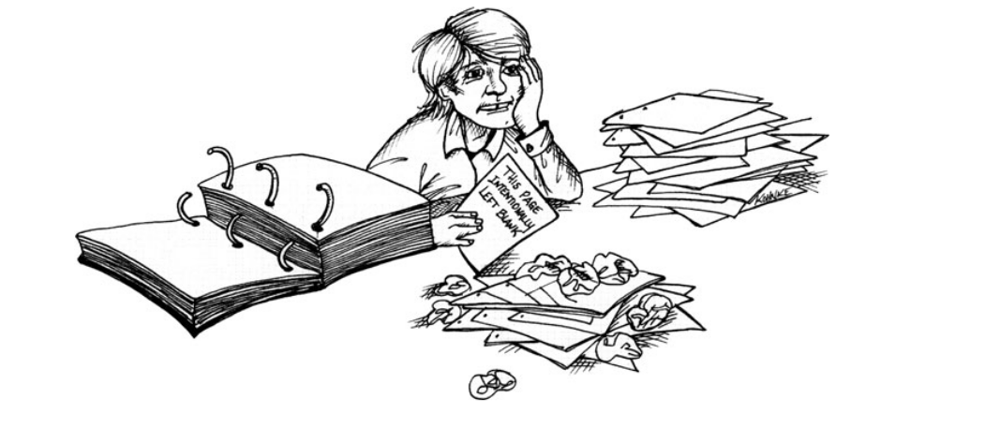

# معرفی پیش‌نیازها

فرض می‌کنم این کتاب را برداشته‌اید چون یک computer programmer (برنامه‌نویس کامپیوتر) هستید و مفهوم professionalism (حرفه‌ای‌گری) کنجکاوی‌تان را برانگیخته است. و حق هم دارید.
Professionalism چیزی است که حرفه‌ی ما به‌شدت به آن نیاز دارد.

من هم یک برنامه‌نویس هستم. حدود ۴۲ سال است که برنامه‌نویسی می‌کنم؛ و بگذارید رک بگویم—در این مدت همه‌چیز را دیده‌ام. اخراج شده‌ام. مورد تحسین قرار گرفته‌ام. team leader (رهبر تیم) بوده‌ام، manager (مدیر) بوده‌ام، نیروی ساده بوده‌ام و حتی CEO (مدیرعامل) هم بوده‌ام. با برنامه‌نویس‌های درخشان کار کرده‌ام و با آدم‌هایی که واقعاً کند و بی‌خاصیت بودند. با سیستم‌های `high-tech cutting-edge embedded software/hardware` systems (سیستم‌های توکار نرم‌افزاری/سخت‌افزاری پیشرفته) کار کرده‌ام و همین‌طور با سیستم‌های سازمانی حقوق و دستمزد. با COBOL، FORTRAN، BAL، PDP-8، PDP-11، C، C++، Java، Ruby، Smalltalk و انبوهی از زبان‌ها و سیستم‌های دیگر برنامه نوشته‌ام. با آدم‌هایی کار کرده‌ام که قابل اعتماد نبودند و عملاً دزد حقوق بودند، و همچنین با consummate professionals (حرفه‌ای‌های تمام‌عیار). و دقیقاً همین دسته‌ی آخر موضوع این کتاب است.

در صفحات این کتاب تلاش می‌کنم توضیح بدهم که `professional programmer` (برنامه‌نویس حرفه‌ای) بودن واقعاً یعنی چه. نگرش‌ها، دیسیپلین‌ها و اقداماتی را توصیف می‌کنم که از نظر من ذاتاً حرفه‌ای هستند.

از کجا می‌دانم این نگرش‌ها، دیسیپلین‌ها و اقدامات چه هستند؟ چون مجبور شدم آن‌ها را به سخت‌ترین شکل ممکن یاد بگیرم. واقعیت این است که وقتی اولین شغل برنامه‌نویسی‌ام را گرفتم، «حرفه‌ای» آخرین واژه‌ای بود که می‌شد برای توصیف من به کار برد.

سال 1969 بود. من 17 ساله بودم. پدرم یک شرکت محلی به نام ASC را آن‌قدر تحت فشار گذاشت تا مرا به‌عنوان یک `temporary part-time programmer` (برنامه‌نویس موقت پاره‌وقت) استخدام کنند. (بله، پدرم از این کارها بلد بود. یک‌بار دیدم جلوی یک ماشین در حال حرکت ایستاد، دستش را بالا گرفت و فرمان داد: «Stop!» و ماشین واقعاً ایستاد. هیچ‌کس به پدرم «نه» نمی‌گفت.) شرکت مرا گذاشت در اتاقی که تمام `IBM computer manuals` (راهنماهای کامپیوتر IBM) آن‌جا نگهداری می‌شد. کارم این بود که سال‌ها به‌روزرسانی را داخل این دفترچه‌ها وارد کنم. همان‌جا بود که برای اولین بار با عبارت معروف
`“This page intentionally left blank.”`
مواجه شدم.

بعد از چند روز به‌روزرسانی دفترچه‌ها، سرپرستم از من خواست یک برنامه‌ی ساده‌ی `Easycoder` بنویسم. از خوشحالی در پوست خودم نمی‌گنجیدم. تا آن موقع هیچ‌وقت برای یک کامپیوتر واقعی برنامه ننوشته بودم. البته کتاب‌های `Autocoder` را بلعیده بودم و یک تصور مبهم از این‌که چطور باید شروع کرد داشتم.

برنامه خیلی ساده بود: خواندن `records` (رکوردها) از روی یک `tape` (نوار مغناطیسی) و جایگزین کردن ID‌های آن‌ها با IDهای جدید. IDهای جدید از 1 شروع می‌شدند و به‌ازای هر رکورد یکی افزایش پیدا می‌کردند. رکوردها با IDهای جدید باید روی یک `tape` جدید نوشته می‌شدند.

سرپرستم قفسه‌ای را به من نشان داد که پر بود از دسته‌های `punched cards` (کارت‌های پانچ‌شده) قرمز و آبی. تصور کنید 50 دسته ورق بازی خریده‌اید، 25 دسته قرمز و 25 دسته آبی، و بعد همه را روی هم چیده‌اید. این دقیقاً شکلی بود که آن دسته کارت‌ها داشتند. نوارهایی قرمز و آبی با نوارهایی حدوداً 200 کارتی. هر نوار شامل source code (کد منبع) کتابخانه‌ی  `subroutine`‌هایی بود که برنامه‌نویس‌ها معمولاً استفاده می‌کردند. برنامه‌نویس‌ها فقط کافی بود بالاترین دسته را بردارند—با این دقت که فقط قرمز یا فقط آبی باشد—و آن را به انتهای دسته‌ی برنامه‌ی خود اضافه کنند.

من برنامه‌ام را روی `coding forms` (فرم‌های کدنویسی) نوشتم. این فرم‌ها کاغذهای مستطیلی بزرگی بودند که به 25 خط و 80 ستون تقسیم شده بودند. هر خط نماینده‌ی یک کارت بود. برنامه را با حروف بزرگ و با مداد می‌نوشتید. در شش ستون آخر هر خط، یک sequence number (شماره توالی) می‌نوشتید. معمولاً این شماره‌ها را با گام 10 افزایش می‌دادند تا بعداً بتوان کارت جدید بین آن‌ها اضافه کرد.

فرم‌های کدنویسی به دست `key punchers` (اپراتورهای پانچ کارت) می‌رسید. این شرکت چند ده زن داشت که فرم‌ها را از یک سبد بزرگ برمی‌داشتند و آن‌ها را در دستگاه‌های `key-punch` «تایپ» می‌کردند. این دستگاه‌ها شبیه ماشین‌تحریر بودند، با این تفاوت که به‌جای چاپ روی کاغذ، کاراکترها روی کارت پانچ می‌شدند.

روز بعد، اپراتورهای `keypunch` برنامه‌ام را از طریق پست داخلی به من برگرداندند. دسته‌ی کوچک کارت‌های پانچ‌شده‌ام با فرم‌های کدنویسی و یک کش لاستیکی بسته شده بود. کارت‌ها را از نظر خطای `keypunch` بررسی کردم. هیچ خطایی نبود. پس دسته‌ی کتابخانه‌ی `subroutine` را به انتهای دسته‌ی برنامه‌ام اضافه کردم و آن را به طبقه‌ی بالا، نزد `computer operators` (اپراتورهای کامپیوتر) بردم.

کامپیوترها پشت درهای قفل‌شده، در اتاقی با کنترل محیطی و کف کاذب (برای کابل‌ها) قرار داشتند. در زدم و یک اپراتور با حالتی سرد دسته‌ی کارت‌ها را از من گرفت و داخل سبدی در اتاق کامپیوتر گذاشت. هر وقت نوبتش می‌شد، برنامه را اجرا می‌کردند.

روز بعد دسته‌ی کارت‌ها به من برگشت. همراهش یک listing (خروجی چاپی) از نتایج اجرا بود که با یک کش نگه داشته شده بود. (آن روزها کش لاستیکی خیلی مصرف می‌کردیم!)
لیست را باز کردم و دیدم compile (کامپایل) شکست خورده است. پیام‌های خطا برایم خیلی سخت بودند، پس آن را پیش سرپرستم بردم. نگاهی انداخت، زیر لب چیزی گفت، چند یادداشت سریع روی لیست نوشت، دسته‌ی کارت‌ها را برداشت و گفت دنبالش بروم.

مرا به اتاق keypunch برد و پشت یک دستگاه خالی نشست. کارت‌هایی را که خطا داشتند یکی‌یکی اصلاح کرد و یکی دو کارت دیگر هم اضافه کرد. خیلی سریع توضیح داد چه کار می‌کند، اما همه‌چیز مثل برق گذشت.

دسته‌ی جدید را به اتاق کامپیوتر برد، در زد، چند کلمه‌ی جادویی به یکی از اپراتورها گفت و پشت سر او وارد اتاق شد. با اشاره از من خواست دنبالش بروم. اپراتور `tape drives` (درایوهای نوار) را آماده کرد و دسته‌ی کارت‌ها را بارگذاری کرد. نوارها چرخیدند، چاپگر صدا داد و تمام شد. برنامه کار کرد.

روز بعد سرپرستم از کمکم تشکر کرد و همکاری‌ام را پایان داد. ظاهراً ASC احساس می‌کرد وقت پرورش یک نوجوان 17 ساله را ندارد.

اما ارتباط من با ASC هنوز تمام نشده بود. چند ماه بعد، یک شغل تمام‌وقت در شیفت دوم گرفتم که کارم راه‌اندازی `off-line printers` (چاپگرهای آفلاین) بود. این چاپگرها از روی تصاویر ذخیره‌شده روی نوار، `junk mail` (نامه‌های تبلیغاتی) چاپ می‌کردند. کار من بارگذاری کاغذ، گذاشتن نوارها، رفع گیر کاغذ و در کل تماشای کار کردن دستگاه‌ها بود.

سال 1970 بود. دانشگاه برایم گزینه‌ای نبود و جذابیتی هم نداشت. جنگ Viet Nam هنوز ادامه داشت و دانشگاه‌ها آشفته بودند. من همچنان کتاب‌های `COBOL`، `Fortran،` `PL/1،` `PDP-8` و `IBM` `360 Assembler` را می‌بلعیدم. قصدم این بود که دانشگاه را دور بزنم و با تمام توان وارد دنیای برنامه‌نویسی شوم.

دوازده ماه بعد به این هدف رسیدم. به‌عنوان `full-time programmer` (برنامه‌نویس تمام‌وقت) در ASC ارتقا گرفتم. من و دو دوست خوبم، Richard و Tim—هر دو 19 ساله—به‌همراه سه برنامه‌نویس دیگر روی یک سیستم حسابداری `real-time` (بلادرنگ) برای یک اتحادیه‌ی رانندگان کار می‌کردیم. ماشین، `Varian` 620i بود؛ یک `mini-computer` (مینی‌کامپیوتر) ساده شبیه PDP-8 با کلمه‌ی 16 بیتی و دو رجیستر. زبان، `assembler` بود.

ما هر خط کد آن سیستم را خودمان نوشتیم. واقعاً هر خط. `operating system` (سیستم‌عامل)، `interrupt heads،` `IO drivers` (درایورهای ورودی/خروجی)، `file system` (سیستم فایل) دیسک‌ها، overlay swapper و حتی `relocatable linker`. تازه جدا از تمام کدهای کاربردی. همه‌ی این‌ها را در 8 ماه نوشتیم، با هفته‌هایی 70 تا 80 ساعت کار، برای رسیدن به یک `deadline` (ددلاین) جهنمی. حقوق من سالی 7,200 دلار بود.

سیستم را تحویل دادیم. و بعد استعفا دادیم.

ناگهانی و با خشم. بعد از آن‌همه کار و تحویل یک سیستم موفق، شرکت به ما فقط 2٪ افزایش حقوق داد. احساس می‌کردیم فریب خورده‌ایم و با ما بدرفتاری شده است. چند نفرمان در جای دیگری کار پیدا کردند و ساده استعفا دادند.

اما من راهی متفاوت—و بسیار بد—را انتخاب کردم. من و یکی از دوستانم با عصبانیت وارد دفتر رئیس شدیم و با سر و صدا استعفا دادیم. این کار از نظر احساسی فوق‌العاده بود—برای یک روز.

روز بعد فهمیدم که دیگر شغلی ندارم. 19 ساله، بیکار، بدون مدرک. در چند مصاحبه‌ی برنامه‌نویسی شرکت کردم، اما هیچ‌کدام خوب پیش نرفت. پس چهار ماه در تعمیرگاه چمن‌زن شوهرخواهرم کار کردم. متأسفانه تعمیرکار چمن‌زن افتضاحی بودم و آخرش مجبور شد مرا اخراج کند. افتادم در یک افسردگی بد.

هر شب تا ساعت 3 بامداد بیدار می‌ماندم، پیتزا می‌خوردم و فیلم‌های قدیمی هیولایی را با تلویزیون سیاه‌وسفید قدیمی پدر و مادرم می‌دیدم. فقط بعضی از ارواح، شخصیت‌های فیلم بودند. تا ساعت 1 ظهر در تخت می‌ماندم چون نمی‌خواستم با روزهای تیره‌ام روبه‌رو شوم. یک درس calculus (حساب دیفرانسیل و انتگرال) در یک کالج محلی گرفتم و افتادم. کاملاً به‌هم‌ریخته بودم.

مادرم مرا کنار کشید و گفت زندگی‌ام آشفته است؛ گفت احمق بوده‌ام که بدون شغل جدید استعفا داده‌ام، که احساسی استعفا داده‌ام، و که همراه دوستم استعفا داده‌ام. گفت هیچ‌وقت بدون شغل جدید استعفا نده و همیشه آرام، خونسرد و تنها استعفا بده. گفت باید به رئیس قبلی‌ام زنگ بزنم و شغلم را پس بگیرم. گفت: «باید `humble pie` (تحمل تحقیر و فروتنی تلخ) بخوری.»

پسرهای نوزده‌ساله معمولاً اشتهای زیادی برای `humble pie` ندارند، و من هم استثنا نبودم. اما شرایط غرورم را خرد کرده بود. در نهایت به رئیس سابقم زنگ زدم و یک گاز بزرگ از آن `humble pie` گرفتم. و جواب داد. او خوشحال شد که مرا با حقوق سالانه 6,800 دلار دوباره استخدام کند، و من هم خوشحال شدم که قبول کنم.

18 ماه دیگر آن‌جا کار کردم، مراقب رفتار و حرف‌هایم بودم و سعی می‌کردم تا حد ممکن کارمند مفیدی باشم. با `promotion` (ارتقا) و افزایش حقوق و یک paycheck (حقوق منظم) پاداش گرفتم. زندگی خوب بود. وقتی از آن شرکت رفتم، با رابطه‌ای خوب و با پیشنهاد شغلی بهتر در جیبم بود.

شاید فکر کنید درس را گرفته بودم و حالا حرفه‌ای شده بودم. اصلاً این‌طور نبود. این فقط اولینِ درس‌های زیادی بود که باید یاد می‌گرفتم. در سال‌های بعد، به‌خاطر بی‌دقتی در از دست دادن تاریخ‌های مهم از یک شغل اخراج شدم؛ و در شغلی دیگر نزدیک بود به‌خاطر افشای ناخواسته‌ی اطلاعات محرمانه برای مشتری اخراج شوم. رهبری یک پروژه‌ی محکوم‌به‌شکست را پذیرفتم و بدون درخواست کمکی که می‌دانستم لازم است، آن را تا نابودی پیش بردم. با شدت از تصمیم‌های فنی‌ام دفاع کردم، حتی وقتی کاملاً خلاف نیاز مشتری بودند. فردی کاملاً نالایق را استخدام کردم و یک `liability` (مسئولیت و ریسک بزرگ) روی دوش کارفرما گذاشتم. و بدتر از همه، به‌خاطر ناتوانی‌ام در رهبری، باعث اخراج دو نفر دیگر شدم.

پس این کتاب را مثل فهرستی از اشتباهات خودم، پرونده‌ای از خطاهایم، و مجموعه‌ای از راهنماها ببینید تا شما مجبور نباشید در کفش‌های دوران ابتدایی من راه بروید.

