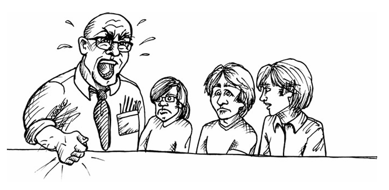

 

# نه گفتن

«انجام بده؛ یا انجام نده. چیزی به نام سعی‌کردن وجود ندارد.»
— یودا

اوایل دههٔ ۷۰ میلادی، من و دو نفر از دوستان نوزده‌ساله‌ام روی یک سیستم حسابداری بلادرنگ برای اتحادیهٔ تیمسترها در شیکاگو کار می‌کردیم؛ برای شرکتی به نام ASC. اگر اسم‌هایی مثل جیمی هافا به ذهنتان می‌آید، درست آمده است. سال ۱۹۷۱ با تیمسترها شوخی نداشتند.

قرار بود سیستم ما در تاریخ مشخصی راه‌اندازی شود. پول زیادی به آن تاریخ گره خورده بود. تیم ما هفته‌ای ۶۰، ۷۰، حتی ۸۰ ساعت کار می‌کرد تا somehow به آن زمان‌بندی برسیم.

یک هفته مانده به تاریخ راه‌اندازی، بالاخره کل سیستم را کنار هم گذاشتیم. پر بود از باگ و مشکل، و ما با عجله داشتیم یکی‌یکی از لیست رد می‌کردیم. عملاً وقتی برای غذا خوردن و خوابیدن هم نبود، چه برسد به فکر کردن.

فرانک، مدیر ASC، یک سرهنگ بازنشستهٔ نیروی هوایی بود. از آن مدیرهای پرسر و صدا و توی صورت‌زن. یا راه او را می‌رفتی یا می‌رفتی کنار. و اگر می‌خواست بفرستدت کنار، تو را از ارتفاع ده‌هزار پایی بدون چتر می‌انداخت پایین. ما نوزده‌ساله‌ها حتی جرئت نمی‌کردیم توی چشمش نگاه کنیم.

فرانک گفت کار باید تا همان تاریخ تمام شود. تمام. بدون بحث. تمام شد و رفت.

رئیس من، بیل، آدم دوست‌داشتنی‌ای بود. سال‌ها با فرانک کار کرده بود و می‌دانست با او چه چیزهایی ممکن است و چه چیزهایی نه. به ما گفت که در هر صورت، در همان تاریخ سیستم راه می‌افتد.

پس سیستم را در همان تاریخ راه‌اندازی کردیم. و نتیجه؟ یک فاجعهٔ تمام‌عیار.

دوازده ترمینال نیمه‌دوطرفهٔ ۳۰۰ باود وجود داشت که دفتر مرکزی تیمسترها در شیکاگو را به ماشین ما که سی مایل آن‌طرف‌تر در حومه بود وصل می‌کرد. هر کدام از این ترمینال‌ها تقریباً هر نیم ساعت قفل می‌کرد. قبلاً این مشکل را دیده بودیم، اما ترافیکی را که کارمندان ورود دادهٔ اتحادیه ناگهان روی سیستم ریختند شبیه‌سازی نکرده بودیم.

بدتر از آن، نوارهایی که روی تل‌تایپ‌های ASR35 چاپ می‌شد—که آن‌ها هم از طریق خطوط تلفن ۱۱۰ باود به سیستم وصل بودند—وسط چاپ یخ می‌زدند.

راه‌حل این قفل شدن‌ها ریبوت بود. یعنی باید همهٔ کسانی که هنوز ترمینالشان کار می‌کرد، کارشان را تمام می‌کردند و می‌ایستادند. بعد به ما زنگ می‌زدند تا سیستم را ریبوت کنیم. کسانی که ترمینالشان قفل شده بود باید از اول شروع می‌کردند. و این اتفاق بیشتر از یک بار در ساعت می‌افتاد.

بعد از نیم روز، مدیر دفتر تیمسترها گفت سیستم را خاموش کنیم و تا وقتی درست کار نکرده، دوباره روشنش نکنیم. در این فاصله، آن‌ها نصف روز کاری را از دست داده بودند و باید همهٔ داده‌ها را با سیستم قدیمی دوباره وارد می‌کردند.

ما فریادها و غرّش‌های فرانک را در تمام ساختمان می‌شنیدیم. مدت خیلی، خیلی طولانی ادامه داشت. بعد بیل و جلیل، تحلیل‌گر سیستم، آمدند پیش ما و پرسیدند کی می‌توانیم سیستم را پایدار کنیم. من گفتم: «چهار هفته.»

نگاهشان اول وحشت‌زده بود، بعد مصمم. گفتند: «نه. باید تا جمعه راه بیفتد.»

من گفتم: «ببینید، ما همین هفتهٔ پیش به زور این سیستم را نیم‌بند راه انداختیم. باید مشکلاتش را دربیاوریم. چهار هفته لازم داریم.»

اما بیل و جلیل کوتاه نیامدند. «نه، واقعاً باید جمعه باشد. حداقل می‌توانی سعی کنی؟»

بعد رهبر تیم گفت: «باشه، سعی می‌کنیم.»

جمعه انتخاب بدی نبود. بار کاری آخر هفته کمتر بود. توانستیم چند مشکل دیگر را پیدا و اصلاح کنیم قبل از این‌که دوشنبه برسد. با این حال، کل این خانهٔ پوشالی نزدیک بود دوباره فرو بریزد. مشکلات قفل شدن روزی یکی دو بار ادامه داشت. مشکلات دیگری هم بود. اما کم‌کم، بعد از چند هفتهٔ دیگر، سیستم به جایی رسید که شکایت‌ها فروکش کرد و زندگی عادی دوباره ممکن به نظر رسید.

و بعد، همان‌طور که در مقدمه گفتم، همه‌مان استعفا دادیم. و آن‌ها با یک بحران واقعی تنها ماندند. مجبور شدند گروه جدیدی از برنامه‌نویس‌ها را استخدام کنند تا با سیل عظیم مشکلات مشتری کنار بیایند.

این فاجعه تقصیر چه کسی بود؟ واضح است که سبک مدیریتی فرانک بخشی از مشکل بود. تهدیدهایش باعث می‌شد شنیدن حقیقت برایش سخت شود. قطعاً بیل و جلیل باید خیلی محکم‌تر جلوی فرانک می‌ایستادند. قطعاً رهبر تیم ما نباید زیر بار درخواست جمعه می‌رفت. و قطعاً من هم باید به «نه» گفتنم ادامه می‌دادم، نه این‌که پشت سر رهبر تیم صف بکشم.

حرفه‌ای‌ها حقیقت را به قدرت می‌گویند.
حرفه‌ای‌ها جرئت نه گفتن به مدیرشان را دارند.

---

### نقش‌های متقابل (Adversarial Roles)

یکی از بازبین‌های این کتاب واقعاً از این فصل بدش آمده بود. گفت نزدیک بود کتاب را کنار بگذارد. او تیم‌هایی ساخته بود که در آن‌ها هیچ رابطهٔ تقابلی‌ای وجود نداشت؛ تیم‌ها هماهنگ و بدون تقابل کار می‌کردند.

برای او خوشحالم، اما شک دارم تیم‌هایش آن‌قدر که فکر می‌کند عاری از تقابل باشند. و اگر هم باشند، شک دارم به اندازه‌ای که می‌توانند، کارآمد باشند. تجربهٔ من این بوده که تصمیم‌های سخت، بهترین شکلشان را در تقابل نقش‌های متضاد پیدا می‌کنند.

مدیران آدم‌هایی هستند با کاری برای انجام دادن، و اغلب می‌دانند چطور آن کار را انجام دهند. بخشی از آن کار این است که اهدافشان را تا جایی که می‌توانند با شدت دنبال و دفاع کنند.

به همان شکل، برنامه‌نویس‌ها هم آدم‌هایی هستند با کاری برای انجام دادن، و اگر حرفه‌ای باشند، اهداف خودشان را با همان شدت دنبال و دفاع می‌کنند.

وقتی مدیرت می‌گوید صفحهٔ لاگین باید تا فردا آماده باشد، او دارد یکی از اهدافش را دنبال می‌کند. اگر تو خوب می‌دانی که انجام این کار تا فردا غیرممکن است، و با این حال بگویی «باشه، سعی می‌کنم»، آن وقت تو کار خودت را درست انجام نداده‌ای. تنها راه انجام درست کارت این است که بگویی: «نه، این غیرممکن است.»

---

### بالاترین ریسک‌ها

مهم‌ترین زمان برای نه گفتن وقتی است که ریسک‌ها بالاترین حد را دارند. هرچه ریسک بالاتر، ارزش «نه» بیشتر.

وقتی هزینهٔ شکست آن‌قدر بالاست که بقای شرکت به آن بستگی دارد، باید مصمم باشی بهترین اطلاعات ممکن را به مدیرانت بدهی. و این اغلب یعنی نه گفتن.

اگر دان به برآوردش پایبند نمی‌ماند، اگر حقیقت را نمی‌گفت، آن تماس‌های سخت شاید خیلی دیرتر انجام می‌شدند. و آن وقت هزینه‌اش به‌مراتب بیشتر بود.

---

## تیمی بودن (Being a “Team Player”)

همه‌مان بارها شنیده‌ایم که «تیمی بودن» چقدر مهم است. تیمی بودن یعنی نقش خودت را تا جایی که می‌توانی درست و کامل بازی کنی، و وقتی هم‌تیمی‌هایت گیر می‌افتند، به کمکشان بروی. یک آدم تیمی مدام ارتباط برقرار می‌کند، حواسش به بقیهٔ اعضای تیم هست، و مسئولیت‌های خودش را تا حد امکان بی‌نقص انجام می‌دهد.

اما یک آدم تیمی کسی نیست که همیشه «بله» بگوید. این سناریو را در نظر بگیر:

Paula:
«مایک، برآوردها را آماده کرده‌ایم. تیم به این نتیجه رسیده که می‌توانیم حدود هشت هفتهٔ دیگر—یکی دو هفته کمتر یا بیشتر—برای دمو آماده باشیم.»

Mike:
«پائولا، ما دمو را برای شش هفتهٔ دیگر برنامه‌ریزی کرده‌ایم.»

Paula:
«بدون این‌که اول نظر ما را بپرسید؟ مایک، این‌طوری نمی‌شود که تاریخ را تحمیل کنید.»

Mike:
«دیگه انجام شده.»

Paula:
(با آه) «باشه، می‌رم با تیم صحبت می‌کنم ببینم در شش هفته چه چیزی را *با خیال راحت* می‌توانیم تحویل بدهیم، ولی کل سیستم نخواهد بود. بعضی قابلیت‌ها حذف می‌شوند و بارگذاری داده هم ناقص می‌ماند.»

Mike:
«پائولا، مشتری انتظار دارد یک دمو کامل ببیند.»

Paula:
«این اتفاق نمی‌افتد، مایک.»

Mike:
«لعنتی… خب، بهترین برنامه‌ای که می‌توانی را آماده کن و فردا خبرم کن.»

Paula:
«این کار را می‌توانم بکنم.»

Mike:
«واقعاً هیچ کاری نمی‌شود کرد که این تاریخ جلو بیاید؟ شاید باهوش‌تر کار کنید، خلاق‌تر باشید.»

Paula:
«ما خلاق هستیم، مایک. مسئله را خوب می‌شناسیم، و تاریخ آماده شدن هشت یا نه هفته است، نه شش.»

Mike:
«می‌توانید اضافه‌کاری کنید.»

Paula:
«اضافه‌کاری فقط ما را کندتر می‌کند، مایک. یادت هست دفعهٔ قبل که اضافه‌کاری اجباری شد چه فاجعه‌ای به بار آمد؟»

Mike:
«آره، ولی این بار لازم نیست همان‌طور بشود.»

Paula:
«دقیقاً مثل دفعهٔ قبل می‌شود، مایک. به من اعتماد کن. هشت یا نه هفته است، نه شش.»

Mike:
«باشه، بهترین برنامه‌ات را بده، ولی همچنان فکر کن چطور می‌شود در شش هفته تمامش کرد. مطمئنم یه راهی پیدا می‌کنید.»

Paula:
«نه مایک، پیدا نمی‌کنیم. من یک برنامهٔ شش‌هفته‌ای می‌دهم، ولی کلی قابلیت و داده در آن نخواهد بود. واقعیت همین است.»

Mike:
«باشه پائولا، ولی شرط می‌بندم اگر بخواهید، معجزه می‌کنید.»

(پائولا در حالی که سرش را تکان می‌دهد، دور می‌شود.)

---

### بعدتر، در جلسهٔ استراتژی مدیران…

Don:
«خب مایک، همان‌طور که می‌دانی مشتری شش هفتهٔ دیگر برای دمو می‌آید. انتظار دارند همه‌چیز کار کند.»

Mike:
«بله، و ما آماده خواهیم بود. تیم من دارد جان می‌کند و انجامش می‌دهیم. کمی اضافه‌کاری می‌خواهد و خلاقیت، ولی از پسش برمی‌آییم!»

Don:
«خیلی عالی است که تو و تیمت این‌قدر تیمی هستید.»

---

در این سناریو چه کسی واقعاً تیمی رفتار کرد؟
پائولا برای تیم بازی می‌کرد، چون صادقانه نشان داد چه چیزی شدنی است و چه چیزی نیست. او با وجود فشار، خواهش و فریب مایک، محکم پای موضعش ایستاد. اما مایک برای تیمی تک‌نفره بازی می‌کرد: تیمِ مایک. او نه در تیم پائولا بود—چون او را متعهد به کاری کرد که صراحتاً گفته بود نمی‌تواند انجام دهد—و نه واقعاً در تیم دان، چون عملاً به او دروغ گفت.

پس چرا مایک این کار را کرد؟ چون می‌خواست دان او را «آدم تیمی» ببیند و بیش‌ازحد به توانایی خودش برای راضی کردن و تحت فشار گذاشتن پائولا ایمان داشت. مایک آدم بدی نیست؛ فقط بیش از حد به قدرت متقاعدسازی خودش اعتماد دارد.

---

## سعی کردن (Trying)

بدترین کاری که پائولا می‌توانست در برابر این بازی‌ها بکند این بود که بگوید: «باشه، سعی می‌کنیم.»
دوست ندارم یودا را وسط بکشم، ولی این‌جا حق با اوست: چیزی به نام «سعی کردن» وجود ندارد.

شاید این حرف را دوست نداشته باشی. شاید فکر کنی «سعی کردن» چیز مثبتی است. خب، اگر کریستف کلمب سعی نکرده بود، آمریکا کشف می‌شد؟

کلمهٔ «سعی» معنی‌های مختلفی دارد. آن تعریفی که من این‌جا با آن مشکل دارم این است: «به‌کار بردن تلاشِ اضافه». پائولا چه تلاش اضافه‌ای می‌توانست بکند که دمو به موقع آماده شود؟ اگر چنین تلاشی وجود دارد، پس یعنی او و تیمش قبلاً تمام توانشان را به کار نگرفته بودند و بخشی از انرژی‌شان را ذخیره کرده بودند.

قولِ «سعی می‌کنم» یعنی اعتراف به این‌که تا حالا کم‌کاری کرده‌ای. یعنی می‌گویی یک مخزن انرژی اضافی داری. یعنی هدف با همین انرژی اضافه دست‌یافتنی است، و تو متعهد می‌شوی آن انرژی را خرج کنی. در نتیجه، وقتی قول می‌دهی «سعی کنی»، در واقع قول موفق شدن می‌دهی. بارِ مسئولیت می‌افتد روی دوش تو. و اگر موفق نشوی، شکست خورده‌ای.

واقعاً چنین ذخیره‌ای داری؟ اگر خرجش کنی، به هدف می‌رسی؟ یا فقط با گفتن «سعی می‌کنم» داری خودت را برای شکست آماده می‌کنی؟

قول دادن به «سعی کردن» یعنی تغییر برنامه. یعنی برنامهٔ قبلی کافی نبوده. اما برنامهٔ جدید چیست؟ دقیقاً چه رفتارت را قرار است عوض کنی؟ چه کار متفاوتی می‌خواهی بکنی؟

اگر برنامهٔ جدیدی نداری، اگر رفتارت را تغییر نمی‌دهی، اگر دقیقاً همان کاری را می‌کنی که قبل از قول «سعی می‌کنم» هم می‌کردی، پس «سعی کردن» اصلاً یعنی چه؟

اگر انرژی ذخیره‌ای نداری، اگر برنامهٔ جدیدی نداری، اگر قرار نیست رفتارت عوض شود، و اگر به برآورد اولیه‌ات هم اطمینان داری، آن‌وقت قول دادن به «سعی» اساساً نادرست و غیراخلاقی است. تو داری دروغ می‌گویی—معمولاً برای حفظ ظاهر و فرار از تقابل.

روش پائولا خیلی بهتر بود. او مدام یادآوری می‌کرد که برآورد تیم همراه با عدم قطعیت است. همیشه می‌گفت «هشت یا نه هفته». روی این عدم قطعیت تأکید می‌کرد و عقب نمی‌نشست. هیچ‌وقت نگفت شاید تلاش اضافه‌ای وجود دارد، یا برنامهٔ جدیدی، یا تغییری در رفتار که بتواند این عدم قطعیت را کم کند.

---

### سه هفته بعد…

Mike:
«پائولا، دمو سه هفتهٔ دیگر است و مشتری‌ها اصرار دارند قابلیت File Upload کار کند.»

Paula:
«مایک، این جزو قابلیت‌هایی نبود که توافق کردیم.»

Mike:
«می‌دانم، ولی دارند اصرار می‌کنند.»

Paula:
«خب، در این صورت یا Single Sign-on یا Backup باید از دمو حذف شود.»

Mike:
«اصلاً! آن‌ها انتظار دارند این‌ها هم کار کند!»

Paula:
«پس یعنی انتظار دارند *همه* قابلیت‌ها کار کند؟ من که گفتم چنین چیزی ممکن نیست.»

Mike:
«متأسفم پائولا، ولی مشتری کوتاه نمی‌آید.»

Paula:
«این اتفاق نمی‌افتد، مایک.»

Mike:
«نمی‌توانید حداقل سعی کنید؟»

Paula:
«مایک، من می‌توانم سعی کنم معلق بزنم. می‌توانم سعی کنم سرب را به طلا تبدیل کنم. می‌توانم سعی کنم اقیانوس اطلس را شنا کنم. فکر می‌کنی موفق می‌شوم؟»

Mike:
«داری غیرمنطقی می‌شوی. من که چیز غیرممکن نمی‌خواهم.»

Paula:
«چرا مایک، دقیقاً داری غیرممکن می‌خواهی.»

(مایک پوزخند می‌زند، سر تکان می‌دهد و می‌رود.)

Mike:
«بهت ایمان دارم پائولا، می‌دانم ناامیدم نمی‌کنی.»

Paula:
(رو به پشت مایک) «داری خواب می‌بینی. این خوب تمام نمی‌شود.»

---

## پرخاشگری منفعلانه (Passive Aggression)

پائولا حالا با یک تصمیم جالب روبه‌روست. او حدس می‌زند که مایک برآوردهایش را به دان منتقل نکرده. می‌تواند بگذارد مایک برود و از صخره بیفتد پایین. می‌تواند مطمئن شود همهٔ ایمیل‌ها و یادداشت‌ها بایگانی شده‌اند تا وقتی فاجعه رخ داد، نشان بدهد چه گفته و کی گفته. این می‌شود پرخاشگری منفعلانه: بگذاری طرف خودش خودش را دار بزند.

یا می‌تواند برای جلوگیری از فاجعه، مستقیم با دان صحبت کند. این کار پرریسک است، اما دقیقاً معنای واقعی تیمی بودن همین است. وقتی قطار باری با سرعت دارد به سمتت می‌آید و فقط تو آن را می‌بینی، یا آرام از ریل کنار می‌روی و می‌گذاری بقیه له شوند، یا فریاد می‌زنی: «قطار! از ریل برید کنار!»

---

### دو روز بعد…

Paula:
«مایک، برآوردهای من را به دان گفته‌ای؟ به مشتری گفته که File Upload در دمو کار نخواهد کرد؟»

Mike:
«پائولا، گفتی درستش می‌کنی.»

Paula:
«نه مایک، چنین چیزی نگفتم. گفتم غیرممکن است. این هم کپی یادداشتی که بعد از صحبت‌مان برایت فرستادم.»

Mike:
«خب، قرار بود سعی کنی دیگر، نه؟»

Paula:
«این را قبلاً بحث کردیم مایک. طلا و سرب را یادت هست؟»

Mike:
(آه می‌کشد) «ببین پائولا، باید انجامش بدهی. خواهش می‌کنم، هر کاری لازم است بکن، فقط این را برای من درست کن.»

Paula:
«مایک، اشتباه می‌کنی. من لازم نیست این کار را برایت انجام بدهم. اگر تو انجام ندهی، کاری که *من* باید بکنم این است که به دان بگویم.»

Mike:
«این یعنی دور زدن من. این کار را نمی‌کنی.»

Paula:
«دوست ندارم، ولی اگر مجبورم کنی، انجامش می‌دهم.»

Paula:
«ببین مایک، این قابلیت‌ها به دمو نمی‌رسند. باید این را بپذیری. دست بردار از این‌که مرا وادار کنی بیشتر کار کنم. دست بردار از این خیال که من قرار است خرگوشی از کلاه بیرون بیاورم. واقعیت را بپذیر: باید امروز به دان بگویی.»

Mike:
(با چشمان باز) «امروز؟»

Paula:
«بله، امروز. چون فردا انتظار دارم جلسه‌ای با تو و دان داشته باشیم دربارهٔ این‌که چه قابلیت‌هایی در دمو باشند. اگر آن جلسه فردا برگزار نشود، خودم مستقیم می‌روم پیش دان. این هم کپی یادداشتی که این را توضیح می‌دهد.»

Mike:
«داری فقط پشت خودت را سفت می‌کنی!»

Paula:
«مایک، دارم پشت هر دومان را سفت می‌کنم. می‌توانی فاجعه‌ای را تصور کنی که مشتری بیاید این‌جا و انتظار دمو کامل داشته باشد و ما نتوانیم تحویل بدهیم؟»

آخرش چه بلایی سر پائولا و مایک می‌آید؟ خودت می‌توانی سناریوها را تصور کنی. نکته این است که پائولا کاملاً حرفه‌ای رفتار کرد. او در تمام لحظه‌های درست، و به تمام شکل‌های درست، «نه» گفت. وقتی از او خواستند برآوردش را عوض کند نه گفت. وقتی تحت فشار، فریب و التماس قرار گرفت نه گفت. و مهم‌تر از همه، به خودفریبی و بی‌عملی مایک نه گفت.

پائولا برای تیم بازی می‌کرد. مایک به کمک نیاز داشت، و او با تمام توانش سعی کرد—نه، *عمل کرد*—که کمکش کند.

---

## هزینهٔ «بله» گفتن

*(The Cost of Saying Yes)*

بیشترِ وقت‌ها دلمان می‌خواهد بگوییم «بله». در واقع، تیم‌های سالم تلاش می‌کنند راهی پیدا کنند که بله بگویند. در تیم‌هایی که خوب اداره می‌شوند، مدیران و توسعه‌دهنده‌ها با هم مذاکره می‌کنند تا به یک برنامهٔ عملی مورد توافق دوطرف برسند.

اما همان‌طور که دیدیم، گاهی تنها راه رسیدن به «بلهٔ درست»، این است که از گفتن «نه» نترسیم.

داستان زیر را در نظر بگیرید؛ نوشته‌ای از جان بلانکو که در وبلاگش منتشر کرده و با اجازهٔ او این‌جا بازنشر شده است. هنگام خواندنش از خودتان بپرسید: او چه زمانی و چگونه باید «نه» می‌گفت؟

---

## آیا کد خوب غیرممکن است؟

وقتی به سن نوجوانی می‌رسی، تصمیم می‌گیری برنامه‌نویس شوی. در دوران دبیرستان، نوشتن نرم‌افزار با اصول شیءگرایی را یاد می‌گیری. وقتی وارد دانشگاه می‌شوی، همهٔ این اصول را در حوزه‌هایی مثل هوش مصنوعی یا گرافیک سه‌بعدی به کار می‌بری.

و وقتی وارد دنیای حرفه‌ای می‌شوی، جست‌وجوی بی‌پایانت برای نوشتن کدی تجاری، قابل نگهداری و «بی‌نقص» شروع می‌شود؛ کدی که در گذر زمان دوام بیاورد.

کیفیت تجاری؟
خب… این واقعاً خنده‌دار است.

خودم را خوش‌شانس می‌دانم. عاشق الگوهای طراحی‌ام. دوست دارم دربارهٔ نظریهٔ کدنویسی بی‌نقص مطالعه کنم. مشکلی ندارم که یک ساعت تمام دربارهٔ این بحث کنم که چرا انتخاب سلسله‌مراتب وراثتِ همکار XP من اشتباه است—و چرا در خیلی از موارد HAS-A بهتر از IS-A است.
اما مدتی است چیزی آزارم می‌دهد و یک سؤال مدام در ذهنم می‌چرخد…

آیا کد خوب در توسعهٔ نرم‌افزار مدرن غیرممکن است؟

---

## پیشنهاد پروژهٔ معمولی

من به‌عنوان یک توسعه‌دهندهٔ قراردادی تمام‌وقت (و نیمه‌وقت)، روزها و شب‌هایم را صرف ساخت اپلیکیشن‌های موبایل برای مشتری‌ها می‌کنم. و چیزی که در این سال‌ها یاد گرفته‌ام این است که فشارهای کارِ مشتری عملاً اجازه نمی‌دهد آن اپلیکیشن‌های واقعاً باکیفیتی را بنویسم که دلم می‌خواهد.

قبل از هر چیز بگویم: مسئله کم‌کاری نیست. من عاشق «کد تمیز» هستم. کسی را نمی‌شناسم که مثل من دنبال طراحی نرم‌افزار بی‌نقص باشد. مشکل من اجراست—و نه به دلیلی که فکرش را می‌کنید.

بگذارید داستانی تعریف کنم.

اواخر سال گذشته، یک شرکت نسبتاً شناخته‌شده یک RFP منتشر کرد تا برایشان یک اپ بسازند. خرده‌فروش بزرگی بودند، اما برای حفظ ناشناسی اسمشان را می‌گذاریم Gorilla Mart. گفتند می‌خواهند حضور آیفونی داشته باشند و اپ باید تا بلک‌فرایدی آماده شود.
مشکل؟
الان اول نوامبر است. یعنی کمتر از چهار هفته وقت داریم. تازه، آن موقع اپل دو هفته برای تأیید اپ‌ها زمان می‌خواست.
پس صبر کن… یعنی این اپ باید در **دو هفته** نوشته شود؟!

بله. دو هفته وقت داریم. و بدتر این‌که—ما برندهٔ مناقصه شده‌ایم. (در دنیای کسب‌وکار، اهمیت مشتری مهم است.) پس این اتفاق قرار است بیفتد.

«ولی اشکالی ندارد»، مدیر شمارهٔ یک Gorilla Mart می‌گوید.
«اپ ساده است. فقط چند محصول از کاتالوگمان را نشان بدهد و اجازه بدهد کاربر موقعیت فروشگاه‌ها را پیدا کند. همین را روی سایت‌مان داریم. گرافیکش را هم به شما می‌دهیم. احتمالاً—اسمش چیست—آره، می‌شود هاردکدش کرد!»

مدیر شمارهٔ دو اضافه می‌کند:
«و فقط چند تا کوپن لازم داریم که کاربر سر صندوق نشان بدهد. این اپ موقتی است. سریع می‌دهیم بیرون، بعد در فاز دو از صفر یک چیز بزرگ‌تر و بهتر می‌سازیم.»

و بعد… اتفاق می‌افتد.
با وجود سال‌ها تجربه که می‌گوید هر قابلیتی که مشتری می‌خواهد، نوشتنش همیشه پیچیده‌تر از توضیح دادنش است، باز هم قبول می‌کنی. این بار واقعاً باور می‌کنی که می‌شود در دو هفته انجامش داد.
بله! می‌توانیم! این بار فرق دارد!
چند تا گرافیک و یک سرویس برای موقعیت فروشگاه. XML! چیزی نیست! می‌زنیم انجامش می‌دهیم! من هیجان‌زده‌ام! بزن بریم!

فقط یک روز طول می‌کشد تا من و واقعیت دوباره با هم آشنا شویم.

من: «می‌شود اطلاعاتی که برای صدا زدن وب‌سرویس موقعیت فروشگاه لازم است را بدهید؟»
مشتری: «وب‌سرویس چیست؟»
من: «………»

---

و دقیقاً همین‌طور شد. سرویس موقعیت فروشگاه—همان که در گوشهٔ بالا-راست سایتشان بود—وب‌سرویس نبود. با کد جاوا تولید می‌شد. API؟ نه خیر. تازه، روی سرور یک شریک استراتژیک Gorilla Mart میزبانی می‌شد.

اینجاست که «طرف سوم» خبیث وارد می‌شود.

در زبان مشتری، «طرف سوم» مثل آنجلینا جولی است. با وعدهٔ یک گفت‌وگوی روشنفکرانه و شاید ادامه‌دار… اما نه، خبری ازش نیست. فقط باید در خیال‌پردازی‌هایت بماند و کارت را خودت راه بیندازی.

تنها چیزی که توانستم از Gorilla Mart بگیرم، یک فایل اکسل از لیست فعلی فروشگاه‌ها بود. مجبور شدم کل جست‌وجوی فروشگاه‌ها را از صفر بنویسم.

ضربهٔ دوم همان روز آمد:
می‌خواستند داده‌های محصولات و کوپن‌ها آنلاین باشد تا هر هفته تغییر کند. خداحافظ هاردکد!
دو هفته برای نوشتن یک اپ آیفون، حالا شده دو هفته برای نوشتن اپ آیفون **به‌علاوه** یک بک‌اند PHP و اتصال این دو به هم—چی؟! QA هم با من است؟!

برای جبران کار اضافه، باید سریع‌تر کدنویسی کنیم.
الگوی Abstract Factory را فراموش کن. به‌جایش یک for-loop چاق و چله بزن. وقت نیست!

کد خوب غیرممکن می‌شود.

---

## دو هفته تا تحویل

باور کنید، آن دو هفته واقعاً جهنمی بود. اول این‌که دو روزش به جلسات تمام‌روزهٔ پروژهٔ بعدی‌ام رفت. یعنی عملاً هشت روز وقت داشتم. هفتهٔ اول ۷۴ ساعت کار کردم و هفتهٔ دوم… خدا… حتی یادم نمی‌آید. احتمالاً مغزم پاکش کرده—و شاید کار خوبی هم کرده.

در آن هشت روز با خشم کد نوشتم. از هر ابزاری که می‌شد استفاده کردم:
کپی‌پیست (یا همان «کد قابل استفادهٔ مجدد»)،
اعداد جادویی (برای این‌که مجبور نشوم ثابت تعریف کنم و دوباره تایپ کنم)،
و مطلقاً **هیچ تست واحدی**! (کی در چنین شرایطی حوصلهٔ دیدن نوار قرمز دارد؟ فقط آدم را ناامید می‌کند!)

کد بدی بود و فرصتی برای ریفکتور نداشتم. با این حال، با توجه به زمان، بد هم نبود. و بالاخره قرار بود کد موقتی باشد، نه؟ آشنا به نظر می‌رسد؟ صبر کن، بهتر هم می‌شود.

در حالی که داشتم آخرین بخش‌های اپ را می‌زدم (یعنی کل کد سرور)، به کدبیس نگاه کردم و با خودم گفتم شاید ارزشش را داشت. بالاخره اپ تمام شده بود. زنده مانده بودم!

«راستی، ما تازه باب را استخدام کرده‌ایم. خیلی سرش شلوغ بود نتوانست در تماس شرکت کند، ولی می‌گوید بهتر است برای گرفتن کوپن، کاربران ایمیل‌شان را وارد کنند. اپ را ندیده، اما فکر می‌کند ایدهٔ عالی‌ای است!
ضمناً یک سیستم گزارش‌گیری هم می‌خواهیم برای این ایمیل‌ها. شیک باشد و ارزان. (این آخری را مونتی پایتون گفت!)
و راستی، کوپن‌ها باید تاریخ انقضا داشته باشند. و…»

بیایید یک قدم عقب برویم. کد خوب یعنی چه؟
قابل توسعه باشد.
قابل نگهداری باشد.
برای تغییر آماده باشد.
مثل نثر خوانده شود.

خب، این کد هیچ‌کدام از این‌ها نبود.

---

## مشتری‌ها هرگز به اندازهٔ تو اهمیت نمی‌دهند

مشتری‌ها—با وجود همهٔ ادعاها و فوریت‌هایشان—هیچ‌وقت به اندازهٔ تو برای به‌موقع بودن اپ اهمیت نمی‌دهند.
روزی که من اپ را «تمام‌شده» اعلام کردم، ایمیلی با بیلد نهایی برای همهٔ ذی‌نفعان فرستادم.
«تمام شد! نسخهٔ ۱.۰ تقدیم می‌شود! ستایشم کنید!»
ارسال را زدم، لم دادم و با لبخندی مغرورانه تصور کردم شرکت مرا روی دست بلند می‌کند و در خیابان ۴۲ رژه می‌روند و تاج «بزرگ‌ترین برنامه‌نویس تاریخ» را روی سرم می‌گذارند.

جالب است—ظاهراً آن‌ها نظر دیگری داشتند.
در واقع، هیچ واکنشی نبود. هیچ.
معلوم شد که Gorilla Mart خیلی راحت رفته سراغ پروژهٔ بعدی.

---

## کد غیرممکن؟

وقتی جان می‌پرسد «آیا کد خوب غیرممکن است؟»، در واقع دارد می‌پرسد:
«آیا حرفه‌ای‌گری غیرممکن است؟»

در این داستان فقط کد آسیب ندید. خانواده‌اش، کارفرمایش، مشتری‌اش و کاربران هم آسیب دیدند. همه باختند—به‌خاطر غیرحرفه‌ای‌گری.

پس چه کسی غیرحرفه‌ای بود؟
نه مدیران Gorilla Mart. آن‌ها گزینه‌ای می‌خواستند و حاضر بودند برایش پول بدهند. کسی هم پیدا شد که آن گزینه را بفروشد.

مسئول اصلی خودِ جان بود.

جان بود که ضرب‌الاجل دو هفته‌ای را پذیرفت.
جان بود که اضافه‌شدن بک‌اند PHP را قبول کرد.
جان بود که ثبت ایمیل و انقضای کوپن را پذیرفت.
جان بود که ۲۰ ساعت در روز کار کرد و ۹۰ ساعت در هفته.
جان بود که خانواده و زندگی‌اش را کنار گذاشت.

چرا؟
چون می‌خواست قهرمان باشد.

حرفه‌ای‌ها گاهی قهرمان می‌شوند—اما نه چون می‌خواهند.
آن‌ها قهرمان می‌شوند چون کار را **خوب، به‌موقع و در چارچوب** انجام می‌دهند.

جان باید «نه» می‌گفت.
نه به ضرب‌الاجل.
نه به امکانات اضافه.
نه به اضافه‌کاری وحشیانه.
و مهم‌تر از همه، نه به این تصمیم درونی که تنها راه رسیدن به موعد، خراب‌کاری حرفه‌ای است.

پس جواب سؤال جان چیست؟

«آیا کد خوب غیرممکن است؟ آیا حرفه‌ای‌گری غیرممکن است؟»

جواب: **نه.**
