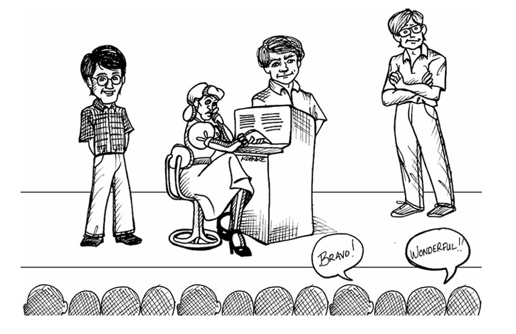

 

# بله گفتن

می‌دانستید که من مخترع ویس‌میل هستم؟ واقعاً همین‌طور است. البته در حقیقت سه نفر بودیم که پتنت ویس‌میل به نام‌مان ثبت شد: کن فایندر، جری فیتزپاتریک و من. این اتفاق اوایل دههٔ ۸۰ میلادی افتاد و ما برای شرکتی به نام Teradyne کار می‌کردیم. مدیرعامل شرکت از ما خواسته بود محصولی از نوعی کاملاً جدید طراحی کنیم و ما «منشی الکترونیکی» یا به اختصار ER را اختراع کردیم.

همهٔ شما می‌دانید ER چیست. ER یکی از همان دستگاه‌های افتضاحی است که تلفن شرکت‌ها را جواب می‌دهد و از شما انواع سؤال‌های بی‌مغز می‌پرسد که باید با فشردن دکمه‌ها جوابشان بدهید. («برای انگلیسی، عدد ۱ را فشار دهید.»)

ER ما تلفن شرکت را جواب می‌داد و از شما می‌خواست نام فرد موردنظر را شماره‌گیری کنید. بعد از شما می‌خواست نام خودتان را تلفظ کنید و سپس با آن شخص تماس می‌گرفت. تماس را معرفی می‌کرد و می‌پرسید که آیا باید پذیرفته شود یا نه. اگر پاسخ مثبت بود، تماس را وصل می‌کرد و کنار می‌رفت.

می‌توانستید به ER بگویید کجا هستید. می‌توانستید چند شماره تلفن به آن بدهید تا امتحان کند. اگر در دفتر شخص دیگری بودید، ER شما را پیدا می‌کرد. اگر خانه بودید، پیدایتان می‌کرد. اگر در شهر دیگری بودید، باز هم پیدایتان می‌کرد. و در نهایت، اگر ER نمی‌توانست شما را پیدا کند، پیام می‌گرفت. این‌جا بود که ویس‌میل وارد ماجرا می‌شد.

به‌طرز عجیبی، Teradyne نتوانست بفهمد چطور باید ER را بفروشد. بودجهٔ پروژه تمام شد و پروژه به چیزی تبدیل شد که بلد بودیم بفروشیم—CDS، یعنی Craft Dispatch System، سیستمی برای اعزام تعمیرکاران تلفن به مأموریت بعدی‌شان. Teradyne همچنین بدون این‌که به ما خبر بدهد، پتنت را هم رها کرد! (!) صاحب فعلی پتنت سه ماه بعد از ما درخواست ثبت داده بود. (!!)¹

مدت‌ها بعد از تبدیل ER به CDS، اما خیلی پیش از آن‌که بفهمم پتنت کنار گذاشته شده، یک روز در یک درخت منتظر مدیرعامل شرکت ماندم. جلوی ساختمان یک درخت بلوط بزرگ بود. از آن بالا رفتم و منتظر شدم جگوارش از راه برسد. جلوی در با او روبه‌رو شدم و چند دقیقه وقت خواستم. قبول کرد.

به او گفتم واقعاً لازم است پروژهٔ ER را دوباره راه بیندازیم. گفتم مطمئنم می‌تواند پول‌ساز باشد. او با گفتن این جمله غافلگیرم کرد:
«باشه باب، یک برنامه آماده کن. نشان بده چطور می‌توانم ازش پول دربیاورم. اگر این کار را بکنی و من هم باورش کنم، پروژهٔ ER را دوباره راه می‌اندازم.»

منتظر چنین پاسخی نبودم. انتظار داشتم بگوید: «حق با توست باب. پروژه را دوباره شروع می‌کنم و خودم راه پول‌سازی‌اش را پیدا می‌کنم.»
اما نه. بار مسئولیت را انداخت گردن من. و این مسئولیتی بود که نسبت به آن دودل بودم. بالاخره من آدم نرم‌افزار بودم، نه آدم پول. می‌خواستم روی پروژهٔ ER کار کنم، نه این‌که مسئول سود و زیان باشم. اما نمی‌خواستم دودلی‌ام را نشان بدهم. پس از او تشکر کردم و با این جمله از دفترش بیرون آمدم:

«ممنون راس. من متعهدم… فکر کنم.»

و با همین، اجازه بدهید شما را با روی اوشروو آشنا کنم؛ کسی که توضیح خواهد داد این جمله چقدر رقت‌انگیز بوده است.

---

## زبان تعهد

**نوشتهٔ روی اوشروو**

**بگو. منظور داشته باش. انجام بده.**

تعهد سه بخش دارد:

1. می‌گویی که انجامش می‌دهی.
2. واقعاً منظورت همین است.
3. واقعاً انجامش می‌دهی.

اما چند وقت یک‌بار با آدم‌هایی روبه‌رو می‌شویم (البته نه خودمان!) که هرگز هر سه مرحله را با هم طی نمی‌کنند؟

* از مسئول IT می‌پرسی چرا شبکه این‌قدر کند است و او می‌گوید: «آره، واقعاً باید چند تا روتر جدید بخریم.» و تو می‌دانی هیچ‌وقت اتفاقی در این زمینه نمی‌افتد.
* از یکی از اعضای تیم می‌خواهی قبل از کامیت، چند تست دستی اجرا کند. جواب می‌دهد: «حتماً. امیدوارم تا آخر روز برسم.» و somehow حس می‌کنی فردا باید دوباره بپرسی آیا واقعاً تستی انجام شده یا نه.
* رئیست وارد اتاق می‌شود و زیرلب می‌گوید: «باید سریع‌تر حرکت کنیم.» و تو می‌دانی منظورش واقعاً این است که *تو* باید سریع‌تر شوی. خودش قرار نیست کاری بکند.

خیلی کم‌اند کسانی که وقتی چیزی می‌گویند، هم واقعاً منظورشان است و هم واقعاً انجامش می‌دهند. بعضی‌ها می‌گویند و منظورشان هم هست، اما هرگز انجامش نمی‌دهند. و خیلی بیشتر از آن‌ها، کسانی هستند که قول می‌دهند، بدون این‌که حتی قصد انجامش را داشته باشند. تا حالا شنیده‌اید کسی بگوید: «واقعاً باید وزن کم کنم»، و شما بدانید که هیچ کاری قرار نیست بکند؟ این اتفاق دائماً می‌افتد.

چرا این حس عجیب همیشه با ماست که اغلب آدم‌ها واقعاً متعهد نیستند کاری را به سرانجام برسانند؟

بدتر از آن، گاهی شهود ما هم اشتباه می‌کند. گاهی دوست داریم باور کنیم کسی واقعاً منظورش همان است که می‌گوید، در حالی که نیست. دوست داریم باور کنیم برنامه‌نویسی که تحت فشار گیر افتاده می‌گوید می‌تواند کاری دو‌هفته‌ای را در یک هفته تمام کند—اما نباید.

به‌جای اعتماد به حس درونی، می‌توانیم از چند ترفند زبانی استفاده کنیم تا بفهمیم آیا مردم واقعاً منظورشان همان است که می‌گویند یا نه. و با تغییر دادن زبان خودمان، می‌توانیم دست‌کم دو مرحلهٔ اول تعهد—گفتن و منظور داشتن—را در خودمان اصلاح کنیم.

---

## تشخیص نبودِ تعهد

باید به زبانی که هنگام متعهد شدن استفاده می‌کنیم توجه کنیم؛ این زبان نشانهٔ روشنی از آینده است. در واقع، مسئله پیدا کردن کلمات مشخصی در حرف‌هاست. اگر آن کلمات جادویی کوچک را پیدا نکنید، احتمالاً یا واقعاً منظورمان نیست، یا خودمان هم باور نداریم که شدنی باشد.

نمونه‌هایی از کلمات و عبارت‌هایی که نشانهٔ نبود تعهد هستند:

* **باید / لازم است**: «باید این کار انجام شود.» «لازم است وزن کم کنم.» «یکی باید این کار را بکند.»
* **امیدوارم / کاش**: «امیدوارم تا فردا انجامش بدهم.» «امیدوارم یک روز دوباره همدیگر را ببینیم.» «کاش وقتش را داشتم.»
* **بیایید** (بدون «من…»): «بیایید یه وقتی همدیگر را ببینیم.» «بیایید این کار را تمام کنیم.»

وقتی شروع کنید دنبال این کلمات گشتن، می‌بینید تقریباً همه‌جا هستند—حتی در حرف‌هایی که خودتان به دیگران می‌زنید. ما معمولاً خیلی سرتاپا مشغولِ مسئولیت‌پذیر نبودن هستیم.

و این وقتی که شما یا شخص دیگری به این وعده‌ها به‌عنوان بخشی از کار تکیه کرده، اصلاً قابل قبول نیست. با این حال، شما قدم اول را برداشته‌اید: تشخیص نبود تعهد، هم در اطراف‌تان و هم در خودتان.

---

## تعهد واقعی چه صدایی دارد؟

وجه مشترک عبارت‌های بخش قبل این است که یا فرض می‌کنند امور خارج از کنترل «من» است، یا مسئولیت شخصی را نمی‌پذیرند. در همهٔ این موارد، آدم‌ها طوری رفتار می‌کنند که انگار قربانی شرایط‌اند، نه کنترل‌کنندهٔ آن.

حقیقت این است که شما، به‌عنوان یک فرد، **همیشه** چیزی دارید که تحت کنترل خودتان است. پس همیشه کاری هست که بتوانید کاملاً به انجامش متعهد شوید.

راز تشخیص تعهد واقعی این است که دنبال جمله‌هایی از این جنس بگردید:
**«من این کار را تا فلان زمان انجام می‌دهم.»**

چرا این جمله مهم است؟ چون دارید واقعیتی را دربارهٔ کاری که *خودتان* انجام خواهید داد، با یک زمان پایان مشخص بیان می‌کنید. دربارهٔ هیچ‌کس جز خودتان حرف نمی‌زنید. دربارهٔ عملی صحبت می‌کنید که انجامش خواهید داد—نه «شاید»، نه «ممکن است»؛ *خواهید داد*.

از نظر فنی، راه گریزی از این تعهد زبانی وجود ندارد. شما گفتید انجامش می‌دهید، و حالا فقط دو حالت وجود دارد: یا انجام می‌شود یا نمی‌شود. اگر انجام نشود، دیگران می‌توانند شما را بابت وعده‌تان بازخواست کنند. خودتان هم از انجام ندادنش حس بدی خواهید داشت. و توضیح دادنش برایتان awkward خواهد بود—اگر آن شخص وعده‌تان را شنیده باشد.

ترسناک است، نه؟

شما دارید در برابر دست‌کم یک نفر دیگر، مسئولیت کامل را می‌پذیرید. نه جلوی آینه، نه جلوی صفحهٔ کامپیوتر؛ بلکه رو‌در‌روی یک انسان دیگر، و می‌گویید انجامش می‌دهم. این آغاز تعهد است—قرار دادن خودتان در موقعیتی که شما را مجبور به انجام کار می‌کند.

با تغییر زبان‌تان به زبان تعهد، عبور از دو مرحلهٔ بعدی—منظور داشتن و عمل کردن—آسان‌تر می‌شود.

---

## چرا ممکن است نتوانید پای تعهد بمانید؟

**۱. چون انجام کار به شخص دیگری وابسته است**
شما فقط می‌توانید به کارهایی متعهد شوید که کاملاً تحت کنترل خودتان است. اگر هدف نهایی به تیم دیگری وابسته است، نمی‌توانید به نتیجهٔ نهایی متعهد شوید؛ اما می‌توانید به اقدام‌های مشخصی متعهد شوید که شما را به هدف نزدیک می‌کند.

**۲. چون نمی‌دانید اصلاً شدنی هست یا نه**
حتی در این حالت هم می‌توانید به اقدام‌هایی متعهد شوید که مشخص کند شدنی است یا نه. فهمیدنِ شدنی بودن، خودش می‌تواند یک تعهد باشد.

**۳. چون گاهی واقعاً نمی‌رسید**
این اتفاق می‌افتد. زندگی است. اما در این حالت، مهم‌ترین کار این است که هرچه زودتر انتظارها را تغییر دهید. اگر نمی‌توانید به تعهدتان برسید، باید در اولین فرصت پرچم قرمز را بالا ببرید.

هرچه زودتر همهٔ ذی‌نفعان را در جریان بگذارید، احتمال این‌که تیم بتواند توقف کند، دوباره ارزیابی کند و تصمیم بهتری بگیرد بیشتر است. با این کار، یا تعهدتان همچنان عملی می‌شود، یا به تعهد دیگری تغییر می‌کند.

---

## جمع‌بندی

ساختن یک «زبان تعهد» شاید کمی ترسناک به نظر برسد، اما می‌تواند بسیاری از مشکلات ارتباطی برنامه‌نویسان امروز—برآوردها، ضرب‌الاجل‌ها و سوءتفاهم‌های رو‌در‌رو—را حل کند. دیگران شما را به‌عنوان یک توسعه‌دهندهٔ جدی خواهند دید که پای حرفش می‌ایستد، و این یکی از بهترین چیزهایی است که می‌توانید در این صنعت به آن امیدوار باشید.

---

¹ البته پتنت هیچ ارزشی برای من نداشت؛ طبق قرارداد کاری‌ام آن را به قیمت یک دلار به Teradyne فروخته بودم (و همان یک دلار را هم نگرفتم).

---

## یاد گرفتن «بله» گفتن

از روی خواستم آن مقاله را بنویسد چون عمیقاً به دلم نشست. مدتی بود که مدام دربارهٔ یاد گرفتن «نه» گفتن حرف می‌زدم؛ اما یاد گرفتن «بله» گفتن هم به همان اندازه مهم است.

---

## روی دیگرِ «سعی کردن»

فرض کنیم پیتر مسئول چند تغییر در موتور محاسبهٔ امتیاز (rating engine) است. او در ذهن خودش برآورد کرده که این تغییرات پنج یا شش روز زمان می‌برد. فکر می‌کند نوشتن مستندات این تغییرات هم چند ساعت بیشتر طول نکشد. صبح دوشنبه، مدیرش مارژ از او وضعیت کار را می‌پرسد.

**Marge:** «پیتر، تا جمعه تغییرات موتور امتیازدهی را تمام می‌کنی؟»
**Peter:** «فکر می‌کنم شدنی باشد.»

**Marge:** «مستندات هم شاملش می‌شود؟»
**Peter:** «سعی می‌کنم آن را هم انجام بدهم.»

شاید مارژ تردید موجود در حرف‌های پیتر را نشنود، اما پیتر عملاً هیچ تعهد جدی‌ای نمی‌دهد. مارژ سؤال‌هایی می‌پرسد که جواب باینری (بله/خیر) می‌خواهند، اما جواب‌های باینری پیتر مه‌آلود و مبهم‌اند.

به سوءاستفاده از کلمهٔ «سعی» توجه کنید. در فصل قبل از تعریف «تلاشِ اضافه» برای try استفاده کردیم. این‌جا پیتر از تعریف «شاید بشود، شاید نشود» استفاده می‌کند.

پیتر بهتر بود این‌طور جواب بدهد:

**Marge:** «پیتر، تا جمعه تغییرات موتور امتیازدهی را تمام می‌کنی؟»
**Peter:** «احتمالاً، اما ممکن است به دوشنبه بکشد.»
**Marge:** «مستندات هم شاملش می‌شود؟»
**Peter:** «مستندات چند ساعت دیگر وقت می‌گیرد، پس دوشنبه ممکن است، ولی شاید تا سه‌شنبه هم طول بکشد.»

در این حالت زبان پیتر صادقانه‌تر است. او دارد عدم قطعیت خودش را برای مارژ توضیح می‌دهد. ممکن است مارژ بتواند با این عدم قطعیت کنار بیاید؛ ممکن هم هست نتواند.

---

## تعهد با انضباط

**Marge:** «پیتر، من به یک بله یا خیرِ قطعی نیاز دارم. آیا تا جمعه موتور امتیازدهی را تمام‌شده و مستندسازی‌شده تحویل می‌دهی؟»

این سؤال کاملاً منصفانه است. مارژ برنامه‌ای دارد که باید حفظش کند و به یک پاسخ باینری دربارهٔ جمعه نیاز دارد. پیتر چه جوابی باید بدهد؟

**Peter:** «در این صورت، مارژ، مجبورم بگویم نه. زودترین زمانی که می‌توانم مطمئن باشم تغییرات و مستندات تمام می‌شوند، سه‌شنبه است.»

**Marge:** «پس متعهد می‌شوی به سه‌شنبه؟»
**Peter:** «بله، سه‌شنبه همه‌چیز آماده خواهد بود.»

اما اگر مارژ واقعاً به این تغییرات و مستندات تا جمعه نیاز داشته باشد چه؟

**Marge:** «پیتر، سه‌شنبه برایم مشکل جدی ایجاد می‌کند. ویلی، نویسندهٔ فنی ما، دوشنبه در دسترس است و پنج روز وقت دارد راهنمای کاربر را تمام کند. اگر تا صبح دوشنبه مستندات موتور امتیازدهی را نداشته باشد، هرگز به موقع نمی‌رسد. می‌توانی اول مستندات را بنویسی؟»

**Peter:** «نه، اول باید تغییرات انجام شود، چون مستندات را از خروجی تست‌ها تولید می‌کنیم.»

**Marge:** «خب، هیچ راهی نیست که هم تغییرات و هم مستندات تا قبل از صبح دوشنبه تمام شود؟»

حالا پیتر باید تصمیم بگیرد. احتمال خوبی وجود دارد که تغییرات موتور امتیازدهی را تا جمعه تمام کند و شاید حتی بتواند قبل از آخر هفته مستندات را هم جمع کند. اگر کار طولانی‌تر شد، می‌تواند چند ساعت هم شنبه کار کند. پس چه باید به مارژ بگوید؟

**Peter:** «ببین مارژ، اگر شنبه چند ساعت اضافه‌کار بمانم، احتمال خوبی هست که تا صبح دوشنبه همه‌چیز تمام شود.»

آیا این مشکل مارژ را حل می‌کند؟ نه. فقط شانس‌ها را تغییر می‌دهد، و این دقیقاً همان چیزی است که پیتر باید به او بگوید.

**Marge:** «پس می‌توانم روی صبح دوشنبه حساب کنم؟»
**Peter:** «احتمالاً، اما قطعی نیست.»

این ممکن است برای مارژ کافی نباشد.

**Marge:** «پیتر، واقعاً به یک جواب قطعی نیاز دارم. هیچ راهی نیست که متعهد شوی این کار تا قبل از صبح دوشنبه تمام شود؟»

در این‌جا پیتر ممکن است وسوسه شود انضباط حرفه‌ای را کنار بگذارد. شاید اگر تست‌ها را ننویسد، سریع‌تر تمام کند. شاید اگر ریفکتور نکند، سریع‌تر تمام کند. شاید اگر کل تست‌های رگرسیون را اجرا نکند، زودتر تمام شود.

---

## جایی که حرفه‌ای خط می‌کشد

این‌جا همان‌جایی است که فرد حرفه‌ای خط قرمز می‌کشد. اول از همه، فرض‌های پیتر غلط است. بدون نوشتن تست‌ها سریع‌تر تمام نخواهد کرد. بدون ریفکتور سریع‌تر تمام نخواهد کرد. حذف اجرای کامل تست‌های رگرسیون هم او را سریع‌تر نمی‌کند. سال‌ها تجربه به ما یاد داده که شکستن انضباط‌ها فقط کار را کندتر می‌کند.

دوم این‌که، پیتر به‌عنوان یک حرفه‌ای مسئول حفظ استانداردهای مشخصی است. کد او باید تست‌شده باشد و تست داشته باشد. کدش باید تمیز باشد. و باید مطمئن شود هیچ بخش دیگری از سیستم را خراب نکرده است.

پیتر، به‌عنوان یک حرفه‌ای، از قبل متعهد شده این استانداردها را حفظ کند. همهٔ تعهدهای دیگر او باید تابع این تعهد باشند. پس کل این خط استدلال باید کنار گذاشته شود.

**Peter:** «نه مارژ، واقعاً هیچ راهی نیست که بتوانم دربارهٔ تاریخی قبل از سه‌شنبه مطمئن باشم. متأسفم اگر برنامه‌ات به هم می‌ریزد، اما این واقعیتی است که با آن روبه‌رو هستیم.»

**Marge:** «لعنتی. واقعاً روی این حساب کرده بودم که زودتر تمام شود. مطمئنی؟»
**Peter:** «مطمئنم که ممکن است تا سه‌شنبه طول بکشد، بله.»
**Marge:** «باشه، فکر کنم بروم با ویلی صحبت کنم ببینم می‌تواند برنامه‌اش را جابه‌جا کند یا نه.»

در این حالت، مارژ پاسخ پیتر را می‌پذیرد و دنبال گزینه‌های دیگر می‌گردد. اما اگر همهٔ گزینه‌های مارژ تمام شده باشد چه؟ اگر پیتر آخرین امید باشد چه؟

**Marge:** «پیتر، می‌دانم درخواست خیلی بزرگی است، اما واقعاً لازم دارم somehow راهی پیدا کنی که این کار تا صبح دوشنبه تمام شود. این موضوع واقعاً حیاتی است. هیچ کاری از دستت برنمی‌آید؟»

حالا پیتر به اضافه‌کاری جدی و احتمالاً کار کردن در بیشتر آخر هفته فکر می‌کند. باید با خودش کاملاً صادق باشد دربارهٔ توان و ذخایر انرژی‌اش. گفتنِ این‌که آخر هفته خیلی کار می‌کنم آسان است؛ اما واقعاً داشتن انرژی کافی برای کارِ باکیفیت خیلی سخت‌تر است.

حرفه‌ای‌ها حد و مرزهای خودشان را می‌شناسند. می‌دانند چه مقدار اضافه‌کاری را می‌توانند مؤثر اعمال کنند و هزینه‌اش چیست.

در این مورد، پیتر نسبتاً مطمئن است که چند ساعت اضافه در طول هفته و مقداری کار در آخر هفته کافی خواهد بود.

**Peter:** «باشه مارژ، این‌طور بگویم. با خانه تماس می‌گیرم و اضافه‌کاری را با خانواده هماهنگ می‌کنم. اگر آن‌ها مشکلی نداشتند، این کار را تا صبح دوشنبه تمام می‌کنم. حتی صبح دوشنبه هم می‌آیم شرکت تا مطمئن شوم همه‌چیز با ویلی روان پیش می‌رود. اما بعدش می‌روم خانه و تا چهارشنبه برنمی‌گردم. قبول؟»

این کاملاً منصفانه است. پیتر می‌داند اگر اضافه‌کاری کند می‌تواند تغییرات و مستندات را تمام کند. و می‌داند که بعد از آن، یکی دو روز کاملاً از کار افتاده خواهد بود.

---

## جمع‌بندی

حرفه‌ای‌ها مجبور نیستند به هر چیزی که از آن‌ها خواسته می‌شود بله بگویند.
اما باید تمام تلاش‌شان را بکنند تا راه‌های خلاقانه‌ای برای ممکن کردن «بله» پیدا کنند.
و وقتی حرفه‌ای‌ها «بله» می‌گویند، از **زبان تعهد** استفاده می‌کنند—به شکلی که هیچ تردیدی دربارهٔ آنچه وعده داده‌اند باقی نماند.
