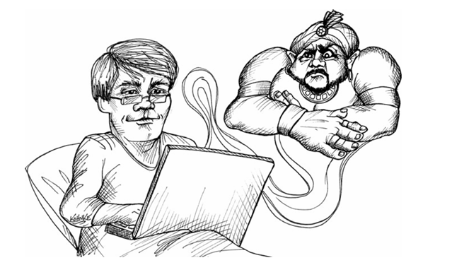

 <div align="center">


</div>

# تمرین کردن

تمام حرفه‌ای‌ها هنر خود را با انجام تمرینات برای تقویت مهارت‌هایشان تمرین می‌کنند. موسیقی‌دان‌ها مقیاس‌ها را تمرین می‌کنند. بازیکنان فوتبال از حلقه‌ها عبور می‌کنند. پزشکان بخیه‌ها و تکنیک‌های جراحی را تمرین می‌کنند. وکلا استدلال‌ها را تمرین می‌کنند. سربازان مأموریت‌ها را تمرین می‌کنند. وقتی عملکرد اهمیت دارد، حرفه‌ای‌ها تمرین می‌کنند. این فصل تماماً در مورد راه‌هایی است که برنامه‌نویسان می‌توانند هنر خود را تمرین کنند.

**پیشینه‌ای در مورد تمرین کردن**

تمرین کردن یک مفهوم جدید در توسعه نرم‌افزار نیست، اما ما آن را تا اوایل هزاره جدید به‌عنوان تمرین به رسمیت نمی‌شناختیم. شاید اولین نمونه رسمی از یک برنامه تمرینی در صفحه ۶ کتاب [K&R-C] چاپ شده بود.

```c
main()
{
  printf("hello, world\n");
}
```

کدام‌یک از ما این برنامه را به شکلی ننوشته‌ایم؟ ما از آن برای اثبات یک محیط جدید یا زبان جدید استفاده می‌کنیم. نوشتن و اجرای این برنامه اثباتی است برای اینکه نشان دهد می‌توانیم هر برنامه‌ای را بنویسیم و اجرا کنیم.

وقتی که بسیار جوان‌تر بودم، یکی از اولین برنامه‌هایی که روی کامپیوتر جدیدم می‌نوشتم، برنامه‌ای بود برای محاسبه مربعات اعداد صحیح. آن را در زبان‌های اسمبلی، BASIC، FORTRAN، COBOL و بسیاری دیگر نوشتم. دوباره، این یک روش برای اثبات این بود که می‌توانم کامپیوتر را وادار کنم که کاری را که می‌خواهم انجام دهد.

در اوایل دهه ۸۰، کامپیوترهای شخصی برای اولین بار در فروشگاه‌های بزرگ به نمایش درآمدند. هر وقت یکی از این دستگاه‌ها را می‌دیدم، مانند VIC-20، Commodore-64 یا TRS-80، یک برنامه کوچک می‌نوشتم که یک جریان بی‌پایان از کاراکترهای ‘\’ و ‘/’ را روی صفحه نمایش می‌داد. الگوهایی که این برنامه ایجاد می‌کرد، برای چشم دلنشین بودند و بسیار پیچیده‌تر از برنامه‌ای که آن‌ها را تولید کرده بود به نظر می‌رسیدند.

گرچه این برنامه‌های کوچک به‌طور قطع برنامه‌های تمرینی بودند، اما برنامه‌نویسان به‌طور کلی تمرین نمی‌کردند. راستش به ذهن‌مان نمی‌رسید. ما خیلی مشغول نوشتن کد بودیم که به تمرین مهارت‌هایمان فکر کنیم. و علاوه بر این، تمرین چه فایده‌ای داشت؟ در آن سال‌ها برنامه‌نویسی به واکنش‌های سریع یا انگشتان چابک نیاز نداشت. ما تا اواخر دهه ۷۰ از ویرایشگرهای صفحه استفاده نمی‌کردیم. بخش زیادی از زمان‌مان را صرف انتظار برای کامپایل یا اشکال‌زدایی از قطعات طولانی کد می‌کردیم. ما هنوز چرخه‌های کوتاه TDD را اختراع نکرده بودیم، بنابراین به ظرافت‌هایی که تمرین می‌تواند به ارمغان آورد، نیاز نداشتیم.

**برخی پیشینه‌ها در مورد تمرین کردن**

اما چیزها از روزهای ابتدایی برنامه‌نویسی تغییر کرده‌اند. برخی چیزها به‌شدت تغییر کرده‌اند. برخی چیزها همچنان کم و بیش ثابت مانده‌اند.

یکی از اولین ماشین‌هایی که برای آن برنامه نوشتم، PDP-8/I بود. این دستگاه دارای زمان چرخه 1.5 میکروثانیه بود. ۴۰۹۶ کلمه ۱۲ بیتی در حافظه اصلی داشت. اندازه‌ای به اندازه یخچال داشت و مصرف انرژی قابل توجهی داشت. یک درایو دیسک داشت که می‌توانست 32K کلمه ۱۲ بیتی ذخیره کند و با یک تله‌تایپ با سرعت ۱۰ کاراکتر در ثانیه با آن ارتباط برقرار می‌کردیم. ما فکر می‌کردیم این دستگاه بسیار قدرتمند است و از آن برای انجام معجزات استفاده می‌کردیم.

من اخیراً یک لپ‌تاپ جدید Macbook Pro خریدم. این لپ‌تاپ دارای پردازنده دو هسته‌ای ۲.۸ گیگاهرتزی، ۸ گیگابایت رم، یک SSD با ظرفیت ۵۱۲ گیگابایت و صفحه نمایش 17 اینچی با وضوح 1920×1200 است. من آن را در کوله‌پشتی‌ام حمل می‌کنم. روی پایم قرار می‌گیرد. کمتر از ۸۵ وات مصرف می‌کند.

لپ‌تاپ من هشت هزار برابر سریع‌تر است، دو میلیون برابر حافظه بیشتر دارد، شانزده میلیون برابر فضای ذخیره‌سازی آفلاین بیشتر دارد، ۱٪ از انرژی را مصرف می‌کند، ۱٪ از فضای دستگاه PDP-8/I را اشغال می‌کند و یک بیست و پنج‌ام قیمت آن را دارد. بیایید ریاضی کنیم:

۸۰۰۰ × ۲,۰۰۰,۰۰۰ × ۱۶,۰۰۰,۰۰۰ × ۱۰۰ × ۱۰۰ × ۲۵ = ۶.۴ × ۱۰²²

این عدد بسیار بزرگ است. ما در مورد ۲۲ مرتبه بزرگ‌تری صحبت می‌کنیم! این تعداد آنگستروم‌هاست که بین اینجا و آلفا قنطورس فاصله است. این تعداد الکترون‌هاست که در یک دلار نقره‌ای وجود دارند. این مقدار جرم زمین است که با واحدهای "مایکل مور" اندازه‌گیری می‌شود. این عدد بسیار، بسیار بزرگ است. و این عدد در دامن من است و احتمالاً در دامن شما هم هست!

اما من از این افزایش قدرت ۲۲ مرتبه بزرگی چه استفاده‌ای می‌کنم؟ تقریباً همان کاری را می‌کنم که با PDP-8/I انجام می‌دادم. من دستورات if، حلقه‌های while و تخصیص‌ها را می‌نویسم.

اووه، ابزارهای بهتری برای نوشتن این دستورات دارم. و زبان‌های بهتری برای نوشتن این دستورات دارم. اما ماهیت دستورات در تمام این سال‌ها تغییر نکرده است. کد در سال ۲۰۱۰ برای برنامه‌نویس‌های دهه ۶۰ قابل شناسایی خواهد بود. خاکی که ما با آن کار می‌کنیم در این چهار دهه تغییر زیادی نکرده است.

**زمان بازخورد**

اما شیوه کاری ما به‌طور چشمگیری تغییر کرده است. در دهه ۶۰ من می‌توانستم یک یا دو روز برای دیدن نتایج کامپایل صبر کنم. در اواخر دهه ۷۰، یک برنامه ۵۰,۰۰۰ خطی ممکن بود ۴۵ دقیقه طول بکشد تا کامپایل شود. حتی در دهه ۹۰، زمان‌های طولانی ساخت برنامه‌ها عادی بود.

امروزه برنامه‌نویسان برای کامپایل‌ها منتظر نمی‌مانند. برنامه‌نویسان امروز چنین قدرت عظیمی تحت دستان خود دارند که می‌توانند به سرعت در حلقه‌ی قرمز-سبز-رفاکتور بچرخند.

برای مثال، من روی یک پروژه ۶۴,۰۰۰ خطی جاوا به نام FitNesse کار می‌کنم. یک ساخت کامل، شامل تمام تست‌های واحد و یکپارچه، در کمتر از ۴ دقیقه اجرا می‌شود. اگر این تست‌ها پاس شوند، من آماده‌ی ارسال محصول هستم. بنابراین، کل فرآیند تضمین کیفیت، از کد منبع تا استقرار، کمتر از ۴ دقیقه طول می‌کشد. کامپایل‌ها تقریباً هیچ زمان قابل اندازه‌گیری ندارند. تست‌های جزئی تنها چند ثانیه طول می‌کشند. بنابراین من می‌توانم به طور واقعی ده بار در دقیقه در حلقه‌ی کامپایل/تست بچرخم!

این همیشه عاقلانه نیست که به این سرعت حرکت کنید. اغلب بهتر است که کمی کندتر حرکت کرده و فقط فکر کنید. اما در برخی مواقع چرخیدن در این حلقه با سریع‌ترین سرعت ممکن، می‌تواند بسیار مولد باشد.

انجام هر کاری سریع نیاز به تمرین دارد. چرخیدن سریع در حلقه کد/تست نیازمند تصمیم‌گیری‌های بسیار سریع است. تصمیم‌گیری سریع به این معناست که شما باید بتوانید تعداد زیادی از موقعیت‌ها و مشکلات را شناسایی کرده و فقط بدانید که چه باید کرد تا آن‌ها را حل کنید.

تصور کنید دو هنرمند رزمی در حال مبارزه هستند. هرکدام باید تشخیص دهند که دیگری چه قصدی دارد و به سرعت به آن پاسخ دهند. در یک موقعیت مبارزه، شما نمی‌توانید زمان را متوقف کرده، موقعیت‌ها را مطالعه کرده و در مورد پاسخ مناسب فکر کنید. در یک موقعیت مبارزه، شما فقط باید واکنش نشان دهید. در حقیقت، بدن شما است که واکنش نشان می‌دهد در حالی که ذهن شما در حال کار کردن روی استراتژی‌های سطح بالاتر است.

1. واقعیت این است که برخی برنامه‌نویسان هنوز هم برای ساخت‌ها منتظر می‌مانند، این غم‌انگیز است و نشان‌دهنده‌ی بی‌دقتی است. در دنیای امروز، زمان‌های ساخت باید در ثانیه‌ها اندازه‌گیری شوند، نه دقیقه‌ها و قطعاً نه ساعت‌ها.

2. این تکنیکی است که ریچ هیکی آن را HDD یا "توسعه مبتنی بر چادر" می‌نامد.

---

**باشگاه کدنویسی**

وقتی که شما در حلقه کد/تست چندین بار در دقیقه می‌چرخید، بدن شما است که می‌داند چه کلیدهایی را فشار دهد. یک بخش ابتدایی از ذهن شما موقعیت را شناسایی می‌کند و در عرض چند میلی‌ثانیه به راه‌حل مناسب واکنش نشان می‌دهد در حالی که ذهن شما آزاد است تا بر مشکل‌های سطح بالاتر تمرکز کند.

در هر دو مورد، چه در مبارزات رزمی و چه در برنامه‌نویسی، سرعت بستگی به تمرین دارد. و در هر دو مورد تمرین مشابه است. ما یک مجموعه از جفت‌های مسئله/راه‌حل را انتخاب می‌کنیم و آن‌ها را بارها و بارها اجرا می‌کنیم تا آن‌ها را به‌خوبی یاد بگیریم.

تصور کنید یک گیتاریست مانند کارلوس سانتانا. موسیقی در ذهن او به راحتی از انگشتانش بیرون می‌آید. او روی موقعیت‌های انگشتان یا تکنیک انتخابی تمرکز نمی‌کند. ذهن او آزاد است که ملودی‌ها و هارمونی‌های سطح بالاتر را برنامه‌ریزی کند در حالی که بدن او این برنامه‌ها را به حرکات انگشتی سطح پایین ترجمه می‌کند.

اما برای رسیدن به این نوع راحتی در نوازندگی، نیاز به تمرین است. موسیقیدان‌ها مقیاس‌ها و تمرین‌های پیچیده و ریف‌ها را بارها و بارها تمرین می‌کنند تا آن‌ها را به‌خوبی یاد بگیرند.

---

**باشگاه کدنویسی**

از سال ۲۰۰۱ من یک نمایش TDD را به نام "بازی بولینگ" اجرا می‌کنم. این یک تمرین کوچک و زیباست که حدود ۳۰ دقیقه طول می‌کشد. در طراحی آن تضاد وجود دارد، به اوج می‌رسد و با یک شگفتی به پایان می‌رسد. من یک فصل کامل در مورد این مثال در [PPP2003] نوشته‌ام.

در طول سال‌ها این نمایش را صدها، شاید هزاران بار اجرا کرده‌ام. من در آن بسیار خوب شدم! می‌توانستم آن را در خواب هم انجام دهم. تعداد فشارهای کلید را به حداقل رساندم، نام‌های متغیرها را تنظیم کردم و ساختار الگوریتم را تا جایی که مناسب بود، تغییر دادم. گرچه در آن زمان نمی‌دانستم، این اولین کاتای من بود.

در سال ۲۰۰۵ در کنفرانس XP2005 در شفیلد، انگلستان شرکت کردم. در آنجا در یک جلسه با نام باشگاه کدنویسی شرکت کردم که توسط لوران بوساویت و امانوئل گایو انجام می‌شد. آن‌ها از همه خواستند که لپ‌تاپ‌هایشان را باز کرده و همراه با آن‌ها کدنویسی کنند در حالی که آن‌ها از TDD برای نوشتن بازی زندگی کانوی استفاده می‌کردند. آن‌ها آن را "کاتا" نامیدند و "دیوی" دِیو توماس را به‌عنوان ایده اصلی آن معرفی کردند.

از آن زمان بسیاری از برنامه‌نویسان از تمثیل هنرهای رزمی برای جلسات تمرین خود استفاده کرده‌اند. نام "باشگاه کدنویسی" به نظر می‌رسد که تثبیت شده باشد. گاهی اوقات گروهی از برنامه‌نویسان گرد هم می‌آیند و مانند هنرمندان رزمی تمرین می‌کنند. در مواقع دیگر، برنامه‌نویسان به‌تنهایی تمرین می‌کنند، باز هم همانند هنرمندان رزمی.

حدود یک سال پیش، من در حال تدریس به یک گروه از توسعه‌دهندگان در اوماها بودم. در ناهار از من دعوت کردند که به باشگاه کدنویسی آن‌ها بپیوندم. من تماشا کردم که بیست توسعه‌دهنده لپ‌تاپ‌های خود را باز کرده‌اند و به‌طور گام‌به‌گام با رهبر که در حال انجام کاتای بازی بولینگ بود، همراه شدند.

---

**کاتا**

در هنرهای رزمی، کاتا مجموعه‌ای دقیق از حرکات هماهنگ است که یک طرف مبارزه را شبیه‌سازی می‌کند. هدف، که به‌طور تقریبی به آن نزدیک می‌شویم، کمال است. هنرمند تلاش می‌کند بدن خود را آموزش دهد تا هر حرکت را به‌طور بی‌نقص انجام دهد و این حرکات را به‌صورت روان و ترکیب‌شده اجرا کند. کاتای به‌خوبی اجرا شده، تماشای زیبایی دارند.

گرچه این‌ها زیبا هستند، هدف از یادگیری کاتا انجام آن در صحنه نیست. هدف این است که ذهن و بدن شما را آموزش دهید تا در موقعیت خاصی از مبارزه واکنش نشان دهید. هدف این است که حرکات کمال‌یافته به‌طور خودکار و غریزی در دسترس شما باشند تا زمانی که به آن‌ها نیاز دارید.

کاتای برنامه‌نویسی مجموعه‌ای دقیق از فشارهای کلید و حرکات ماوس است که شبیه‌سازی می‌کند یک مشکل برنامه‌نویسی را حل کند. شما در واقع مشکل را حل نمی‌کنید چون قبلاً راه‌حل را می‌دانید. بلکه شما در حال تمرین حرکات و تصمیمات مربوط به حل مشکل هستید.

---

بسیاری از کاتاها در [katas.softwarecraftsmanship.org](http://katas.softwarecraftsmanship.org) ثبت شده‌اند. برخی دیگر را می‌توانید در [codekata.pragprog.com](http://codekata.pragprog.com) پیدا کنید. برخی از کاتای مورد علاقه من عبارتند از:

* بازی بولینگ: [لینک](http://butunclebob.com/ArticleS.UncleBob.TheBowlingGameKata)
* عوامل اول: [لینک](http://butunclebob.com/ArticleS.UncleBob.ThePrimeFactorsKata)
* پیچیدن کلمات: [لینک](http://thecleancoder.blogspot.com/2010/10/craftsman-62-darkpath.html)

---

**واسا (WASA)**

زمانی که در ژوژیتسو تمرین می‌کردم، بخش زیادی از وقت خود را در دوجو صرف تمرین **واسا** می‌کردیم. واسا بسیار شبیه یک کاتای دو نفره است. حرکات به طور دقیق حفظ می‌شوند و اجرا می‌شوند. یک نفر نقش مهاجم را بازی می‌کند و نفر دیگر نقش مدافع را. این حرکات بارها و بارها تکرار می‌شوند و در حین آن، نفرات نقش‌ها را عوض می‌کنند.

برنامه‌نویسان می‌توانند به شیوه‌ای مشابه با استفاده از بازی‌ای به نام **پینگ پنگ** تمرین کنند. دو شریک یک کاتا یا مشکل ساده را انتخاب می‌کنند. یکی از برنامه‌نویسان یک تست واحد می‌نویسد و سپس دیگری باید آن را پاس کند. سپس نقش‌ها عوض می‌شود.

اگر شرکا یک کاتای استاندارد را انتخاب کنند، نتیجه از قبل مشخص است و برنامه‌نویسان در حال تمرین و نقد تکنیک‌های تایپ و موس خود و اینکه چقدر کاتا را حفظ کرده‌اند هستند. از طرف دیگر، اگر شرکا یک مشکل جدید برای حل انتخاب کنند، بازی می‌تواند کمی جالب‌تر شود. برنامه‌نویس نویسنده تست کنترل زیادی بر نحوه حل مشکل دارد. او همچنین قدرت زیادی برای تنظیم محدودیت‌ها دارد. به عنوان مثال، اگر برنامه‌نویسان تصمیم به پیاده‌سازی الگوریتم مرتب‌سازی بگیرند، نویسنده تست می‌تواند محدودیت‌هایی در سرعت و فضای حافظه تعیین کند که چالش‌برانگیز خواهد بود. این می‌تواند بازی را رقابتی... و سرگرم‌کننده کند.

**راندوری (RANDORI)**

راندوری مبارزه آزاد است. در دوجوی ژوژیتسو، ما سناریوهای مختلف مبارزه را تنظیم می‌کردیم و سپس آن‌ها را اجرا می‌کردیم. گاهی یک نفر موظف می‌شد که دفاع کند، در حالی که بقیه ما به ترتیب به او حمله می‌کردیم. گاهی اوقات دو یا بیشتر از مهاجمان را علیه یک مدافع (معمولاً سنسی که تقریباً همیشه برنده می‌شد) قرار می‌دادیم. گاهی اوقات دو نفر در برابر دو نفر مبارزه می‌کردند و غیره.

مبارزه شبیه‌سازی شده به خوبی با برنامه‌نویسی سازگار نیست؛ با این حال، بازی‌ای وجود دارد که در بسیاری از دوجوهای برنامه‌نویسی به نام **راندوری** بازی می‌شود. این بازی بسیار شبیه واسای دو نفره است که در آن شرکا در حال حل یک مشکل هستند. با این حال، این بازی با حضور افراد زیاد انجام می‌شود و قوانین یک پیچ و تاب دارند. با نمایش صفحه روی دیوار، یک نفر تستی می‌نویسد و سپس می‌نشیند. نفر بعدی تست را پاس می‌کند و سپس تست بعدی را می‌نویسد. این کار می‌تواند به ترتیب دور میز انجام شود یا افراد به سادگی به ترتیب تمایل خود در صف قرار گیرند. در هر صورت این تمرین‌ها می‌توانند بسیار سرگرم‌کننده باشند.

**گسترش تجربه شما (BROADENING YOUR EXPERIENCE)**

شگفت‌انگیز است که از این جلسات چقدر می‌توانید بیاموزید. شما می‌توانید دیدگاه‌های زیادی از نحوه حل مسائل توسط دیگران کسب کنید. این دیدگاه‌ها تنها به گسترش رویکرد شما و بهبود مهارت شما کمک خواهند کرد.

برنامه‌نویسان حرفه‌ای اغلب از کمبود تنوع در نوع مسائلی که حل می‌کنند رنج می‌برند. کارفرمایان اغلب یک زبان، پلتفرم و حوزه خاص را برای کار برنامه‌نویسان خود اعمال می‌کنند. بدون داشتن تأثیر تنوع، این می‌تواند منجر به باریک شدن بسیار ناسالم رزومه و نگرش شما شود. معمولاً این برنامه‌نویسان خود را برای تغییراتی که به صورت دوره‌ای صنعت را فرا می‌گیرند، آماده نمی‌بینند.

**منبع باز (OPEN SOURCE)**

یکی از راه‌هایی که می‌توانید از پیشرفت‌های صنعت جلوتر بمانید این است که مانند وکلا و پزشکان عمل کنید: کارهای **پرو بونو** انجام دهید و به یک پروژه منبع باز کمک کنید. پروژه‌های زیادی وجود دارند و احتمالاً هیچ راهی بهتر از این نیست که مهارت‌های خود را افزایش دهید تا این که واقعاً روی چیزی کار کنید که دیگران به آن اهمیت می‌دهند.

پس اگر شما برنامه‌نویس جاوا هستید، به یک پروژه ریلس کمک کنید. اگر بیشتر C++ برای کارفرمای خود می‌نویسید، یک پروژه پایتون پیدا کنید و به آن کمک کنید.

**اخلاق تمرین (PRACTICE ETHICS)**

برنامه‌نویسان حرفه‌ای در زمان خود تمرین می‌کنند. این وظیفه کارفرمای شما نیست که به شما کمک کند تا مهارت‌هایتان را تیز نگه دارید. این وظیفه کارفرمای شما نیست که به شما کمک کند رزومه‌تان را به روز کنید. بیماران به پزشکان برای تمرین بخیه‌ها پول نمی‌دهند. طرفداران فوتبال معمولاً برای دیدن بازیکنان در حال عبور از تایرها پول نمی‌دهند. تماشاگران کنسرت برای شنیدن نوازندگان در حال تمرین اسکال‌ها پول نمی‌دهند. و کارفرمایان برنامه‌نویسان نباید برای زمان تمرین شما پول بدهند.

از آنجایی که زمان تمرین شما زمان خود شماست، لازم نیست از همان زبان‌ها یا پلتفرم‌هایی که در محل کار استفاده می‌کنید استفاده کنید. هر زبانی که دوست دارید را انتخاب کنید و مهارت‌های پلی‌گلات خود را تیز نگه دارید. اگر در یک محیط .NET کار می‌کنید، مقداری جاوا یا روبی در ناهار یا در خانه تمرین کنید.

**نتیجه‌گیری (CONCLUSION)**

به نوعی یا به شکلی، همه حرفه‌ای‌ها تمرین می‌کنند. آن‌ها این کار را انجام می‌دهند زیرا برای انجام بهترین کار ممکن خود اهمیت قائل هستند. علاوه بر این، آن‌ها در زمان خود تمرین می‌کنند زیرا متوجه می‌شوند که این مسئولیت آن‌هاست—و نه مسئولیت کارفرما—که مهارت‌های خود را تیز نگه دارند. تمرین کردن کارهایی است که وقتی پولی نمی‌گیرید، انجام می‌دهید. شما این کار را انجام می‌دهید تا خوب پرداخت شوید، و خوب پرداخت شوید.

**منابع (BIBLIOGRAPHY)**

[K&R-C]: Brian W. Kernighan and Dennis M. Ritchie, *The C Programming Language*, Upper Saddle River, NJ: Prentice Hall, 1975.
[PPP2003]: Robert C. Martin, *Agile Software Development: Principles, Patterns, and Practices*, Upper Saddle River, NJ: Prentice Hall, 2003.
