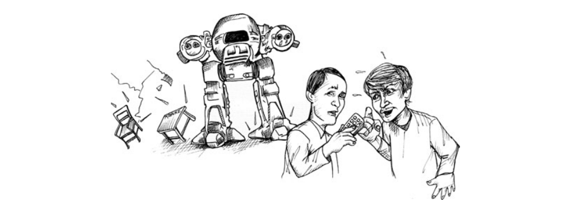

# تست پذیرش

نقش یک توسعه‌دهندهٔ حرفه‌ای، علاوه بر نقش توسعه، یک نقش ارتباطی نیز هست. به یاد داشته باشید که اصل garbage-in/garbage-out برای برنامه‌نویسان هم صادق است؛ بنابراین برنامه‌نویسان حرفه‌ای دقت می‌کنند که ارتباطشان با سایر اعضای تیم و با بخش کسب‌وکار، دقیق و سالم باشد.

## برقراری ارتباط دربارهٔ نیازمندی‌ها

یکی از رایج‌ترین مشکلات ارتباطی میان برنامه‌نویسان و کسب‌وکار، نیازمندی‌ها هستند. افراد کسب‌وکار آنچه فکر می‌کنند نیاز دارند را بیان می‌کنند، و سپس برنامه‌نویسان چیزی را می‌سازند که تصور می‌کنند کسب‌وکار توصیف کرده است. حداقل قرار است این‌طور باشد. در عمل، انتقال نیازمندی‌ها فوق‌العاده دشوار است و این فرایند سرشار از خطاست.

در سال ۱۹۷۹، زمانی که در Teradyne کار می‌کردم، تام، مدیر نصب و خدمات میدانی، به دیدنم آمد. او از من خواست به او نشان بدهم چگونه با ویرایشگر متنی ED-402 یک سیستم سادهٔ ثبت تیکت‌های خرابی بسازد.

ED-402 یک ویرایشگر اختصاصی بود که برای کامپیوتر M365 نوشته شده بود؛ سیستمی که نسخهٔ کلون PDP-8 شرکت Teradyne محسوب می‌شد. به‌عنوان یک ویرایشگر متن، بسیار قدرتمند بود. یک زبان اسکریپت‌نویسی داخلی داشت که ما از آن برای انواع برنامه‌های متنی ساده استفاده می‌کردیم.

تام برنامه‌نویس نبود. اما برنامه‌ای که در ذهن داشت ساده بود، بنابراین فکر می‌کرد من می‌توانم خیلی سریع به او آموزش بدهم و بعد خودش برنامه را بنویسد. در ساده‌لوحی خودم، من هم همین فکر را می‌کردم. بالاخره زبان اسکریپت چیزی بیش از یک زبان ماکرو برای دستورات ویرایش نبود، با ساختارهای بسیار ابتدایی تصمیم‌گیری و حلقه.

پس با هم نشستیم و من از او پرسیدم برنامه‌اش دقیقاً چه کاری باید انجام دهد. او از صفحهٔ ورود اولیه شروع کرد. من به او نشان دادم چگونه یک فایل متنی بسازد که دستورات اسکریپت را در خود نگه دارد و چگونه نمایش نمادین دستورات ویرایش را در آن فایل تایپ کند. اما وقتی به چشمانش نگاه کردم، چیزی در آن‌ها نبود. توضیحات من اصلاً برایش معنا نداشت.

این اولین باری بود که با چنین چیزی روبه‌رو می‌شدم. برای من، نمایش نمادین دستورات ویرایش کار ساده‌ای بود. مثلاً برای نمایش دستور control-B (دستوری که مکان‌نما را به ابتدای خط جاری می‌برد) کافی بود ^B را در فایل اسکریپت تایپ کنید. اما این برای تام هیچ معنایی نداشت. او نمی‌توانست از ویرایش یک فایل به ویرایش فایلی که خودش یک فایل دیگر را ویرایش می‌کند، این جهش ذهنی را انجام دهد.

تام آدم کم‌هوشی نبود. فکر می‌کنم او فقط متوجه شد که این کار بسیار پیچیده‌تر از چیزی است که ابتدا تصور می‌کرد، و نمی‌خواست زمان و انرژی ذهنی لازم برای یادگیری چیزی به آن اندازه پیچیده و درهم‌ریخته — مثل استفاده از یک ویرایشگر برای فرمان دادن به یک ویرایشگر — را صرف کند.

پس کم‌کم دیدم که خودم دارم این برنامه را پیاده‌سازی می‌کنم، در حالی که او آنجا نشسته و تماشا می‌کند. در بیست دقیقهٔ اول کاملاً مشخص شد که تمرکزش از یاد گرفتن اینکه خودش چگونه این کار را انجام دهد، به اطمینان از این تغییر کرده که آنچه من انجام می‌دهم دقیقاً همان چیزی است که او می‌خواهد.

این کار یک روز کامل طول کشید. او یک قابلیت را توصیف می‌کرد و من در حالی که نگاه می‌کرد آن را پیاده‌سازی می‌کردم. چرخهٔ بازخورد پنج دقیقه یا کمتر بود، بنابراین دلیلی نداشت که او بلند شود و کار دیگری انجام دهد. از من می‌خواست X را انجام بدهم و ظرف پنج دقیقه X کار می‌کرد.

اغلب آنچه می‌خواست را روی یک تکه کاغذ می‌کشید. بعضی از چیزهایی که می‌خواست انجام آن‌ها در ED-402 سخت بود، بنابراین من گزینهٔ دیگری پیشنهاد می‌دادم. در نهایت روی چیزی که شدنی بود به توافق می‌رسیدیم و بعد من آن را اجرا می‌کردم.

اما بعد امتحانش می‌کردیم و نظرش عوض می‌شد. چیزی شبیه این می‌گفت:
«آره، این اون جریانی که دنبالش هستم رو نداره. بیایم یه جور دیگه امتحانش کنیم.»

ساعت‌ها، یکی پس از دیگری، آن برنامه را دست‌کاری کردیم، هل دادیم، کش دادیم تا به شکل دلخواه دربیاید. یک چیز را امتحان می‌کردیم، بعد یکی دیگر، و بعد یکی دیگر. برایم کاملاً روشن شد که او مجسمه‌ساز است و من ابزاری هستم که با آن کار می‌کند.

در نهایت، او به برنامه‌ای که دنبالش بود رسید، اما هیچ تصوری از این نداشت که چطور می‌تواند برنامهٔ بعدی را خودش بسازد. من، از طرف دیگر، یک درس بسیار مهم دربارهٔ این‌که مشتریان واقعاً چگونه متوجه می‌شوند چه چیزی می‌خواهند، یاد گرفتم. یاد گرفتم که تصور آن‌ها از ویژگی‌ها اغلب در برخورد واقعی با کامپیوتر دوام نمی‌آورد.

## دقت زودهنگام

هم کسب‌وکار و هم برنامه‌نویسان وسوسه می‌شوند که به دام دقت زودهنگام بیفتند. افراد کسب‌وکار می‌خواهند دقیقاً بدانند قبل از تأیید پروژه چه چیزی دریافت خواهند کرد. توسعه‌دهندگان هم می‌خواهند دقیقاً بدانند قرار است چه چیزی را تحویل دهند تا بتوانند پروژه را برآورد کنند. هر دو طرف به دنبال دقتی هستند که اصولاً دست‌یافتنی نیست، و اغلب حاضرند برای رسیدن به آن ثروت هنگفتی را هدر بدهند.

## اصل عدم قطعیت

مشکل این است که چیزها روی کاغذ با آنچه در یک سیستم در حال اجرا دیده می‌شوند، متفاوت به نظر می‌رسند. وقتی کسب‌وکار واقعاً آنچه را که مشخص کرده‌اند در حال اجرا می‌بیند، متوجه می‌شود که اصلاً آن چیزی نیست که می‌خواسته است. وقتی نیازمندی را در حال اجرا می‌بینند، درک بهتری از آنچه واقعاً می‌خواهند پیدا می‌کنند — و معمولاً چیزی که می‌بینند آن نیست.

نوعی اثر ناظر، یا اصل عدم قطعیت، در اینجا وجود دارد. وقتی یک قابلیت را به کسب‌وکار نمایش می‌دهید، اطلاعات بیشتری نسبت به قبل در اختیارشان قرار می‌گیرد، و این اطلاعات جدید نحوهٔ نگاه آن‌ها به کل سیستم را تغییر می‌دهد.

در نهایت، هرچه نیازمندی‌ها را دقیق‌تر تعریف کنید، با پیاده‌سازی سیستم، کم‌ربط‌تر می‌شوند.

## اضطراب برآورد

توسعه‌دهندگان هم ممکن است در دام دقت بیفتند. آن‌ها می‌دانند که باید سیستم را برآورد کنند و اغلب فکر می‌کنند این کار نیازمند دقت بالاست. اما این‌طور نیست.

اولاً، حتی با اطلاعات کاملاً بی‌نقص هم برآوردهای شما واریانس بسیار بزرگی خواهند داشت. ثانیاً، اصل عدم قطعیت هرگونه دقت زودهنگام را بی‌اعتبار می‌کند. نیازمندی‌ها تغییر خواهند کرد و آن دقت بی‌معنا می‌شود.

توسعه‌دهندگان حرفه‌ای می‌دانند که برآوردها می‌توانند — و باید — بر اساس نیازمندی‌های کم‌دقت انجام شوند، و می‌پذیرند که این‌ها صرفاً برآورد هستند. برای تأکید بر این موضوع، توسعه‌دهندگان حرفه‌ای همیشه بازهٔ خطا (error bars) را همراه برآوردهایشان ارائه می‌کنند تا کسب‌وکار عدم قطعیت را درک کند. (به فصل ۱۰، «برآورد»، مراجعه کنید.)

## ابهام دیرهنگام

راه‌حل دقت زودهنگام این است که تا حد ممکن دقت را به تعویق بیندازیم. توسعه‌دهندگان حرفه‌ای یک نیازمندی را تا زمانی که واقعاً در آستانهٔ توسعهٔ آن هستند، کاملاً شفاف و دقیق نمی‌کنند. اما این کار می‌تواند به مشکل دیگری منجر شود: ابهام دیرهنگام.

اغلب ذی‌نفعان با هم اختلاف نظر دارند. وقتی چنین اختلافی وجود دارد، ممکن است برایشان ساده‌تر باشد که با بازی با کلمات از کنار اختلاف عبور کنند تا اینکه واقعاً آن را حل کنند. آن‌ها عبارتی برای نیازمندی پیدا می‌کنند که همه بتوانند با آن موافق باشند، بدون اینکه اختلاف واقعی حل شده باشد. یک بار از تام دمارکو شنیدم که می‌گفت:
«یک ابهام در سند نیازمندی‌ها، نمایندهٔ یک دعوا میان ذی‌نفعان است.»¹

البته، برای ایجاد ابهام لزوماً نیازی به دعوا یا اختلاف نیست. گاهی ذی‌نفعان صرفاً فرض می‌کنند که خوانندگان می‌دانند منظورشان چیست. در بافت ذهنی خودشان کاملاً واضح است، اما ممکن است برای برنامه‌نویسی که آن را می‌خواند، معنای کاملاً متفاوتی داشته باشد. این نوع ابهام وابسته به زمینه حتی زمانی که مشتریان و برنامه‌نویسان رو در رو با هم صحبت می‌کنند نیز می‌تواند رخ دهد.

`سم` (ذی‌نفع): «خب، حالا این فایل‌های لاگ باید بک‌آپ گرفته بشن.»

`پائولا`: «باشه، هر چند وقت یک‌بار؟»

`سم`: «روزانه.»

`پائولا`: «خیلی خب. و کجا می‌خوای ذخیره بشه؟»

`سم`: «منظورت چیه؟»

`پائولا`: «می‌خوای توی یه زیرشاخهٔ خاص ذخیره‌ش کنم؟»

`سم`: «بله، خوبه.»

`پائولا`: «اسمش رو چی بذاریم؟»

`سم`: «مثلاً “backup” چطوره؟»

`پائولا`: «باشه، خوبه. پس هر روز فایل لاگ رو داخل دایرکتوری backup می‌نویسیم. چه ساعتی؟»

`سم`: «هر روز.»

`پائولا`: «نه، منظورم اینه چه ساعتی از روز نوشته بشه؟»

`سم`: «هر زمانی.»

`پائولا`: «ظهر؟»

`سم`: «نه، نه در ساعات معاملاتی. نیمه‌شب بهتره.»

`پائولا`: «باشه، پس نیمه‌شب.»

`سم`: «عالیه، ممنون!»

`پائولا`: «عالیه همه چی خوب بنظر میرسه.»

> بعداً، پائولا دارد دربارهٔ این کار با هم‌تیمی‌اش پیتر صحبت می‌کند.

`پائولا`: «خب، باید هر شب رأس نیمه‌شب فایل لاگ رو داخل یک زیرشاخه به نام backup کپی کنیم.»

`پیتر`: «باشه، اسم فایل چی باشه؟»

`پائولا`: «log.backup خوبه.»

`پیتر`: «انجام شد.»

> در یک دفتر دیگر، سم با مشتری‌اش تلفنی صحبت می‌کند.

`سم`: «بله، بله، فایل‌های لاگ ذخیره می‌شن.»

`کارل`: «باشه، خیلی حیاتیه که هیچ‌وقت هیچ لاگی رو از دست ندیم. باید بتونیم حتی ماه‌ها یا سال‌ها 
بعد، هر وقت قطعی، رویداد یا اختلافی پیش اومد، به همهٔ اون فایل‌های لاگ برگردیم.»

`سم`: «نگران نباش، همین الان با پائولا صحبت کردم. اون هر شب رأس نیمه‌شب لاگ‌ها رو داخل دایرکتوری‌ای 
به نام backup ذخیره می‌کنه.»

`کارل`: «باشه، این خوب به نظر میاد.»

احتمالاً ابهام را تشخیص داده‌اید. مشتری انتظار دارد تمام فایل‌های لاگ ذخیره شوند، در حالی که پائولا فقط فکر کرده آن‌ها می‌خواهند فایل لاگ دیشب ذخیره شود. وقتی مشتری دنبال بک‌آپ لاگ‌های چند ماهه می‌گردد، فقط لاگ دیشب را پیدا خواهد کرد.

در این مثال، هم پائولا و هم سم کوتاهی کردند. مسئولیت توسعه‌دهندگان حرفه‌ای (و ذی‌نفعان) است که مطمئن شوند تمام ابهام‌ها از نیازمندی‌ها حذف شده‌اند.

> این کار سخت است، و تنها یک راه می‌شناسم که بتوان آن را انجام داد.

## آزمون‌های پذیرش

اصطلاح Acceptance Test بیش‌ازحد استفاده شده و معانی مختلفی به آن نسبت داده می‌شود. بعضی افراد تصور می‌کنند این‌ها همان آزمون‌هایی هستند که کاربران قبل از پذیرش یک نسخهٔ جدید اجرا می‌کنند. بعضی دیگر فکر می‌کنند این‌ها تست‌های QA هستند. در این فصل، آزمون‌های پذیرش را این‌گونه تعریف می‌کنیم:
آزمون‌هایی که با همکاری ذی‌نفعان و برنامه‌نویسان نوشته می‌شوند تا مشخص کنند چه زمانی یک نیازمندی «انجام‌شده» محسوب می‌شود.

## تعریف «انجام‌شده» (Done)

یکی از رایج‌ترین ابهام‌هایی که ما به‌عنوان متخصصان نرم‌افزار با آن مواجه هستیم، ابهام در معنای «انجام‌شده» است. وقتی یک توسعه‌دهنده می‌گوید کارش تمام شده، دقیقاً منظورش چیست؟
آیا منظورش این است که با اطمینان کامل آمادهٔ استقرار ویژگی است؟
یا منظورش این است که کار آمادهٔ تحویل به QA است؟
یا شاید فقط کدنویسی را تمام کرده و یک بار اجرا شده، اما هنوز واقعاً تست نشده است؟

من با تیم‌هایی کار کرده‌ام که برای کلمات «done» و «complete» تعریف‌های متفاوتی داشتند. یک تیم خاص حتی از دو اصطلاح «done» و «done-done» استفاده می‌کرد.

توسعه‌دهندگان حرفه‌ای فقط یک تعریف از «done» دارند:
Done یعنی done.
Done یعنی تمام کد نوشته شده، تمام تست‌ها پاس شده‌اند، QA و ذی‌نفعان آن را پذیرفته‌اند. Done.

اما چگونه می‌توان به چنین سطحی از «انجام‌شدگی» رسید و در عین حال، از یک تکرار (iteration) به تکرار بعدی سریع پیش رفت؟
با ایجاد یک مجموعه تست خودکار که وقتی پاس می‌شوند، تمام معیارهای بالا را برآورده کنند! وقتی آزمون‌های پذیرش مربوط به ویژگی شما پاس می‌شوند، کار تمام است.

توسعه‌دهندگان حرفه‌ای تعریف نیازمندی‌های خود را تا رسیدن به آزمون‌های پذیرش خودکار پیش می‌برند. آن‌ها با ذی‌نفعان و QA همکاری می‌کنند تا مطمئن شوند این آزمون‌های خودکار، یک مشخصات کامل و دقیق از «done» بودن هستند.

سم: «خب، حالا این فایل‌های لاگ باید بک‌آپ گرفته بشن.»

پائولا: «باشه، هر چند وقت یک‌بار؟»

سم: «روزانه.»

پائولا: «خوبه. و کجا می‌خوای ذخیره بشه؟»

سم: «منظورت چیه؟»

پائولا: «می‌خوای توی یه زیرشاخهٔ خاص ذخیره‌ش کنم؟»

سم: «بله، خوبه.»

پائولا: «اسمش رو چی بذاریم؟»

سم: «مثلاً “backup”؟»

تام (تستر): «صبر کن، backup اسم خیلی عمومی‌ایه. دقیقاً چی قراره توی این دایرکتوری ذخیره بشه؟»

سم: «بک‌آپ‌ها.»

تام: «بک‌آپِ چی؟»

سم: «فایل‌های لاگ.»

پائولا: «اما فقط یه فایل لاگ وجود داره.»

سم: «نه، چندتا هست. یکی برای هر روز.»

تام: «یعنی یه فایل لاگ فعال داریم و تعداد زیادی بک‌آپ از فایل‌های لاگ؟»

سم: «معلومه.»

پائولا: «اوه! من فکر کردم فقط یه بک‌آپ موقت می‌خوای.»

سم: «نه، مشتری می‌خواد همه‌شون رو برای همیشه نگه داره.»

پائولا: «این یکی جدید بود برام. خب، خوب شد روشنش کردیم.»

تام: «پس اسم زیرشاخه باید دقیقاً بگه چی توش هست.»

سم: «توش همهٔ لاگ‌های قدیمی و غیرفعال هست.»

تام: «پس اسمش رو بذاریم old_inactive_logs.»

سم: «عالیه.»

تام: «خب این دایرکتوری کی ساخته می‌شه؟»

سم: «ها؟»

پائولا: «باید موقع بالا اومدن سیستم ساخته بشه، ولی فقط اگه از قبل وجود نداشته باشه.»

تام: «باشه، این اولین تست ماست. باید سیستم رو بالا بیارم و ببینم آیا دایرکتوری old_inactive_logs 
ساخته می‌شه یا نه. بعد یه فایل به اون دایرکتوری اضافه می‌کنم. بعد سیستم رو خاموش می‌کنم و دوباره بالا میارم و مطمئن می‌شم هم دایرکتوری و هم فایل هنوز وجود دارن.»

پائولا: «اجرای این تست خیلی زمان‌بر می‌شه. راه‌اندازی سیستم الان خودش ۲۰ ثانیه طول می‌کشه و داره بیشتر هم می‌شه. تازه، واقعاً دوست ندارم هر بار که تست‌های پذیرش رو اجرا می‌کنم کل سیستم رو بیلد کنم.»

تام: «چه پیشنهادی داری؟»

پائولا: «یه کلاس SystemStarter می‌سازیم. برنامهٔ اصلی این استارتر رو با یه مجموعه از آبجکت‌های StartupCommand لود می‌کنه که از الگوی Command پیروی می‌کنن. بعد، هنگام بالا اومدن سیستم، SystemStarter فقط به همهٔ StartupCommandها می‌گه اجرا بشن. یکی از این مشتق‌های StartupCommand دایرکتوری old_inactive_logs رو می‌سازه، البته فقط اگه از قبل وجود نداشته باشه.»

تام: «آها، باشه. پس تنها چیزی که باید تست کنم همون مشتق StartupCommand هست. می‌تونم براش یه تست سادهٔ FitNesse بنویسم.»

تام می‌ره پای تخته.

«بخش اولش یه چیزی شبیه این می‌شه»:

با فرض اینکه دستور LogFileDirectoryStartupCommand وجود دارد
و با فرض اینکه دایرکتوری old_inactive_logs وجود ندارد
وقتی دستور اجرا می‌شود
آنگاه دایرکتوری old_inactive_logs باید وجود داشته باشد
و باید خالی باشد

«بخش دومش این‌طوری می‌شه»:

با فرض اینکه دستور LogFileDirectoryStartupCommand وجود دارد
و با فرض اینکه دایرکتوری old_inactive_logs وجود دارد
و شامل فایلی به نام x است
وقتی دستور اجرا می‌شود
آنگاه دایرکتوری old_inactive_logs باید همچنان وجود داشته باشد
و همچنان باید شامل فایلی به نام x باشد

پائولا: «آره، این باید همه‌چیز رو پوشش بده.»

سم: «وای، واقعاً همهٔ اینا لازمه؟»

پائولا: «سم، کدوم یکی از این دو تا جمله اون‌قدر مهم نیست که مشخصش کنیم؟»

سم: «من فقط می‌گم به نظر میاد فکر کردن به همهٔ این تست‌ها و نوشتنشون کلی کار داره.»

تام: «داره، ولی نه بیشتر از نوشتن یه برنامهٔ تست دستی. و اجرای مکرر تست دستی خیلی بیشتر از این‌ها 
کار می‌بره.»

## ارتباط

هدف آزمون‌های پذیرش، ارتباط، شفافیت و دقت است. با توافق روی این آزمون‌ها، توسعه‌دهندگان، ذی‌نفعان و تسترها همگی درک مشترکی از برنامهٔ رفتار سیستم پیدا می‌کنند. دستیابی به چنین سطحی از شفافیت، مسئولیت همهٔ طرف‌هاست. توسعه‌دهندگان حرفه‌ای این را وظیفهٔ خود می‌دانند که با ذی‌نفعان و تسترها همکاری کنند تا همه بدانند دقیقاً چه چیزی قرار است ساخته شود.

## خودکارسازی

آزمون‌های پذیرش باید همیشه خودکار باشند. در چرخهٔ عمر نرم‌افزار، جایی برای تست دستی وجود دارد، اما این نوع تست‌ها هرگز نباید دستی باشند. دلیلش ساده است: هزینه.

تصویری را که در شکل ۷-۱ آمده در نظر بگیرید. دست‌هایی که در تصویر می‌بینید متعلق به مدیر QA یک شرکت بزرگ اینترنتی است. سندی که در دست دارد، فهرست مطالب برنامهٔ تست دستی اوست. او یک ارتش از تسترهای دستی در موقعیت‌های برون‌سپاری‌شده (off-shore) دارد که هر شش هفته یک‌بار این برنامه را اجرا می‌کنند. هر بار بیش از یک میلیون دلار برایش هزینه دارد. او این سند را به من نشان می‌دهد، چون تازه از جلسه‌ای برگشته که مدیرش در آن گفته باید بودجه‌اش را ۵۰٪ کاهش بدهد. سؤال او از من این است:
«کدوم نصفِ این تست‌ها رو نباید اجرا کنم؟»

تست دستی - img 7-1

این‌که این وضعیت را «فاجعه» بنامیم، به‌شدت کم‌گویی است. هزینهٔ اجرای برنامهٔ تست دستی آن‌قدر عظیم است که تصمیم گرفته‌اند کلاً آن را کنار بگذارند و با این واقعیت زندگی کنند که دیگر نمی‌دانند آیا نیمی از محصولشان کار می‌کند یا نه!

توسعه‌دهندگان حرفه‌ای اجازه نمی‌دهند چنین وضعیتی به وجود بیاید. هزینهٔ خودکارسازی آزمون‌های پذیرش در مقایسه با هزینهٔ اجرای برنامه‌های تست دستی آن‌قدر ناچیز است که از نظر اقتصادی اصلاً منطقی نیست اسکریپت‌هایی بنویسیم که انسان‌ها آن‌ها را اجرا کنند. توسعه‌دهندگان حرفه‌ای مسئولیت سهم خود را در اطمینان از خودکار بودن آزمون‌های پذیرش می‌پذیرند.

ابزارهای متن‌باز و تجاری زیادی وجود دارند که خودکارسازی آزمون‌های پذیرش را تسهیل می‌کنند؛ از جمله FitNesse، Cucumber، cuke4duke، Robot Framework و Selenium، فقط برای نام بردن چند مورد. همهٔ این ابزارها به شما اجازه می‌دهند آزمون‌های خودکار را به شکلی مشخص کنید که افراد غیر برنامه‌نویس بتوانند آن‌ها را بخوانند، بفهمند و حتی خودشان بنویسند.

## کار اضافه

نکته‌ای که سم دربارهٔ «کار» مطرح کرد قابل درک است. واقعاً به نظر می‌رسد نوشتن چنین آزمون‌های پذیرفتی کار اضافهٔ زیادی باشد. اما با توجه به شکل ۷-۱ می‌بینیم که در واقع اصلاً کار اضافه‌ای نیست. نوشتن این آزمون‌ها صرفاً همان کاری است که برای مشخص‌سازی سیستم باید انجام شود.

مشخص‌سازی در این سطح از جزئیات تنها راهی است که ما به‌عنوان برنامه‌نویس می‌توانیم بفهمیم «done» واقعاً یعنی چه. مشخص‌سازی در این سطح تنها راهی است که ذی‌نفعان می‌توانند مطمئن شوند سیستمی که بابتش پول می‌دهند واقعاً کاری را که نیاز دارند انجام می‌دهد. و مشخص‌سازی در این سطح تنها راه موفقیت‌آمیز برای خودکارسازی تست‌هاست.

پس به این آزمون‌ها به چشم کار اضافه نگاه نکنید. به آن‌ها به‌عنوان صرفه‌جویی‌های عظیم در زمان و هزینه نگاه کنید. این آزمون‌ها جلوی پیاده‌سازی سیستم اشتباه را می‌گیرند و به شما اجازه می‌دهند بفهمید چه زمانی کارتان واقعاً تمام شده است.

## چه کسی آزمون‌های پذیرش را می‌نویسد و چه زمانی؟

در دنیای ایده‌آل، ذی‌نفعان و QA با هم همکاری می‌کنند تا این آزمون‌ها را بنویسند و توسعه‌دهندگان آن‌ها را از نظر سازگاری بازبینی می‌کنند. اما در دنیای واقعی، ذی‌نفعان به‌ندرت زمان یا تمایل دارند وارد چنین سطحی از جزئیات شوند. بنابراین اغلب این مسئولیت را به تحلیل‌گران کسب‌وکار (BA)، QA یا حتی خود توسعه‌دهندگان واگذار می‌کنند.

اگر در نهایت توسعه‌دهندگان مجبور شوند این آزمون‌ها را بنویسند، باید دقت شود که توسعه‌دهنده‌ای که آزمون را می‌نویسد، همان کسی نباشد که ویژگی مورد آزمون را پیاده‌سازی می‌کند.

معمولاً تحلیل‌گران کسب‌وکار نسخه‌های «مسیر خوشحال» (happy path) آزمون‌ها را می‌نویسند، چون این آزمون‌ها ویژگی‌هایی را توصیف می‌کنند که ارزش کسب‌وکاری دارند. QA معمولاً آزمون‌های «مسیر ناخوشحال» (unhappy path)، شرایط مرزی، استثناها و موارد خاص را می‌نویسد، چون وظیفهٔ QA این است که به این فکر کند چه چیزهایی ممکن است خراب شوند.

بر اساس اصل «دقت دیرهنگام» (late precision)، آزمون‌های پذیرش باید تا حد ممکن دیر نوشته شوند؛ معمولاً چند روز قبل از پیاده‌سازی ویژگی. در پروژه‌های اجایل، این آزمون‌ها بعد از آن نوشته می‌شوند که ویژگی‌ها برای Iteration یا Sprint بعدی انتخاب شده‌اند.

اولین چند آزمون پذیرش باید تا روز اول Iteration آماده باشند. هر روز باید تعداد بیشتری تکمیل شود تا این‌که در نیمهٔ Iteration، همهٔ آن‌ها آماده باشند. اگر تا نیمهٔ Iteration همهٔ آزمون‌های پذیرش آماده نشده باشند، بعضی از توسعه‌دهندگان مجبور می‌شوند برای تمام کردن آن‌ها کمک کنند. اگر این اتفاق مرتب تکرار شود، باید BAها و/یا QAهای بیشتری به تیم اضافه شوند.

## نقش توسعه‌دهنده

کار پیاده‌سازی یک ویژگی زمانی شروع می‌شود که آزمون‌های پذیرش آن ویژگی آماده باشند. توسعه‌دهندگان آزمون‌های پذیرش مربوط به ویژگی جدید را اجرا می‌کنند و می‌بینند که چگونه شکست می‌خورند. سپس روی متصل کردن آزمون پذیرش به سیستم کار می‌کنند و بعد با پیاده‌سازی ویژگی موردنظر، شروع به پاس کردن آزمون‌ها می‌کنند.

پائولا: «پیتر، می‌تونی یه کم توی این استوری کمکم کنی؟»

پیتر: «حتماً پائولا، چی شده؟»

پائولا: «این هم تست پذیرش. همون‌طور که می‌بینی داره fail می‌شه.»

    given the command LogFileDirectoryStartupCommand
    given that the old_inactive_logs directory does not exist
    when the command is executed
    then the old_inactive_logs directory should exist
    and it should be empty

پیتر: «آره، همه‌اش قرمزه. هیچ‌کدوم از سناریوها نوشته نشده. بذار اولی رو من بنویسم.»

    |scenario|given the command _|cmd|
    |create command|@cmd|

پائولا: «ما قبلاً عملیات createCommand رو داریم؟»

پیتر: «آره، توی CommandUtilitiesFixture هست که هفتهٔ پیش نوشتمش.»
پائولا: «باشه، پس حالا تست رو اجرا کنیم.»

پیتر: (تست را اجرا می‌کند) «آره، خط اول سبز شد. بریم سراغ بعدی.»

زیاد نگران Scenarios و Fixtures نباشید. این‌ها فقط بخشی از لوله‌کشی (plumbing) لازم برای وصل کردن تست‌ها به سیستمی هستند که در حال تست شدن است. کافی است بدانید که همهٔ ابزارها راهی برای استفاده از تطبیق الگو (pattern matching) فراهم می‌کنند تا عبارات تست را تشخیص داده و تجزیه کنند و سپس توابعی را فراخوانی کنند که داده‌های تست را به سیستم مورد آزمون تزریق می‌کنند. میزان تلاش موردنیاز کم است، و Scenarios و Fixtures در بسیاری از تست‌های مختلف قابل استفادهٔ مجدد هستند.

نکتهٔ اصلی این است که وظیفهٔ توسعه‌دهنده است که تست‌های پذیرش را به سیستم متصل کند و سپس کاری کند که این تست‌ها پاس شوند.

##  مذاکره دربارهٔ تست و پرخاشگری منفعلانه 

نویسندگان تست هم انسان هستند و اشتباه می‌کنند. گاهی تست‌ها آن‌طور که نوشته شده‌اند، وقتی شروع به پیاده‌سازی می‌کنید، منطقی به نظر نمی‌رسند. ممکن است بیش‌ازحد پیچیده باشند، یا بدقواره، یا شامل فرضیات احمقانه باشند. یا ممکن است کلاً اشتباه باشند. اگر شما توسعه‌دهنده‌ای باشید که باید این تست را پاس کند، این موضوع می‌تواند بسیار آزاردهنده باشد.

به‌عنوان یک توسعه‌دهندهٔ حرفه‌ای، وظیفهٔ شماست که با نویسندهٔ تست مذاکره کنید تا به تست بهتری برسید. کاری که هرگز نباید انجام دهید این است که رویکرد پرخاشگری منفعلانه را انتخاب کنید و با خودتان بگویید:
«خب، تست اینو می‌گه، پس منم دقیقاً همونو پیاده می‌کنم.»

یادتان باشد، به‌عنوان یک حرفه‌ای، وظیفهٔ شما کمک به تیم برای ساخت بهترین نرم‌افزار ممکن است. این یعنی همه باید حواسشان به خطاها و لغزش‌ها باشد و با هم برای اصلاح آن‌ها همکاری کنند.

پائولا: «تام، این تست یه مقدار درست نیست.»

    ensure that the post operation finishes in 2 seconds.

تام: «به نظر من که خوبه. نیازمندی ما اینه که کاربرها بیشتر از دو ثانیه منتظر نمونن. مشکلش چیه؟»

پائولا: «مشکل اینه که ما فقط می‌تونیم این تضمین رو به‌صورت آماری بدیم.»

تام: «ها؟ این شبیه بهانه آوردنه. نیازمندی دو ثانیه‌ست.»

پائولا: «درسته، و ما می‌تونیم ۹۹٫۵٪ مواقع بهش برسیم.»

تام: «پائولا، این نیازمندی نیست.»

پائولا: «ولی واقعیت همینه. هیچ راه دیگه‌ای برای تضمینش ندارم.»

تام: «سم از کوره در می‌ره.»

پائولا: «نه، در واقع من قبلاً باهاش صحبت کردم. تا وقتی تجربهٔ معمول کاربر دو ثانیه یا کمتر باشه، 
براش مشکلی نداره.»

تام: «باشه، پس من این تست رو چطوری بنویسم؟ نمی‌تونم که بنویسم عملیات post معمولاً توی دو ثانیه تموم می‌شه.»

پائولا: «باید آماری بنویسیش.»
تام: «یعنی می‌خوای هزار تا عملیات post اجرا کنم و مطمئن بشم بیشتر از پنج‌تاشون بیشتر از دو ثانیه طول نکشن؟ این مسخره‌ست.»

پائولا: «نه، اون تقریباً یک ساعت طول می‌کشه. اینو چطور می‌بینی؟»

    execute 15 post transactions and accumulate times.
    ensure that the Z score for 2 seconds is at least 2.57

تام: «وایسا، Z score چیه؟»
پائولا: «یه کم آمار. اینو چطور؟»

    execute 15 post transactions and accumulate times.
    ensure odds are 99.5% that time will be less than 2 seconds.

تام: «آره، یه‌جوری قابل خوندنه، ولی می‌تونم به محاسبات پشت‌صحنه اعتماد کنم؟»

پائولا: «توی گزارش تست همهٔ محاسبات میانی رو نشون می‌دم تا اگه شک داشتی، بتونی خودت بررسیشون کنی.»

تام: «باشه، این به نظرم قابل قبوله.»

## آزمون‌های پذیرش و تست‌های واحد

آزمون‌های پذیرش، تست واحد نیستند. تست‌های واحد توسط برنامه‌نویسان و برای برنامه‌نویسان نوشته می‌شوند. آن‌ها اسناد رسمی طراحی هستند که پایین‌ترین سطح ساختار و رفتار کد را توصیف می‌کنند. مخاطب آن‌ها برنامه‌نویسان‌اند، نه کسب‌وکار.

آزمون‌های پذیرش توسط کسب‌وکار و برای کسب‌وکار نوشته می‌شوند (حتی اگر در نهایت شما، به‌عنوان توسعه‌دهنده، آن‌ها را بنویسید). آن‌ها اسناد رسمی نیازمندی هستند که مشخص می‌کنند سیستم از دیدگاه کسب‌وکار چگونه باید رفتار کند. مخاطب آن‌ها هم کسب‌وکار است و هم برنامه‌نویسان.

ممکن است وسوسه شوید که برای حذف «کار اضافه» فرض کنید این دو نوع تست تکراری هستند. هرچند درست است که تست‌های واحد و پذیرش اغلب چیزهای مشابهی را تست می‌کنند، اما به‌هیچ‌وجه تکراری نیستند.

اول این‌که، اگرچه ممکن است چیزهای یکسانی را تست کنند، اما این کار را از مسیرها و مکانیزم‌های متفاوتی انجام می‌دهند. تست‌های واحد به درون guts سیستم نفوذ می‌کنند و متدهای کلاس‌های مشخص را صدا می‌زنند. تست‌های پذیرش سیستم را در سطحی بسیار بالاتر فراخوانی می‌کنند؛ در سطح API یا حتی گاهی در سطح UI. بنابراین مسیرهای اجرایی این تست‌ها کاملاً متفاوت است.

اما دلیل اصلی غیرتکراری بودن این تست‌ها این است که کارکرد اصلی آن‌ها تست کردن نیست. تست بودن آن‌ها اتفاقی است. تست‌های واحد و تست‌های پذیرش، قبل از هر چیز سند هستند و بعد تست. هدف اصلی آن‌ها مستندسازی رسمی طراحی، ساختار و رفتار سیستم است. این‌که به‌صورت خودکار طراحی، ساختار و رفتاری را که مشخص می‌کنند تأیید هم می‌کنند، فوق‌العاده مفید است، اما مشخص‌سازی هدف واقعی آن‌هاست.

## رابط‌های گرافیکی و پیچیدگی‌های دیگر

مشخص‌سازی GUIها از ابتدا کار سختی است. شدنی هست، اما به‌ندرت خوب انجام می‌شود. دلیلش این است که زیبایی‌شناسی ذهنی است و بنابراین ناپایدار. آدم‌ها دوست دارند با GUIها ور بروند. دوست دارند آن‌ها را دست‌کاری و اصلاح کنند. فونت‌ها، رنگ‌ها، چیدمان صفحات و گردش‌کارها را عوض کنند. GUIها دائماً در حال تغییرند.

این موضوع نوشتن تست‌های پذیرش برای GUIها را چالش‌برانگیز می‌کند. ترفند کار این است که سیستم را طوری طراحی کنید که بتوانید با GUI مثل یک API رفتار کنید، نه مجموعه‌ای از دکمه‌ها، اسلایدرها، جدول‌ها و منوها. شاید عجیب به نظر برسد، اما در واقع فقط یک طراحی خوب است.

یک اصل طراحی به نام Single Responsibility Principle (SRP) وجود دارد. این اصل می‌گوید چیزهایی که به دلایل متفاوت تغییر می‌کنند را باید از هم جدا کرد، و چیزهایی که به دلایل مشابه تغییر می‌کنند را کنار هم قرار داد.

> GUI ها هم از این قاعده مستثنا نیستند.

چیدمان، قالب و گردش‌کار GUI به دلایل زیبایی‌شناختی و کارایی تغییر می‌کنند، اما قابلیت‌های زیربنایی GUI علی‌رغم این تغییرات ثابت می‌مانند. بنابراین هنگام نوشتن تست‌های پذیرش برای یک GUI، باید از انتزاع‌های زیربنایی‌ای استفاده کنید که خیلی کم تغییر می‌کنند.

برای مثال، ممکن است در یک صفحه چندین دکمه وجود داشته باشد. به‌جای نوشتن تست‌هایی که بر اساس موقعیت دکمه‌ها روی صفحه (مثلاً جایگاهشان) روی آن‌ها کلیک می‌کنند، می‌توانید بر اساس نامشان روی آن‌ها کلیک کنید. حتی بهتر از آن، شاید هرکدام یک شناسهٔ یکتا (ID) داشته باشند که بتوانید از آن استفاده کنید. نوشتن تستی که دکمه‌ای با شناسهٔ ok_button را انتخاب می‌کند، بسیار بهتر از انتخاب دکمه‌ای است که در ستون ۳، ردیف ۴ جدول کنترل قرار دارد.

## تست از طریق اینترفیس مناسب

بهتر از همه این است که تست‌هایی بنویسید که قابلیت‌های سیستم زیربنایی را از طریق یک API واقعی فراخوانی کنند، نه از طریق GUI. این API باید همان API‌ای باشد که خود GUI هم از آن استفاده می‌کند. این موضوع تازه نیست؛ متخصصان طراحی دهه‌هاست که به ما می‌گویند GUI را از قوانین کسب‌وکار جدا کنیم.

تست از طریق GUI همیشه مشکل‌ساز است، مگر این‌که صرفاً در حال تست خود GUI باشید. دلیلش این است که GUI احتمالاً تغییر می‌کند و این باعث می‌شود تست‌ها بسیار شکننده شوند. وقتی هر تغییر کوچک در GUI هزار تست را می‌شکند، یا شروع می‌کنید به دور ریختن تست‌ها، یا کلاً تغییر دادن GUI را متوقف می‌کنید. هیچ‌کدام از این‌ها گزینه‌های خوبی نیستند. پس تست‌های مربوط به قوانین کسب‌وکار را طوری بنویسید که از طریق یک API درست در زیر لایهٔ GUI اجرا شوند.

بعضی از تست‌های پذیرش، رفتار خود GUI را مشخص می‌کنند. این تست‌ها باید از طریق GUI اجرا شوند. اما این تست‌ها قوانین کسب‌وکار را تست نمی‌کنند و بنابراین نیازی ندارند که قوانین کسب‌وکار به GUI متصل باشند. به همین دلیل، ایدهٔ خوبی است که GUI و قوانین کسب‌وکار را از هم جدا کنید و هنگام تست خود GUI، قوانین کسب‌وکار را با stub جایگزین کنید.

تعداد تست‌های GUI را به حداقل برسانید. آن‌ها شکننده‌اند، چون GUI ناپایدار است. هرچه تست GUI بیشتری داشته باشید، احتمال نگه‌داشتن و حفظ آن‌ها کمتر می‌شود.

### یکپارچه‌سازی مداوم (Continuous Integration)

اطمینان حاصل کنید که همهٔ تست‌های واحد و تست‌های پذیرش شما چندین بار در روز در یک سیستم یکپارچه‌سازی مداوم اجرا می‌شوند. این سیستم باید توسط سیستم کنترل نسخهٔ کد منبع شما فعال شود. هر بار که کسی یک ماژول را commit می‌کند، سیستم CI باید یک build را آغاز کند و سپس همهٔ تست‌های موجود در سیستم را اجرا کند. نتیجهٔ این اجرا باید برای همهٔ اعضای تیم ایمیل شود.

## توقف کامل کار

بسیار مهم است که تست‌های CI همیشه در حال اجرا باشند و هرگز fail نشوند. اگر fail شدند، کل تیم باید هر کاری که انجام می‌دهد را متوقف کند و روی پاس شدن دوبارهٔ تست‌های خراب تمرکز کند. یک build خراب در سیستم CI باید به‌عنوان یک وضعیت اضطراری در نظر گرفته شود؛ یک رویداد «چاپ را متوقف کنید».

من با تیم‌هایی مشاوره داده‌ام که خراب شدن تست‌ها را جدی نمی‌گرفتند. آن‌ها «خیلی سرشان شلوغ بود» که تست‌های خراب را درست کنند، بنابراین آن‌ها را کنار می‌گذاشتند و قول می‌دادند بعداً درستشان کنند. در یک مورد، تیم حتی تست‌های خراب را از build خارج کرد، چون دیدن fail شدن آن‌ها خیلی آزاردهنده بود. بعداً، پس از انتشار محصول برای مشتری، متوجه شدند که فراموش کرده‌اند آن تست‌ها را دوباره به build برگردانند. این را وقتی فهمیدند که یک مشتری عصبانی داشت با گزارش باگ‌ها با آن‌ها تماس می‌گرفت.

## نتیجه‌گیری

ارتباط دربارهٔ جزئیات کار دشواری است. این موضوع به‌ویژه زمانی صادق است که برنامه‌نویسان و ذی‌نفعان دربارهٔ جزئیات یک نرم‌افزار با هم ارتباط برقرار می‌کنند. خیلی راحت هر طرف با دست اشاره‌ای می‌کند و فرض می‌گیرد که طرف مقابل منظورش را فهمیده است. اغلب هر دو طرف با این تصور که کاملاً همدیگر را فهمیده‌اند جلسه را ترک می‌کنند، در حالی که در ذهنشان برداشت‌های کاملاً متفاوتی دارند.

تنها راهی که من می‌شناسم تا بتوان به‌طور مؤثر خطاهای ارتباطی بین برنامه‌نویسان و ذی‌نفعان را حذف کرد، نوشتن آزمون‌های پذیرش خودکار است. این آزمون‌ها آن‌قدر رسمی هستند که اجرا می‌شوند. کاملاً بدون ابهام‌اند و هرگز از برنامه‌ای که توصیف می‌کنند عقب نمی‌مانند یا با آن ناهماهنگ نمی‌شوند. آن‌ها بهترین سند نیازمندی‌ها هستند.