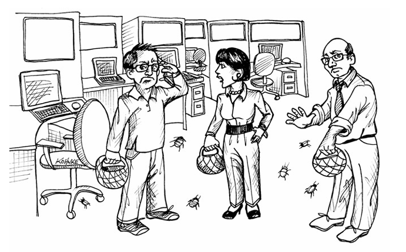
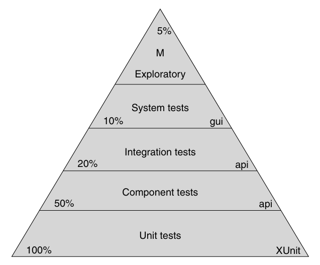
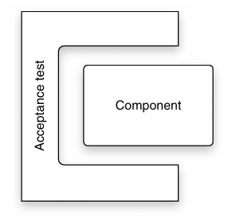
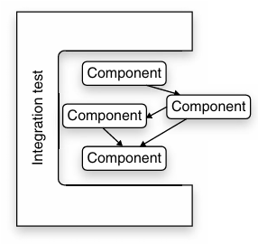

 

# استراتژی‌های تست

توسعه‌دهندگان حرفه‌ای کد خود را تست می‌کنند. اما تست کردن صرفاً به معنای نوشتن چند تست واحد (Unit Test) یا چند تست پذیرش (Acceptance Test) نیست. نوشتن این تست‌ها کار خوبی است، اما به هیچ وجه کافی نیست. آنچه هر تیم توسعه حرفه‌ای به آن نیاز دارد، یک استراتژی تست خوب است.

در سال ۱۹۸۹، من در شرکت «Rational» روی اولین نسخه نرم‌افزار «Rose» کار می‌کردم. تقریباً هر ماه، مدیر تضمین کیفیت (QA) ما روزی را به عنوان «روز شکار باگ» اعلام می‌کرد. همه اعضای تیم، از برنامه‌نویسان و مدیران گرفته تا منشی‌ها و مدیران پایگاه داده، پای نرم‌افزار Rose می‌نشستند و تلاش می‌کردند آن را با شکست مواجه کنند. جوایزی برای انواع مختلف باگ‌ها در نظر گرفته شده بود. کسی که یک باگ منجر به کرش (Crash) پیدا می‌کرد، می‌توانست برنده یک شام دو نفره شود. کسی که بیشترین تعداد باگ را پیدا می‌کرد، ممکن بود برنده یک سفر آخر هفته به مونتری شود.

### تیم QA نباید چیزی پیدا کند

من این را قبلاً گفته‌ام و باز هم می‌گویم. با وجود اینکه شرکت شما ممکن است گروه QA جداگانه‌ای برای تست نرم‌افزار داشته باشد، هدف گروه توسعه باید این باشد که تیم QA هیچ ایرادی پیدا نکند.

البته بعید است که این هدف دائماً محقق شود. به هر حال، وقتی گروهی از افراد باهوش مصمم می‌شوند تا تمام چین و چروک‌ها و نواقص یک محصول را پیدا کنند، احتمالاً مواردی را خواهند یافت. با این حال، هر بار که QA چیزی پیدا می‌کند، تیم توسعه باید وحشت‌زده واکنش نشان دهد. آن‌ها باید از خود بپرسند که این اتفاق چگونه رخ داده و گام‌هایی بردارند تا از وقوع مجدد آن در آینده جلوگیری کنند.

### تیم QA بخشی از تیم است

بخش قبلی ممکن است این تصور را ایجاد کرده باشد که QA و توسعه‌دهندگان با هم اختلاف دارند و رابطه آن‌ها خصمانه است. این اصلاً مقصود من نیست. بلکه QA و توسعه‌دهندگان باید با هم همکاری کنند تا کیفیت سیستم را تضمین نمایند. بهترین نقش برای بخش QA در تیم این است که به عنوان «تعیین‌کنندگان مشخصات» (Specifiers) و «توصیف‌کنندگان» (Characterizers) عمل کنند.

#### QA به عنوان تعیین‌کنندگان مشخصات (QA as Specifiers)

نقش QA باید این باشد که با بخش کسب‌وک‌ار (Business) همکاری کند تا تست‌های پذیرش خودکار را ایجاد نمایند؛ تست‌هایی که تبدیل به مستندات واقعی مشخصات و نیازمندی‌های سیستم می‌شوند. آن‌ها در هر تکرار (Iteration)، نیازمندی‌ها را از کسب‌وک‌ار دریافت کرده و آن‌ها را به تست‌هایی ترجمه می‌کنند که به توسعه‌دهندگان توضیح می‌دهد سیستم چگونه باید رفتار کند (به فصل ۷، «تست پذیرش» مراجعه کنید). به طور کلی، بخش کسب‌وک‌ار تست‌های «مسیر خوشحالی» (Happy-path - سناریوهای موفق) را می‌نویسد، در حالی که QA تست‌های گوشه‌ای (Corner cases)، مرزی (Boundary) و «مسیر ناخوشایند» (Unhappy-path) را می‌نویسد.

#### QA به عنوان توصیف‌کنندگان (QA as Characterizers)

نقش دیگر QA استفاده از دیسیپلین «تست اکتشافی» (Exploratory Testing) است تا رفتار واقعی سیستم در حال اجرا را توصیف کرده و آن رفتار را به تیم توسعه و کسب‌وک‌ار گزارش دهند. در این نقش، QA نیازمندی‌ها را تفسیر نمی‌کند، بلکه رفتارهای واقعی سیستم را شناسایی می‌نماید.

### هرم اتوماسیون تست

توسعه‌دهندگان حرفه‌ای از دیسیپلین «توسعه مبتنی بر تست» (TDD) برای ایجاد تست‌های واحد استفاده می‌کنند. تیم‌های توسعه حرفه‌ای از تست‌های پذیرش برای تعیین مشخصات سیستم خود، و از یکپارچه‌سازی مداوم (CI) برای جلوگیری از پسرفت (Regression) بهره می‌برند. اما این تست‌ها تنها بخشی از ماجرا هستند. هر چقدر هم که داشتن مجموعه‌ای از تست‌های واحد و پذیرش خوب باشد، ما به تست‌های سطح بالاتری نیاز داریم تا اطمینان حاصل کنیم که QA چیزی پیدا نمی‌کند. شکل ۱-۸ «هرم اتوماسیون تست» را نشان می‌دهد؛ یک نمایش گرافیکی از انواع تست‌هایی که یک سازمان توسعه حرفه‌ای به آن‌ها نیاز دارد.

 

### تست‌های واحد (Unit Tests)

در قاعده (پایین) این هرم، «تست‌های واحد» قرار دارند. این تست‌ها توسط برنامه‌نویسان، برای برنامه‌نویسان و با همان زبان برنامه‌نویسی سیستم نوشته می‌شوند. هدف از این تست‌ها، تعیین مشخصات سیستم در پایین‌ترین سطح ممکن است. توسعه‌دهندگان این تست‌ها را پیش از نوشتن کد عملیاتی (Production Code) می‌نویسند تا از این طریق، آنچه را که قصد نوشتن آن را دارند، مشخص کنند.

این تست‌ها به عنوان بخشی از فرایند «یکپارچه‌سازی مداوم» (Continuous Integration) اجرا می‌شوند تا اطمینان حاصل شود که نیت و مقصود برنامه‌نویسان حفظ شده است. تست‌های واحد باید تا حد امکان پوششی نزدیک به ۱۰۰ درصد ارائه دهند. به طور کلی، این عدد باید جایی در محدوده ۹۰ درصد باشد. و البته این باید یک پوشش واقعی باشد، نه تست‌های کاذبی که صرفاً کد را اجرا می‌کنند بدون اینکه صحت رفتار آن را بسنجند (Assert کنند).

### تست‌های مؤلفه (Component Tests)

این‌ها برخی از همان تست‌های پذیرشی هستند که در فصل قبل به آن‌ها اشاره شد. این تست‌ها عموماً برای مؤلفه‌های (Components) انفرادی سیستم نوشته می‌شوند. از آنجا که مؤلفه‌های سیستم، قوانین کسب‌وک‌ار (Business Rules) را کپسوله می‌کنند، تست‌های مربوط به این مؤلفه‌ها در واقع همان تست‌های پذیرش برای آن قوانین کسب‌وک‌ار محسوب می‌شوند.

همان‌طور که در شکل ۲-۸ نشان داده شده است، یک تست مؤلفه، یک مؤلفه را در بر می‌گیرد (Wrap می‌کند). این تست، داده‌های ورودی را به مؤلفه می‌دهد و داده‌های خروجی را از آن دریافت می‌کند و سپس بررسی می‌کند که آیا خروجی با ورودی مطابقت دارد یا خیر. سایر مؤلفه‌های سیستم با استفاده از تکنیک‌های مناسب «ماک کردن» (Mocking) و «بدل‌های تست» (Test-doubling)، از این تست جدا (Decouple) می‌شوند.

 

تست‌های مؤلفه توسط تیم QA و بخش کسب‌وک‌ار، و با کمک تیم توسعه نوشته می‌شوند. این تست‌ها در محیط‌های تست مؤلفه نظیر FitNesse، JBehave یا Cucumber تدوین می‌گردند. (مؤلفه‌های رابط کاربری گرافیکی (GUI) با استفاده از محیط‌های تست GUI مانند Selenium یا Watir تست می‌شوند.) هدف این است که بخش کسب‌وک‌ار اگر نتواند این تست‌ها را بنویسد، دست‌کم بتواند آن‌ها را بخواند و تفسیر کند.

تست‌های مؤلفه تقریباً نیمی از سیستم را پوشش می‌دهند. تمرکز آن‌ها بیشتر بر سناریوهای «مسیر خوشحالی» (Happy-path) و حالت‌های بسیار واضح گوشه‌ای، مرزی و مسیرهای جایگزین است. اکثریت قریب به اتفاق سناریوهای «مسیر ناخوشایند» (Unhappy-path) توسط تست‌های واحد پوشش داده می‌شوند و بررسی آن‌ها در سطح تست‌های مؤلفه بی‌معنی است.

### تست‌های یکپارچه‌سازی (Integration Tests)

این تست‌ها تنها برای سیستم‌های بزرگ‌تری که دارای مؤلفه‌های متعدد هستند، معنا پیدا می‌کنند. همان‌طور که در شکل ۳-۸ نشان داده شده است، این تست‌ها گروه‌هایی از مؤلفه‌ها را کنار هم قرار می‌دهند (اسمبل می‌کنند) و بررسی می‌کنند که آن‌ها چقدر خوب با یکدیگر ارتباط برقرار می‌کنند. سایر مؤلفه‌های سیستم، طبق معمول با استفاده از ماک‌ها (Mocks) و بدل‌های تست (Test-doubles) مناسب، از فرایند تست جدا (Decouple) می‌شوند.

تست‌های یکپارچه‌سازی، تست‌های هماهنگی (Choreography) هستند. آن‌ها قوانین کسب‌وک‌ار را تست نمی‌کنند، بلکه بررسی می‌کنند که مجموعه مؤلفه‌ها چقدر خوب با هم «می‌رقصند» (هماهنگ عمل می‌کنند). این‌ها تست‌های «لوله‌کشی» (Plumbing) هستند که اطمینان حاصل می‌کنند مؤلفه‌ها به درستی به هم متصل شده‌اند و می‌توانند به وضوح با یکدیگر ارتباط برقرار کنند.

 

تست‌های یکپارچه‌سازی معمولاً توسط معماران سیستم یا طراحان ارشد سیستم نوشته می‌شوند. این تست‌ها تضمین می‌کنند که ساختار معماری سیستم مستحکم و سالم است. در این سطح است که ممکن است تست‌های کارایی (Performance) و توان عملیاتی (Throughput) را مشاهده کنیم.

تست‌های یکپارچه‌سازی معمولاً با همان زبان و در همان محیطِ تست‌های مؤلفه نوشته می‌شوند. این تست‌ها معمولاً به عنوان بخشی از مجموعه «یکپارچه‌سازی مداوم» (CI) اجرا نمی‌شوند، زیرا اغلب زمان اجرای طولانی‌تری دارند. در عوض، این تست‌ها بنا به تشخیص نویسندگانشان، به صورت دوره‌ای (شبانه، هفتگی و غیره) اجرا می‌شوند.

### تست‌های سیستم (System Tests)

این‌ها تست‌های خودکاری هستند که روی کل سیستمِ یکپارچه شده اجرا می‌شوند. آن‌ها تست‌های یکپارچه‌سازی نهایی محسوب می‌شوند. این تست‌ها قوانین کسب‌وک‌ار را مستقیماً آزمایش نمی‌کنند؛ بلکه بررسی می‌کنند که آیا سیستم به درستی به هم متصل (Wired) شده است و آیا اجزای آن طبق برنامه با هم تعامل دارند یا خیر.

ما انتظار داریم که تست‌های توان عملیاتی و کارایی را در این مجموعه ببینیم. این تست‌ها توسط معماران سیستم و رهبران فنی نوشته می‌شوند. معمولاً آن‌ها با همان زبان و محیطی نوشته می‌شوند که تست‌های یکپارچه‌سازی برای رابط کاربری (UI) نوشته شده‌اند. این تست‌ها بسته به مدت زمان اجرایشان، نسبتاً به ندرت اجرا می‌شوند، اما هرچه دفعات اجرا بیشتر باشد، بهتر است.

تست‌های سیستم شاید ۱۰ درصد از کل سیستم را پوشش دهند. دلیل آن این است که هدف آن‌ها اطمینان از رفتار صحیح سیستم نیست، بلکه اطمینان از «ساخت» صحیح سیستم است. رفتار صحیح کد و مؤلفه‌های زیرین، پیش از این توسط لایه‌های پایین‌تر هرم محرز شده است.

### تست‌های اکتشافی دستی (Manual Exploratory Tests)

اینجا جایی است که انسان‌ها دستانشان را روی کیبورد و چشمانشان را روی صفحه نمایش می‌گذارند. این تست‌ها نه خودکار هستند و نه از پیش سناریو نویسی شده (Scripted). هدف این تست‌ها کاوش در سیستم برای یافتن رفتارهای غیرمنتظره و در عین حال تأیید رفتارهای مورد انتظار است.

برای نیل به این هدف، ما به مغز انسان و خلاقیت انسانی نیاز داریم تا سیستم را بررسی و کاوش کند. ایجاد یک برنامه تست مکتوب برای این نوع تست، نقض غرض است.

برخی تیم‌ها متخصصانی برای انجام این کار دارند. سایر تیم‌ها صرفاً یک یا دو روز را به عنوان «شکار باگ» اعلام می‌کنند که در آن تا حد ممکن افراد زیادی، شامل مدیران، منشی‌ها، برنامه‌نویسان، تسترها و نویسندگان فنی، سیستم را به چالش می‌کشند (به اصطلاح به آن ضربه می‌زنند) تا ببینند آیا می‌توانند آن را بشکنند.

هدف در اینجا «پوشش» (Coverage) نیست. ما قرار نیست با این تست‌ها تک‌تک قوانین کسب‌وک‌ار و مسیرهای اجرایی را اثبات کنیم. بلکه هدف اطمینان از این است که سیستم تحت عملیات انسانی عملکرد خوبی دارد و پیدا کردن خلاقانه هر چه بیشتر «عجایب» و ناهنجاری‌های ممکن است.

### نتیجه‌گیری

توسعه مبتنی بر تست (TDD) یک دیسیپلین قدرتمند است و تست‌های پذیرش روش‌های ارزشمندی برای بیان و اعمال نیازمندی‌ها هستند. اما آن‌ها تنها بخشی از یک استراتژی کلی تست محسوب می‌شوند.

برای تحقق این هدف که «تیم QA نباید چیزی پیدا کند»، تیم‌های توسعه باید دست در دست تیم QA کار کنند تا سلسله‌مراتبی از تست‌های واحد، مؤلفه، یکپارچه‌سازی، سیستم و اکتشافی ایجاد نمایند. این تست‌ها باید تا حد امکان با بیشترین تواتر اجرا شوند تا حداکثر بازخورد را ارائه دهند و اطمینان حاصل شود که سیستم به طور مداوم تمیز باقی می‌ماند.

---
**کتاب‌شناسی**
*[COHN09]: Mike Cohn, Succeeding with Agile, Boston, MA: Addison-Wesley, 2009.*
