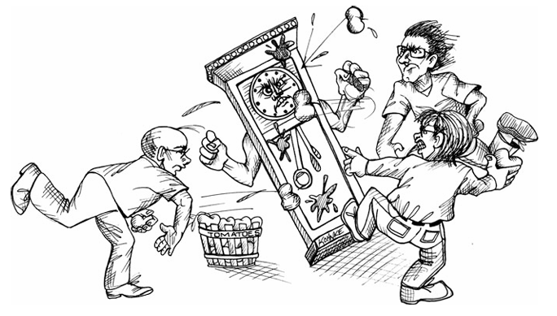

 

# مدیریت زمان

هشت ساعت، مدت زمانی به‌طور قابل‌ملاحظه‌ای کوتاه است. این زمان فقط ۴۸۰ دقیقه یا ۲۸،۸۰۰ ثانیه است. به عنوان یک فرد حرفه‌ای، شما انتظار دارید که از این چند ثانیه گرانبها به کارآمدترین و مؤثرترین شکل ممکن استفاده کنید. چه استراتژی‌ای می‌توانید به کار بگیرید تا اطمینان حاصل کنید که این زمان اندک را هدر نمی‌دهید؟ چگونه می‌توانید زمان خود را به شکلی مؤثر مدیریت کنید؟

در سال ۱۹۸۶، من در «لیتل سندهرست»، در سوری (Surrey) انگلستان زندگی می‌کردم. مدیریت یک دپارتمان توسعه نرم‌افزار ۱۵ نفره را برای شرکت «تراداین» (Teradyne) در براکنل بر عهده داشتم. روزهای من با تماس‌های تلفنی، جلسات بدون برنامه‌ریزی قبلی، مسائل مربوط به خدمات میدانی و وقفه‌های مداوم، بسیار شلوغ و پرهیاهو بود. بنابراین، برای اینکه بتوانم کاری انجام دهم، مجبور شدم نظم و انضباط‌های مدیریت زمانِ بسیار سفت و سختی را اتخاذ کنم:

* هر روز صبح ساعت ۵ بیدار می‌شدم و با دوچرخه به سمت دفتر در براکنل می‌رفتم تا ساعت ۶ آنجا باشم. این کار به من ۲.۵ ساعت زمان ساکت و آرام می‌داد، پیش از آنکه هیاهوی روز آغاز شود.
* به محض ورود، برنامه‌ای را روی تخته وایتبردم می‌نوشتم. زمان را به بازه‌های ۱۵ دقیقه‌ای تقسیم می‌کردم و فعالیتی را که قرار بود در آن بازه انجام دهم، در آن می‌نوشتم.
* ۳ ساعت اول آن برنامه را کاملاً پر می‌کردم. از ساعت ۹ صبح به بعد، در هر ساعت یک جای خالی ۱۵ دقیقه‌ای باقی می‌گذاشتم؛ به این ترتیب می‌توانستم به سرعت اکثر وقفه‌ها و مزاحمت‌ها را به یکی از آن اسلات‌های خالی منتقل کنم و به کارم ادامه دهم.
* زمان بعد از ناهار را برنامه‌ریزی‌نکرده باقی می‌گذاشتم، چون می‌دانستم که تا آن موقع دیگر «سگ صاحبش را نمی‌شناسد» (اوضاع حسابی شلوغ شده) و من باید بقیه روز را در حالت واکنشی (Reactive) سپری کنم. در آن بازه‌های نادر بعدازظهر که آشوب محیط مزاحم نمی‌شد، صرفاً روی مهم‌ترین کار موجود کار می‌کردم تا زمانی که دوباره وقفه‌ای ایجاد شود.

این طرح همیشه هم موفق نبود. بیدار شدن در ساعت ۵ صبح همیشه امکان‌پذیر نبود و گاهی اوقات آشوب محیط تمام استراتژی‌های دقیق مرا در هم می‌شکست و کل روزم را می‌بلعید. اما در بیشتر موارد، می‌توانستم سرم را بالای آب نگه دارم (اوضاع را کنترل کنم).

### جلسات

هزینه جلسات حدود ۲۰۰ دلار در ساعت به ازای هر شرکت‌کننده است. این مبلغ با در نظر گرفتن حقوق، مزایا، هزینه‌های تسهیلات و غیره محاسبه شده است. دفعه بعد که در یک جلسه هستید، هزینه آن را محاسبه کنید. ممکن است شگفت‌زده شوید.

درباره جلسات دو حقیقت وجود دارد:
۱. جلسات ضروری هستند.
۲. جلسات اتلاف‌کنندگان بزرگِ زمان هستند.

اغلب اوقات، این دو حقیقت به طور مساوی یک جلسه واحد را توصیف می‌کنند. برخی از حاضران ممکن است آن جلسه را بسیار ارزشمند بدانند؛ در حالی که دیگران ممکن است آن را زائد یا بی‌فایده تلقی کنند.

#### نپذیرفتن دعوت به جلسه (Declining)

افراد حرفه‌ای از هزینه بالای جلسات آگاه‌اند. آن‌ها همچنین می‌دانند که زمان خودشان گرانبهاست؛ آن‌ها کدی برای نوشتن و برنامه‌های زمانی‌ای برای تحویل دارند. بنابراین، فعالانه در برابر شرکت در جلساتی که منفعت فوری و قابل توجهی ندارند، مقاومت می‌کنند.

شما مجبور نیستید در هر جلسه‌ای که به آن دعوت می‌شوید شرکت کنید. در واقع، رفتن به جلساتِ بیش‌ازحد، غیرحرفه‌ای است. شما باید از زمان خود خردمندانه استفاده کنید. بنابراین در مورد اینکه در کدام جلسات شرکت می‌کنید و کدام را مؤدبانه رد می‌کنید، بسیار دقت به خرج دهید.

شخصی که شما را به جلسه دعوت می‌کند، مسئول مدیریت زمان شما نیست. تنها خود شما می‌توانید این کار را انجام دهید. بنابراین وقتی دعوت‌نامه‌ای برای جلسه دریافت می‌کنید، آن را نپذیرید مگر اینکه جلسه‌ای باشد که مشارکت شما در آن برای کاری که هم‌اکنون انجام می‌دهید، «فوراً و به طور قابل‌توجهی» ضروری باشد.

* گاهی اوقات جلسه در مورد موضوعی است که برایتان جالب است، اما فوریت ندارد. باید انتخاب کنید که آیا استطاعت صرف این زمان را دارید یا خیر. مراقب باشید؛ ممکن است تعداد این جلسات آن‌قدر زیاد باشد که تمام روزهای شما را ببلعند.
* گاهی اوقات جلسه در مورد موضوعی است که می‌توانید در آن مشارکت کنید، اما برای کاری که در حال حاضر انجام می‌دهید اهمیت فوری ندارد. باید انتخاب کنید که آیا زیان وارد شده به پروژه شما، ارزش منفعتی که به پروژه آن‌ها می‌رسانید را دارد یا خیر. شاید این حرف بدبینانه به نظر برسد، اما مسئولیت شما در وهله اول نسبت به پروژه‌های خودتان است. با این حال، کمک یک تیم به تیم دیگر اغلب خوب است، بنابراین ممکن است بخواهید در مورد شرکت خود با تیم و مدیرتان مشورت کنید.
* گاهی اوقات حضور شما در جلسه توسط کسی که در جایگاه قدرت است درخواست می‌شود، مثلاً یک مهندس خیلی ارشد در پروژه‌ای دیگر یا مدیر یک پروژه متفاوت. شما باید انتخاب کنید که آیا آن قدرت بر برنامه کاری شما می‌چربد یا خیر. در اینجا هم تیم و سرپرست شما می‌توانند در گرفتن این تصمیم کمک کنند.

یکی از مهم‌ترین وظایف مدیر شما این است که شما را از جلسات دور نگه دارد. یک مدیر خوب، با کمال میل حاضر است از تصمیم شما برای رد کردن حضور در جلسه دفاع کند، زیرا آن مدیر درست به اندازه شما نگران وقتتان است.

---

### ترک کردن جلسه (Leaving)

جلسات همیشه طبق برنامه پیش نمی‌روند. گاهی اوقات خود را در جلسه‌ای می‌بینید که اگر اطلاعات بیشتری داشتید، دعوت آن را رد می‌کردید. گاهی موضوعات جدیدی اضافه می‌شود، یا یک موضوع مورد علاقه شخصیِ یک نفر (Pet peeve) بر بحث مسلط می‌شود.

در طول سال‌ها من یک قانون ساده برای خودم ایجاد کرده‌ام: **وقتی جلسه کسل‌کننده می‌شود، آن را ترک کنید.**

باز هم تکرار می‌کنم، شما وظیفه دارید زمان خود را به خوبی مدیریت کنید. اگر در جلسه‌ای گرفتار شدید که استفاده مناسبی از زمان شما نیست، باید راهی پیدا کنید تا مؤدبانه از آن خارج شوید.

واضح است که نباید با عصبانیت از جلسه بیرون بزنید و فریاد بزنید «این خیلی کسل‌کننده است!». نیازی به بی‌ادبی نیست. می‌توانید خیلی ساده در یک لحظه مناسب بپرسید که آیا حضور شما همچنان ضروری است یا خیر. می‌توانید توضیح دهید که نمی‌توانید زمان خیلی بیشتری اختصاص دهید و بپرسید آیا راهی برای تسریع بحث یا تغییر ترتیب دستور جلسه وجود دارد یا نه.

نکته مهمی که باید درک کنید این است که باقی ماندن در جلسه‌ای که برای شما تبدیل به اتلاف وقت شده و دیگر نمی‌توانید مشارکت معناداری در آن داشته باشید، **غیرحرفه‌ای** است. شما وظیفه دارید پول و زمان کارفرمای خود را خردمندانه خرج کنید؛ بنابراین، انتخاب لحظه‌ای مناسب برای مذاکره جهت خروج، رفتاری غیرحرفه‌ای نیست.

### دستور جلسه (Agenda) و هدف داشته باشید

دلیلی که ما حاضریم هزینه جلسات را تحمل کنیم این است که گاهی واقعاً نیاز داریم شرکت‌کنندگان در یک اتاق کنار هم باشند تا به تحقق یک هدف خاص کمک کنند. برای استفاده خردمندانه از زمان شرکت‌کنندگان، جلسه باید یک دستور کار واضح داشته باشد که زمان هر موضوع و هدف تعیین‌شده در آن مشخص باشد.

اگر از شما خواسته شد به جلسه‌ای بروید، اطمینان حاصل کنید که می‌دانید چه بحث‌هایی قرار است مطرح شود، چقدر زمان به آن‌ها اختصاص داده شده و قرار است به چه هدفی برسند. اگر نمی‌توانید پاسخ روشنی برای این موارد بگیرید، مؤدبانه از شرکت در آن خودداری کنید.

اگر به جلسه‌ای رفتید و دیدید که دستور جلسه ربوده شده (منحرف شده) یا رها شده است، باید درخواست کنید که موضوع جدید فعلاً کنار گذاشته شود (Tabled) و طبق دستور جلسه پیش بروید. اگر این اتفاق نیفتاد، باید در صورت امکان مؤدبانه جلسه را ترک کنید.

### جلسات ایستاده (Stand-up Meetings)

این جلسات بخشی از اصول (Canon) چابک (Agile) هستند. نام آن‌ها از این واقعیت می‌آید که از شرکت‌کنندگان انتظار می‌رود در طول جلسه ایستاده باشند. هر شرکت‌کننده به نوبت به سه سؤال پاسخ می‌دهد:

۱. دیروز چه کار کردم؟
۲. امروز قرار است چه کار کنم؟
۳. چه چیزی مانع راه من است؟

همین و بس. پاسخ به هر سؤال نباید بیش از بیست ثانیه طول بکشد، بنابراین هر شرکت‌کننده نباید بیش از یک دقیقه وقت بگیرد. حتی در یک گروه ده نفره، این جلسه باید خیلی زودتر از سپری شدن ده دقیقه تمام شود.

### جلسات برنامه‌ریزی تکرار (Iteration Planning Meetings)

این‌ها دشوارترین جلسات در اصول چابک برای خوب اجرا کردن هستند. اگر بد اجرا شوند، زمان بسیار زیادی می‌گیرند. خوب برگزار کردن این جلسات نیاز به مهارت دارد؛ مهارتی که یادگیری آن بسیار ارزشمند است.

جلسات برنامه‌ریزی تکرار (یا اسپرینت) به منظور انتخاب اقلامی از بک‌لاگ (Backlog) هستند که در تکرار بعدی اجرا خواهند شد. تخمین‌ها باید قبلاً برای اقلام کاندیدا انجام شده باشد. ارزیابی ارزش کسب‌وک‌ار باید قبلاً انجام شده باشد. در سازمان‌های واقعاً خوب، تست‌های پذیرش/مؤلفه قبلاً نوشته شده‌اند یا حداقل طرح کلی آن‌ها مشخص شده است.

جلسه باید به سرعت پیش برود؛ هر آیتم کاندیدا از بک‌لاگ به طور مختصر مورد بحث قرار گرفته و سپس یا انتخاب و یا رد می‌شود. نباید بیش از پنج یا ده دقیقه روی هر آیتم خاص وقت گذاشته شود. اگر بحث طولانی‌تری نیاز است، باید برای زمان دیگری و با زیرمجموعه‌ای از اعضای تیم برنامه‌ریزی شود.

قانون سرانگشتی من این است که این جلسه نباید بیش از ۵٪ از کل زمان تکرار را بگیرد. بنابراین برای یک تکرار یک هفته‌ای (چهل ساعت)، جلسه باید ظرف دو ساعت تمام شود.

### بازنگری تکرار (Retrospective) و دمو

این جلسات در پایان هر تکرار برگزار می‌شوند. اعضای تیم در مورد اینکه چه چیزی درست پیش رفت و چه چیزی اشتباه، بحث می‌کنند. ذینفعان (Stakeholders) دموی ویژگی‌های تازه کار را می‌بینند.

این جلسات ممکن است به شدت مورد سوءاستفاده قرار گیرند و زمان زیادی را ببلعند، بنابراین آن‌ها را ۴۵ دقیقه قبل از پایان ساعت کاری در آخرین روز تکرار برنامه‌ریزی کنید. بیش از ۲۰ دقیقه برای بازنگری و ۲۵ دقیقه برای دمو اختصاص ندهید. به یاد داشته باشید، فقط یک یا دو هفته گذشته است، پس نباید حرف زیادی برای گفتن وجود داشته باشد.

---

### بحث‌ها / اختلافات (Arguments / Disagreements)

کنت بِک (Kent Beck) زمانی جمله عمیقی به من گفت: «هر بحثی که نتوان آن را در پنج دقیقه حل‌وفصل کرد، با بحث کردن حل نخواهد شد.»

دلیل اینکه بحث‌ها این‌قدر طولانی می‌شوند این است که شواهد روشنی برای حمایت از هیچ‌یک از طرفین وجود ندارد. بحث احتمالاً به جای اینکه مبتنی بر واقعیت باشد، جنبه «مذهبی» (اعتقادی/سلیقه‌ای) دارد. اختلافات فنی تمایل دارند که سر به فلک بکشند (از واقعیت دور شوند). هر یک از طرفین انواع توجیهات را برای موضع خود دارند، اما به ندرت «داده‌ای» در دست دارند. بدون داده، هر بحثی که ظرف چند دقیقه (بین پنج تا سی دقیقه) منجر به توافق نشود، به سادگی هرگز به توافق نخواهد رسید. تنها کاری که می‌توان کرد این است که بروید و مقداری داده به دست آورید.

برخی افراد سعی می‌کنند با تکیه بر «جذبه شخصیتی» در بحث پیروز شوند. ممکن است داد بزنند، توی صورتتان بیایند، یا رفتاری تحقیرآمیز داشته باشند. مهم نیست؛ نیروی اراده به تنهایی نمی‌تواند اختلافات را برای مدت طولانی حل کند. اما داده‌ها می‌توانند.

برخی افراد «پرخاشگر-منفعل» (Passive-aggressive) هستند. آن‌ها فقط برای پایان دادن به بحث موافقت می‌کنند و سپس با امتناع از مشارکت در راه‌حل، نتیجه کار را خراب می‌کنند. آن‌ها با خود می‌گویند: «این همان طوری است که خودشان می‌خواستند، حالا هم همان چیزی که می‌خواستند گیرشان می‌آید.» این احتمالاً بدترین نوع رفتار غیرحرفه‌ای است که وجود دارد. **هرگز، هرگز این کار را نکنید.** اگر موافقت می‌کنید، باید مشارکت کنید.

چگونه داده‌های مورد نیاز برای حل اختلاف را به دست می‌آورید؟
گاهی اوقات می‌توانید آزمایش‌هایی را اجرا کنید یا شبیه‌سازی و مدل‌سازی انجام دهید. اما گاهی بهترین جایگزین این است که برای انتخاب یکی از دو مسیر مورد بحث، خیلی ساده «شیر یا خط» بیندازید. اگر اوضاع خوب پیش رفت، یعنی آن مسیر عملی بوده است. اگر به مشکل برخوردید، می‌توانید برگردید و مسیر دیگر را طی کنید. عاقلانه است که روی یک زمان مشخص و مجموعه‌ای از معیارها توافق کنید تا تعیین شود چه زمانی باید مسیر انتخاب شده را رها کرد.

از جلساتی که صرفاً محلی برای خالی کردن عقده‌های اختلاف و جمع کردن حمایت برای این طرف یا آن طرف است، برحذر باشید. و از جلساتی که در آن فقط یکی از طرفین دعوا صحبت می‌کند، اجتناب کنید.

اگر یک اختلاف واقعاً باید حل شود، از هر یک از طرفین بخواهید که استدلال خود را در پنج دقیقه یا کمتر برای تیم ارائه دهند. سپس از تیم بخواهید رأی دهند. کل جلسه کمتر از پانزده دقیقه طول خواهد کشید.

### تمرکز - مانا (Focus-Manna)

مرا ببخشید اگر این بخش بوی متافیزیک «عصر جدید» (New Age) یا شاید بازی «سیاه‌چال‌ها و اژدهایان» (Dungeons & Dragons) را می‌دهد. مسئله این است که من درباره این موضوع این‌طور فکر می‌کنم.

برنامه‌نویسی یک تمرین ذهنی است که نیاز به دوره‌های طولانی تمرکز و توجه دارد. تمرکز یک منبع کمیاب است، چیزی شبیه به «مانا» (Manna).*

بعد از اینکه «مانای تمرکز» (Focus-manna) خود را مصرف کردید، باید با انجام فعالیت‌های غیرمتمرکز به مدت یک ساعت یا بیشتر، خود را شارژ کنید. من نمی‌دانم این مانای تمرکز دقیقاً چیست، اما احساس می‌کنم یک ماده فیزیکی (یا شاید فقدان آن) است که بر هوشیاری و توجه تأثیر می‌گذارد. هر چه که باشد، می‌توانید حس کنید که چه زمانی وجود دارد و چه زمانی تمام شده است.

توسعه‌دهندگان حرفه‌ای یاد می‌گیرند که زمان خود را طوری مدیریت کنند که از مانای تمرکزشان بهره ببرند. ما زمانی کد می‌نویسیم که مانای تمرکز بالایی داریم؛ و زمانی که این‌طور نیست، کارهای دیگر و کم‌بازده‌تر را انجام می‌دهیم.

مانای تمرکز همچنین منبعی «رو به زوال» است. اگر زمانی که موجود است از آن استفاده نکنید، احتمالاً آن را از دست خواهید داد. این یکی از دلایلی است که جلسات می‌توانند تا این حد ویرانگر باشند. اگر تمام مانای تمرکز خود را در یک جلسه خرج کنید، دیگر چیزی برای کدنویسی باقی نخواهد ماند.

نگرانی و حواس‌پرتی‌ها نیز مانای تمرکز را مصرف می‌کنند. دعوایی که دیشب با همسرتان داشتید، فرورفتگی‌ای که امروز صبح روی سپر ماشینتان ایجاد کردید، یا قبضی که هفته پیش فراموش کردید پرداخت کنید، همگی مانای تمرکز را به سرعت از وجود شما می‌مکند.

> *پانویس: مانا یک کالای رایج در بازی‌های فانتزی و نقش‌آفرینی مانند Dungeons & Dragons است. هر بازیکن مقدار مشخصی مانا دارد که ماده‌ای جادویی است و هرگاه بازیکن طلسمی اجرا کند مصرف می‌شود. هرچه طلسم قوی‌تر باشد، مانای بیشتری مصرف می‌شود. مانا با نرخ ثابت و آهسته‌ای دوباره شارژ می‌شود. بنابراین خیلی آسان است که تمام آن را در چند نوبت اجرای طلسم مصرف کنید.*

### خواب (Sleep)

نمی‌توانم به اندازه کافی روی اهمیت این مورد تأکید کنم. من بیشترین مانای تمرکز را بعد از یک خواب خوب شبانه دارم. هفت ساعت خواب اغلب به من معادل هشت ساعت کامل مانای تمرکز می‌دهد. توسعه‌دهندگان حرفه‌ای برنامه خواب خود را مدیریت می‌کنند تا اطمینان حاصل کنند که تا زمان رسیدن به محل کار در صبح، مخزن مانای تمرکزشان را پر کرده‌اند.

### کافئین (Caffeine)

شکی نیست که برخی از ما می‌توانیم با مصرف مقادیر متوسط کافئین، استفاده کارآمدتری از مانای تمرکز خود داشته باشیم. اما مراقب باشید. کافئین همچنین یک‌جور «لرزش» یا بی‌قراری عجیب روی تمرکز شما می‌اندازد. مصرف بیش از حد آن می‌تواند تمرکز شما را به جهت‌های بسیار عجیبی بفرستد. یک اثر شدید کافئین می‌تواند باعث شود کل روز را با «تمرکز بیش از حد» (Hyper-focusing) روی چیزهای کاملاً اشتباه هدر دهید.

مصرف کافئین و میزان تحمل آن یک مسئله شخصی است. ترجیح شخصی من یک فنجان قهوه قوی در صبح و یک نوشابه رژیمی با ناهار است. گاهی این دوز را دو برابر می‌کنم، اما به ندرت بیشتر از آن مصرف می‌کنم.

---

### شارژ مجدد (Recharging)

مانای تمرکز می‌تواند تا حدودی با «تمرکز نکردن» (De-focussing) شارژ شود. یک پیاده‌روی طولانی و خوب، گفتگو با دوستان، یا زمانی برای خیره شدن به بیرون از پنجره، همگی می‌توانند به پمپاژ دوباره مانای تمرکز کمک کنند. برخی افراد مدیتیشن می‌کنند. برخی دیگر یک چرت کوتاه (Power nap) می‌زنند. برخی دیگر به پادکست گوش می‌دهند یا مجله‌ای را ورق می‌زنند.

من دریافته‌ام که وقتی مانا تمام می‌شود، نمی‌توانید تمرکز را به زور ایجاد کنید. شما همچنان می‌توانید کد بنویسید، اما تقریباً به یقین مجبور خواهید شد روز بعد آن را بازنویسی کنید، یا برای هفته‌ها و ماه‌ها با توده‌ای از کدهای گندیده (Rotting mass) زندگی کنید. بنابراین بهتر است سی یا حتی شصت دقیقه وقت بگذارید تا «تمرکززدایی» کنید.

### تمرکز عضلانی (Muscle Focus)

انجام دیسیپلین‌های فیزیکی مانند هنرهای رزمی، تای‌چی یا یوگا ویژگی خاص و عجیبی دارد. با اینکه این فعالیت‌ها نیاز به تمرکز قابل‌توجهی دارند، اما نوع تمرکزشان با کدنویسی متفاوت است. این تمرکز فکری نیست، بلکه عضلانی است. و به طریقی، تمرکز عضلانی به شارژ شدن تمرکز ذهنی کمک می‌کند.

البته این چیزی فراتر از یک شارژ ساده است. من متوجه شده‌ام که یک رژیم منظم از تمرکز عضلانی، ظرفیت من برای تمرکز ذهنی را افزایش می‌دهد.

شکل انتخابی من برای تمرکز فیزیکی، دوچرخه‌سواری است. من برای یک یا دو ساعت رکاب می‌زنم و گاهی بیست یا سی مایل (حدود ۳۰ تا ۵۰ کیلومتر) را طی می‌کنم. من در مسیری که به موازات رودخانه «دیس‌پلینز» (Des Plaines) است دوچرخه‌سواری می‌کنم، بنابراین مجبور نیستم با ماشین‌ها سروکله بزنم. در حین دوچرخه‌سواری به پادکست‌هایی درباره نجوم یا سیاست گوش می‌دهم. گاهی فقط به موسیقی مورد علاقه‌ام گوش می‌دهم. و گاهی هم هدفون را خاموش می‌کنم و فقط به طبیعت گوش می‌دهم.

برخی افراد وقت خود را صرف کار با دستانشان می‌کنند. شاید از نجاری، ساخت ماکت، یا باغبانی لذت ببرند. فعالیت هر چه که باشد، ویژگی‌ای در فعالیت‌های متمرکز بر عضلات وجود دارد که توانایی کار با ذهن را تقویت می‌کند.

### ورودی در برابر خروجی (Input Versus Output)

چیز دیگری که برای تمرکز ضروری می‌دانم، ایجاد تعادل بین خروجی و ورودی مناسب است. نوشتن نرم‌افزار یک تمرین خلاقانه است. من دریافته‌ام که زمانی بیشترین خلاقیت را دارم که در معرض خلاقیت دیگران قرار می‌گیرم. به همین دلیل داستان‌های علمی-تخیلی زیادی می‌خوانم. خلاقیت آن نویسندگان به نوعی جوهر خلاقیت خود من را برای نرم‌افزار تحریک می‌کند.

### تایم‌باکسینگ و گوجه‌فرنگی‌ها (Time Boxing and Tomatoes)

یکی از روش‌های بسیار مؤثری که من برای مدیریت زمان و تمرکز خود استفاده کرده‌ام، تکنیک مشهور «پومودورو» (Pomodoro Technique) است که به عنوان «گوجه‌فرنگی‌ها» نیز شناخته می‌شود.

ایده اصلی بسیار ساده است. شما یک تایمر استاندارد آشپزخانه (که به طور سنتی شبیه گوجه‌فرنگی است) را روی ۲۵ دقیقه تنظیم می‌کنید. تا زمانی که آن تایمر در حال کار است، اجازه نمی‌دهید هیچ چیزی در کاری که انجام می‌دهید تداخل ایجاد کند.

اگر تلفن زنگ خورد، جواب می‌دهید و مؤدبانه می‌پرسید که آیا می‌توانید تا ۲۵ دقیقه دیگر تماس بگیرید. اگر کسی کنار میزتان توقف کرد تا سؤالی بپرسد، مؤدبانه می‌پرسید که آیا می‌توانید تا ۲۵ دقیقه دیگر به او مراجعه کنید. فارغ از نوع وقفه، شما صرفاً آن را تا زمانی که تایمر زنگ بزند به تعویق می‌اندازید. هر چه باشد، وقفه‌های اندکی وجود دارند که آن‌قدر وحشتناک فوری باشند که نتوانند ۲۵ دقیقه صبر کنند!

وقتی تایمر گوجه‌فرنگی زنگ زد، فوراً کارتان را متوقف می‌کنید. به وقفه‌هایی که در طول گوجه‌فرنگی رخ داده بود رسیدگی می‌کنید. سپس یک استراحت حدوداً پنج دقیقه‌ای می‌کنید. بعد تایمر را برای ۲۵ دقیقه دیگر تنظیم کرده و گوجه‌فرنگی بعدی را شروع می‌کنید. بعد از هر چهار گوجه‌فرنگی، یک استراحت طولانی‌ترِ حدوداً ۳۰ دقیقه‌ای خواهید داشت.

مطالب زیادی درباره این تکنیک نوشته شده است و من قویاً توصیه می‌کنم آن‌ها را بخوانید. با این حال، توضیحات بالا جان کلام این تکنیک را به شما ارائه می‌دهد.

با استفاده از این تکنیک، زمان شما به زمان «گوجه‌فرنگی» و زمان «غیر گوجه‌فرنگی» تقسیم می‌شود. زمان گوجه‌فرنگی، سازنده و مفید است. در همین گوجه‌فرنگی‌هاست که کار واقعی انجام می‌شود. زمان خارج از گوجه‌فرنگی‌ها یا صرف حواس‌پرتی‌ها، جلسات و استراحت‌ها می‌شود، یا هر زمان دیگری که صرف کار روی وظایفتان نمی‌شود.

چند گوجه‌فرنگی می‌توانید در روز انجام دهید؟ در یک روز خوب ممکن است ۱۲ یا حتی ۱۴ گوجه‌فرنگی را تمام کنید. در یک روز بد، ممکن است فقط دو یا سه تا انجام دهید. اگر آن‌ها را بشمارید و نمودار کنید، خیلی سریع احساس دقیقی پیدا می‌کنید که چه مقدار از روزتان را صرف کارهای سازنده می‌کنید و چه مقدار را صرف سروکله زدن با «چیزهای متفرقه».

برخی افراد آن‌قدر با این تکنیک راحت می‌شوند که وظایف خود را بر حسب گوجه‌فرنگی تخمین می‌زنند و سپس «سرعت» (Velocity) گوجه‌فرنگی هفتگی خود را اندازه می‌گیرند. اما این فقط خامه روی کیک (بخش تشویقی ماجرا) است. فایده واقعی تکنیک پومودورو، آن پنجره زمانی ۲۵ دقیقه‌ای از کار مفید است که شما با چنگ و دندان در برابر تمام وقفه‌ها از آن دفاع می‌کنید.

---

### اجتناب (Avoidance)

گاهی اوقات دلتان به کار نمی‌رود. ممکن است کاری که باید انجام شود ترسناک، ناراحت‌کننده یا کسل‌کننده باشد. شاید فکر می‌کنید که این کار شما را مجبور به یک رویارویی می‌کند یا شما را به داخل سوراخ موشی می‌کشاند که راه فراری از آن نیست. یا شاید خیلی ساده، اصلاً نمی‌خواهید آن را انجام دهید.

#### وارونگی اولویت (Priority Inversion)

دلیلش هر چه باشد، شما راه‌هایی پیدا می‌کنید تا از انجام «کار اصلی» اجتناب کنید. خودتان را متقاعد می‌کنید که چیز دیگری فوری‌تر است و به جای کار اصلی، آن را انجام می‌دهید. به این می‌گویند **«وارونگی اولویت»**.

شما اولویت یک وظیفه دیگر را بالا می‌برید تا بتوانید وظیفه‌ای را که اولویت واقعی دارد، به تعویق بیندازید.

وارونگی اولویت، دروغی است که ما به خودمان می‌گوییم. ما نمی‌توانیم با آنچه باید انجام شود روبرو شویم، بنابراین خودمان را قانع می‌کنیم که وظیفه دیگری مهم‌تر است. ما می‌دانیم که این‌طور نیست، اما به خودمان دروغ می‌گوییم.

در واقع، ما به خودمان دروغ نمی‌گوییم. کاری که واقعاً انجام می‌دهیم این است که داریم مقدمات دروغی را می‌چینیم که وقتی کسی پرسید «چه کار می‌کنی و چرا؟»، آن را تحویلش دهیم. ما داریم یک سنگر دفاعی می‌سازیم تا ما را در برابر قضاوت دیگران محافظت کند.

واضح است که این رفتار غیرحرفه‌ای است. افراد حرفه‌ای اولویت هر وظیفه را بدون توجه به ترس‌ها و امیال شخصی خود ارزیابی کرده و آن وظایف را به ترتیب اولویت اجرا می‌کنند.

### کوچه‌های بن‌بست (Blind Alleys)

کوچه‌های بن‌بست، واقعیت زندگی تمام صنعتگران نرم‌افزار هستند. گاهی اوقات تصمیمی می‌گیرید و در یک مسیر فنی پرسه می‌زنید که به هیچ‌جا ختم نمی‌شود. هرچه بیشتر روی تصمیم خود سرمایه‌گذاری (تعصب) داشته باشید، مدت طولانی‌تری در آن بیابان سرگردان خواهید ماند. اگر آبروی حرفه‌ای خود را گرو گذاشته باشید، تا ابد سرگردان خواهید ماند.

احتیاط و تجربه به شما کمک می‌کند تا از برخی بن‌بست‌ها اجتناب کنید، اما هرگز نمی‌توانید از همه آن‌ها دوری کنید. بنابراین مهارت واقعی که به آن نیاز دارید این است که وقتی در یک بن‌بست هستید، به سرعت متوجه آن شوید و شجاعت عقب‌گرد را داشته باشید. به این گاهی **«قانون چاله‌ها»** می‌گویند: **وقتی در یک چاله هستید، دست از کندن بردارید.**

افراد حرفه‌ای از اینکه آن‌چنان دلبسته و پایبندِ یک ایده شوند که نتوانند آن را رها کنند و برگردند، اجتناب می‌کنند. آن‌ها ذهن خود را نسبت به ایده‌های دیگر باز نگه می‌دارند تا وقتی به بن‌بست خوردند، همچنان گزینه‌های دیگری داشته باشند.

### مرداب‌ها، لجن‌زارها، باتلاق‌ها و سایر کثیف‌کاری‌ها

بدتر از بن‌بست‌ها، «کثیف‌کاری‌ها» (Messes) هستند. کثیف‌کاری‌ها سرعت شما را کم می‌کنند، اما متوقفتان نمی‌کنند. آن‌ها مانع پیشرفت شما می‌شوند، اما شما همچنان می‌توانید با زور بازو و فشار مطلق به جلو حرکت کنید.

کثیف‌کاری‌ها بدتر از بن‌بست‌ها هستند، زیرا شما همیشه می‌توانید راه پیشِ رو را ببینید و همیشه کوتاه‌تر از راه برگشت به نظر می‌رسد (اما این‌طور نیست).

من محصولاتی را دیده‌ام که نابود شده‌اند و شرکت‌هایی را دیده‌ام که به خاطر کثیف‌کاری‌های نرم‌افزاری از بین رفته‌اند. من دیده‌ام که بهره‌وری تیم‌ها تنها در عرض چند ماه، از رقص و پایکوبی (Jitterbug) به نوحه و عزا (Dirge) تبدیل شده است. هیچ‌چیز، تأکید می‌کنم **هیچ‌چیز**، تأثیر منفی عمیق‌تر یا طولانی‌مدت‌تری نسبت به یک «کثیف‌کاری» بر بهره‌وری تیم نرم‌افزاری ندارد.

مشکل اینجاست که شروع یک کثیف‌کاری، درست مثل رفتن به یک کوچه بن‌بست، اجتناب‌ناپذیر است. تجربه و احتیاط می‌تواند به شما کمک کند تا از آن‌ها دوری کنید، اما در نهایت تصمیمی خواهید گرفت که منجر به کثیف‌کاری می‌شود.

پیشروی چنین وضعیتی موذیانه است. شما راه‌حلی برای یک مسئله ساده ایجاد می‌کنید و مراقبید که کد را ساده و تمیز نگه دارید. با گسترش دامنه و پیچیدگی مسئله، آن پایه کد (Code base) را گسترش می‌دهید و سعی می‌کنید تا حد امکان تمیزش نگه دارید. در مقطعی متوجه می‌شوید که در شروع کار یک انتخاب طراحی اشتباه داشته‌اید و کد شما در جهتی که نیازمندی‌ها حرکت می‌کنند، به خوبی مقیاس‌پذیر نیست (Scale نمی‌شود).

این **«نقطه عطف»** است! شما هنوز می‌توانید برگردید و طراحی را اصلاح کنید. اما می‌توانید به جلو هم ادامه دهید. عقب‌گرد پرهزینه به نظر می‌رسد چون باید کدهای موجود را دوباره‌کاری کنید، **اما عقب‌گرد هرگز آسان‌تر از الان نخواهد بود.**

اگر به جلو بروید، سیستم را به داخل باتلاقی می‌رانید که ممکن است هرگز از آن فرار نکند.

افراد حرفه‌ای از کثیف‌کاری‌ها بسیار بیشتر از بن‌بست‌ها می‌ترسند. آن‌ها همیشه گوش‌به‌زنگِ کثیف‌کاری‌هایی هستند که شروع به رشد بی‌رویه می‌کنند و تمام تلاش لازم را به کار می‌بندند تا هر چه زودتر و سریع‌تر از آن‌ها فرار کنند.

حرکت رو به جلو در یک باتلاق، وقتی می‌دانید که آنجا باتلاق است، بدترین نوعِ «وارونگی اولویت» است. با حرکت به جلو، شما دارید به خودتان دروغ می‌گویید، به تیمتان دروغ می‌گویید، به شرکتتان دروغ می‌گویید و به مشتریانتان دروغ می‌گویید. شما به آن‌ها می‌گویید که همه‌چیز خوب پیش خواهد رفت، در حالی که در واقعیت، شما به سمت یک فروپاشی و سرنوشت شوم مشترک پیش می‌روید.

### نتیجه‌گیری

متخصصان نرم‌افزار در مدیریت زمان و تمرکز خود کوشا هستند. آن‌ها وسوسه‌های «وارونگی اولویت» را درک می‌کنند و به عنوان یک مسئله حیثیتی (شرف حرفه‌ای) با آن مبارزه می‌کنند. آن‌ها با باز نگه داشتن ذهن خود نسبت به راه‌حل‌های جایگزین، گزینه‌های خود را حفظ می‌کنند. آن‌ها هرگز آن‌قدر روی یک راه‌حل سرمایه‌گذاری نمی‌کنند که نتوانند آن را رها کنند. و آن‌ها همیشه مراقب کثیف‌کاری‌های در حال رشد هستند و به محض تشخیص، آن‌ها را تمیز می‌کنند.

هیچ منظره‌ای غم‌انگیزتر از تیمی از توسعه‌دهندگان نرم‌افزار نیست که بیهوده در باتلاقی که مدام عمیق‌تر می‌شود، دست‌وپای می‌زنند.
