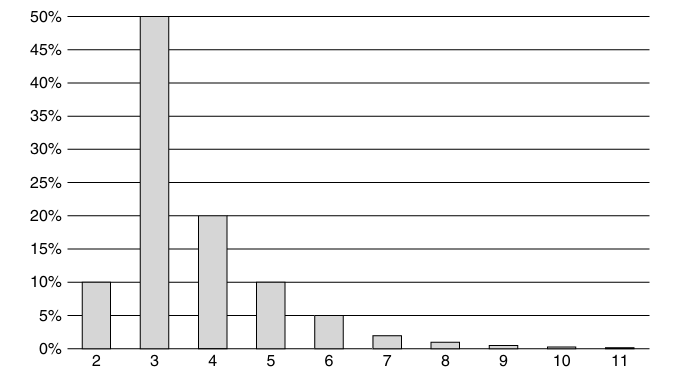

 

# تخمین

تخمین یکی از ساده‌ترین، اما ترسناک‌ترین فعالیت‌هایی است که متخصصان نرم‌افزار با آن روبرو هستند. ارزش کسب‌وکار بسیاری به آن وابسته است. بخش زیادی از اعتبار ما بر آن سوار است. و بخش زیادی از اضطراب و شکست‌های ما ناشی از آن است.

تخمین، گوه (شکاف) اصلی‌ای است که بین افراد تجاری و توسعه‌دهندگان کوبیده شده است. این منبعِ تقریباً تمامی بی‌اعتمادی‌هایی است که بر این رابطه حاکم است.

در سال ۱۹۷۸، من توسعه‌دهنده ارشد یک برنامه ۳۲ کیلوبایتی برای پردازنده Z-80 بودم که به زبان اسمبلی نوشته شده بود. این برنامه روی ۳۲ عدد چیپ ۱ کیلوبایتی (1K x 8 EEprom) سوزانده (Burn) می‌شد. این ۳۲ چیپ در سه بورد قرار می‌گرفتند که هر کدام ۱۲ چیپ را نگه می‌داشتند. ما صدها دستگاه در محیط عملیاتی داشتیم که در مراکز مخابراتی سراسر ایالات متحده نصب شده بودند.

هر زمان که یک باگ را رفع می‌کردیم یا قابلیتی اضافه می‌کردیم، باید تکنسین‌های خدمات میدانی را به تک‌تک آن واحدها می‌فرستادیم تا تمام ۳۲ چیپ را تعویض کنند! این یک کابوس بود. چیپ‌ها و بوردها ظریف بودند. پایه‌های چیپ‌ها ممکن بود خم شده و بشکنند. خم و راست شدن مداوم بوردها می‌توانست به اتصالات لحیم‌کاری آسیب برساند. خطر شکستگی و خطا بسیار زیاد بود. هزینه برای شرکت خیلی بیش از حد بالا بود.

رئیس من، کن فایندر (Ken Finder)، پیش من آمد و خواست این مشکل را حل کنم. چیزی که او می‌خواست راهی بود تا بتوان تغییری در یک چیپ ایجاد کرد که نیازمند تغییر تمام چیپ‌های دیگر نباشد. اگر کتاب‌های مرا خوانده باشید یا سخنرانی‌هایم را شنیده باشید، می‌دانید که من در مورد «قابلیت استقرار مستقل» (Independent Deployability) زیاد غُر می‌زنم و سخنرانی می‌کنم. این‌جایی است که من برای اولین بار این درس را آموختم.

مشکل ما این بود که نرم‌افزار به صورت یک فایل اجراییِ لینک‌شده (Linked Executable) واحد بود. اگر یک خط کد جدید به برنامه اضافه می‌شد، تمام آدرس‌های خطوط بعدی کد تغییر می‌کرد. از آنجا که هر چیپ فقط ۱ کیلوبایت از فضای آدرس را در خود داشت، محتوای تقریباً تمام چیپ‌ها تغییر می‌کرد.

راه‌حل نسبتاً ساده بود. هر چیپ باید از تمام چیپ‌های دیگر جدا (Decouple) می‌شد. هر کدام باید به یک «واحد کامپایل مستقل» تبدیل می‌شد که بتوان آن را مستقل از دیگران روی چیپ سوزاند. بنابراین من اندازه تمام توابع برنامه را اندازه گرفتم و یک برنامه ساده نوشتم که آن‌ها را مثل قطعات پازل در هر یک از چیپ‌ها جا می‌داد و حدود ۱۰۰ بایت فضا برای توسعه‌های بعدی باقی می‌گذاشت.

در ابتدای هر چیپ، جدولی از اشاره‌گرها (Pointers) به تمام توابع موجود در آن چیپ قرار دادم. هنگام بوت شدن سیستم، این اشاره‌گرها به RAM منتقل می‌شدند. تمام کد سیستم تغییر کرد تا توابع فقط از طریق این بردارهای RAM فراخوانی شوند و هرگز مستقیماً صدا زده نشوند.

بله، درست متوجه شدید. چیپ‌ها «شیء» (Object) بودند و «جداول مجازی» (vtables) داشتند. تمام توابع به صورت «چندریختی» (Polymorphically) مستقر شده بودند. و بله، این‌گونه بود که من برخی از اصول طراحی شیءگرا (OOD) را آموختم، خیلی قبل از آنکه بدانم شیء چیست.

مزایا فوق‌العاده بود. نه تنها می‌توانستیم چیپ‌های تکی را مستقر کنیم، بلکه می‌توانستیم در محیط عملیاتی با انتقال توابع به RAM و تغییر مسیر بردارها، پچ‌های (Patch) نرم‌افزاری اعمال کنیم. این کار دیباگ کردن در محل و پچ کردن داغ (Hot patching) را بسیار آسان‌تر کرد.

اما از بحث دور شدم. وقتی «کن» پیش من آمد و خواست این مشکل را حل کنم، چیزی درباره اشاره‌گر به توابع پیشنهاد داد. من یکی دو روز را صرف فرموله کردن ایده کردم و سپس طرحی دقیق به او ارائه دادم. او از من پرسید چقدر طول می‌کشد و من پاسخ دادم که حدود یک ماه زمان می‌برد.

این کار سه ماه طول کشید.

من در تمام عمرم فقط دو بار مست شده‌ام و فقط یک بار واقعاً سیاه مست بودم. آن هم در جشن کریسمس «تراداین» در سال ۱۹۷۸ بود. من ۲۶ ساله بودم. جشن در دفتر تراداین برگزار می‌شد که بیشتر فضای آزمایشگاهی باز بود. همه زود رسیدند و سپس کولاک شدیدی شد که مانع رسیدن گروه موسیقی و کترینگ غذا شد. خوشبختانه مشروبات الکلی به وفور یافت می‌شد.

من چیز زیادی از آن شب به یاد ندارم. و همان چیزهایی را هم که به یاد دارم، کاش به یاد نداشتم. اما یک لحظه پراحساس را با شما به اشتراک می‌گذارم. من چهارزانو روی زمین نشسته بودم و با کن (رئیسم که در آن زمان کلِ ۲۹ سالش بود و مست هم نبود) صحبت می‌کردم و گریه می‌کردم که چرا کارِ برداری کردن (Vectorization) این‌قدر طول کشیده است. الکل ترس‌ها و ناامنی‌های سرکوب‌شده‌ام درباره تخمینم را آزاد کرده بود. فکر نمی‌کنم سرم روی پاهایش بوده باشد، اما حافظه‌ام در مورد این‌جور جزئیات خیلی شفاف نیست. یادم هست از او پرسیدم آیا از دست من عصبانی است و آیا فکر می‌کند خیلی طول کشیده است.

اگرچه آن شب مثل یک تصویر مات و تار بود، اما پاسخ او در دهه‌های بعد شفاف مانده است. او گفت: «بله، فکر می‌کنم زمان زیادی از تو گرفته، اما می‌بینم که سخت روی آن کار می‌کنی و پیشرفت خوبی داری. این چیزی است که واقعاً به آن نیاز داریم. پس، نه، من عصبانی نیستم.»

### تخمین چیست؟ (What is an Estimate)

مشکل اینجاست که ما به تخمین‌ها به شیوه‌های متفاوتی نگاه می‌کنیم.

* کسب‌وکار دوست دارد به تخمین‌ها به عنوان **«تعهد»** (Commitment) نگاه کند.
* توسعه‌دهندگان دوست دارند به تخمین‌ها به عنوان **«حدس»** (Guess) نگاه کنند.

تفاوت این دو عمیق است.

#### تعهد (A Commitment)

تعهد چیزی است که **باید** به آن دست یابید. اگر متعهد می‌شوید کاری را تا تاریخ مشخصی انجام دهید، پس باید آن را تا آن تاریخ تمام کنید. اگر این به معنای آن است که باید روزی ۱۲ ساعت کار کنید، آخرهفته‌ها کار کنید و قید تعطیلات خانوادگی را بزنید، پس باید همین کار را بکنید. شما تعهد داده‌اید و باید به آن وفادار باشید.

افراد حرفه‌ای تعهد نمی‌دهند مگر اینکه بدانند می‌توانند به آن دست یابند. به همین سادگی. اگر از شما خواسته شود به چیزی متعهد شوید که مطمئن نیستید می‌توانید انجامش دهید، شرافت شما حکم می‌کند که آن را نپذیرید.

اگر از شما خواسته شود به تاریخی متعهد شوید که می‌دانید می‌توانید به آن برسید، اما نیاز به ساعات طولانی کار، کار در آخرهفته و لغو تعطیلات خانوادگی دارد، آنگاه انتخاب با شماست؛ اما بهتر است مایل به انجام هر کاری که لازم است باشید.

تعهد درباره **«قطعیت»** است. دیگران قرار است تعهدات شما را بپذیرند و بر اساس آن‌ها برنامه‌ریزی کنند. هزینه انجام نشدن آن تعهدات، برای آن‌ها و برای شهرت و اعتبار شما، بسیار زیاد است. عمل نکردن به تعهد، نوعی بی‌صداقتی است که تنها اندکی از یک دروغ آشکار کمتر سنگین است.

---

#### یک تخمین (An Estimate)

یک تخمین، یک **«حدس»** است. هیچ تعهدی در آن مستتر نیست. هیچ قولی داده نشده است. برآورده نشدن یک تخمین به هیچ وجه بی‌شرافتی نیست. دلیل اینکه ما تخمین می‌زنیم این است که **نمی‌دانیم** کاری چقدر طول خواهد کشید.

متأسفانه، اکثر توسعه‌دهندگان نرم‌افزار تخمین‌زنندگان وحشتناکی هستند. دلیلش این نیست که تخمین زدن یک مهارت مخفی دارد؛ این‌طور نیست. دلیل اینکه ما اغلب در تخمین زدن این‌قدر بد هستیم این است که ماهیت واقعی یک تخمین را درک نمی‌کنیم.

تخمین یک عدد نیست. تخمین یک **«توزیع»** (Distribution) است.

توجه کنید:

* **مایک:** «تخمینت برای تکمیل کارِ "فرازل" (Frazzle) چیه؟»
* **پیتر:** «سه روز.»

آیا پیتر واقعاً سه روزه کار را تمام می‌کند؟ ممکن است، اما چقدر احتمال دارد؟ پاسخ این است: ما هیچ ایده‌ای نداریم. پیتر چه منظوری داشت و مایک چه فهمید؟ اگر مایک سه روز دیگر برگردد، آیا باید تعجب کند که کار پیتر تمام نشده؟ چرا باید تعجب کند؟ پیتر تعهدی نداده است. پیتر به او نگفته که احتمال سه روزه تمام شدن چقدر در برابر چهار یا پنج روز است.

چه اتفاقی می‌افتاد اگر مایک از پیتر می‌پرسید که احتمالِ تخمینِ سه روزه چقدر است؟

* **مایک:** «چقدر احتمال داره که سه روزه تمومش کنی؟»
* **پیتر:** «خیلی محتمله.»
* **مایک:** «میشه یه عدد براش بگی؟»
* **پیتر:** «پنجاه یا شصت درصد.»
* **مایک:** «پس شانس خوبی هم هست که چهار روز طول بکشه.»
* **پیتر:** «آره، در واقع حتی ممکنه پنج یا شش روز طول بکشه، اگرچه شک دارم.»
* **مایک:** «چقدر شک داری؟»
* **پیتر:** «اوه، نمی‌دونم... نود و پنج درصد مطمئنم که قبل از شش روز تمومش می‌کنم.»
* **مایک:** «منظورت اینه که ممکنه هفت روز بشه؟»
* **پیتر:** «خب، فقط اگه همه‌چیز خراب بشه. لعنتی، اگه همه‌چیز خراب بشه، ممکنه ده یا حتی یازده روز طول بکشه. اما خیلی احتمال نداره که این‌قدر همه‌چیز به هم بریزه.»

حالا داریم به حقیقت نزدیک می‌شویم. تخمین پیتر یک **توزیع احتمال** است. در ذهن پیتر، احتمال تکمیل کار شبیه چیزی است که در شکل ۱-۱۰ نشان داده شده است (اشاره به نمودار توزیع احتمال).

می‌توانید ببینید چرا پیتر تخمین اولیه را سه روز داد. این بلندترین میله در نمودار است. بنابراین در ذهن پیتر، این محتمل‌ترین مدت زمان برای انجام کار است. اما مایک قضایا را متفاوت می‌بیند. او به «دُم» سمت راست نمودار نگاه می‌کند و نگران است که پیتر واقعاً یازده روز طول بدهد تا کار را تمام کند.

 

آیا مایک باید نگران این موضوع باشد؟ البته! قانون مورفی* راه خودش را با پیتر پیدا می‌کند، پس احتمالاً بعضی چیزها خراب خواهند شد.

### تعهدات ضمنی (Implied Commitments)

حالا مایک یک مشکل دارد. او در مورد زمانی که طول می‌کشد تا پیتر کار را تمام کند، نامطمئن است. برای به حداقل رساندن این عدم قطعیت، ممکن است از پیتر یک «تعهد» بخواهد. این چیزی است که پیتر در جایگاهی نیست که بتواند بدهد.

* **مایک:** «پیتر، می‌تونی یه تاریخ قطعی به من بدی که کی کار تموم میشه؟»
* **پیتر:** «نه مایک. همون‌طور که گفتم، احتمالاً سه، شاید هم چهار روزه تموم میشه.»
* **مایک:** «پس می‌تونیم بگیم چهار روز؟»
* **پیتر:** «نه، ممکنه پنج یا شش روز بشه.»

تا اینجا، همه دارند منصفانه رفتار می‌کنند. مایک درخواست تعهد کرده و پیتر با دقت از دادن آن امتناع کرده است. بنابراین مایک روش متفاوتی را امتحان می‌کند:

* **مایک:** «خیلی خب پیتر، اما می‌تونی **سعی کنی** (Try) که بیشتر از شش روز نشه؟»

درخواست مایک به نظر معصومانه می‌آید و مایک قطعاً نیت بدی ندارد. اما مایک دقیقاً از پیتر می‌خواهد چه کار کند؟ «سعی کردن» یعنی چه؟ ما قبلاً در فصل ۲ درباره این موضوع صحبت کردیم. کلمه «سعی کردن» یک اصطلاح باردار و سنگین است.

اگر پیتر موافقت کند که «سعی کند»، پس دارد به شش روز **متعهد** می‌شود. هیچ راه دیگری برای تفسیر آن وجود ندارد. موافقت با سعی کردن، موافقت با موفق شدن است. چه تفسیر دیگری می‌تواند وجود داشته باشد؟

پیتر دقیقاً قرار است چه کاری انجام دهد تا «سعی» کرده باشد؟ آیا قرار است بیش از هشت ساعت کار کند؟ این به وضوح مستتر (Implied) است. آیا قرار است آخرهفته‌ها کار کند؟ بله، این هم مستتر است. آیا قرار است تعطیلات خانوادگی را لغو کند؟ بله، این هم بخشی از آن مفهوم ضمنی است. همه این چیزها بخشی از «سعی کردن» هستند. اگر پیتر این کارها را انجام ندهد، مایک می‌تواند او را متهم کند که به اندازه کافی سعی نکرده است.

افراد حرفه‌ای مرز مشخصی بین تخمین‌ها و تعهدات قائل می‌شوند. آن‌ها تعهد نمی‌دهند مگر اینکه یقین داشته باشند موفق می‌شوند. آن‌ها مراقب هستند که هیچ تعهد ضمنی‌ای ندهند. آن‌ها توزیع احتمال تخمین‌های خود را تا حد امکان به وضوح بیان می‌کنند تا مدیران بتوانند برنامه‌ریزی‌های مناسبی انجام دهند.

> *پانویس: قانون مورفی بیان می‌کند که اگر چیزی امکان خراب شدن داشته باشد، خراب خواهد شد.*

---

### تکنیک PERT

در سال ۱۹۵۷، «تکنیک ارزیابی و بازنگری برنامه» (PERT) برای پشتیبانی از پروژه زیردریایی پلاریس نیروی دریایی آمریکا ایجاد شد. یکی از عناصر PERT روشی است که تخمین‌ها در آن محاسبه می‌شوند. این طرح روشی بسیار ساده اما بسیار مؤثر برای تبدیل تخمین‌ها به توزیع‌های احتمالیِ مناسب برای مدیران ارائه می‌دهد.

وقتی شما یک وظیفه (Task) را تخمین می‌زنید، سه عدد ارائه می‌دهید. به این کار «تحلیل سه‌متغیره» (Trivariate Analysis) گفته می‌شود:

* **O: تخمین خوش‌بینانه (Optimistic Estimate).** این عدد به طرز وحشتناکی خوش‌بینانه است. شما تنها در صورتی می‌توانید کار را در این مدت تمام کنید که **مطلقاً** همه‌چیز درست پیش برود. در واقع، برای اینکه ریاضیات درست کار کند، این عدد باید شانسی بسیار کمتر از ۱٪ برای وقوع داشته باشد.* در مورد پیتر، این عدد ۱ روز است، همان‌طور که در شکل ۱-۱۰ نشان داده شده است.
* **N: تخمین اسمی (Nominal Estimate).** این تخمینی است که بیشترین شانس موفقیت را دارد. اگر بخواهید نمودار میله‌ای رسم کنید، این بلندترین میله خواهد بود (شکل ۱-۱۰). در اینجا ۳ روز است.
* **P: تخمین بدبینانه (Pessimistic Estimate).** باز هم، این عدد به طرز وحشتناکی بدبینانه است. این عدد باید همه‌چیز را شامل شود به جز طوفان، جنگ هسته‌ای، سیاه‌چاله‌های سرگردان و سایر فجایع. باز هم، ریاضیات تنها در صورتی کار می‌کند که این عدد شانسی بسیار کمتر از ۱٪ برای موفقیت داشته باشد. در مورد پیتر، این عدد از سمت راست نمودار بیرون می‌زند. پس ۱۲ روز.

با داشتن این سه تخمین، می‌توانیم توزیع احتمال را به صورت زیر توصیف کنیم:

$$ \mu = \frac{O + 4N + P}{6} $$

$\mu$ (مو) مدت زمان مورد انتظار (Expected Duration) برای وظیفه است. در مورد پیتر این عدد برابر است با $(1 + 12 + 12) / 6$ یا حدود ۴.۲ روز. برای اکثر وظایف، این عدد تا حدی بدبینانه خواهد بود زیرا دُم سمت راست توزیع، طولانی‌تر از دُم سمت چپ است.**

$$ \sigma = \frac{P - O}{6} $$

$\sigma$ (سیگما) انحراف معیار (Standard Deviation)*** توزیع احتمال برای آن وظیفه است. این معیاری است برای اینکه آن وظیفه چقدر **عدم قطعیت** دارد. وقتی این عدد بزرگ است، عدم قطعیت نیز بزرگ است. برای پیتر این عدد برابر است با $(12 - 1) / 6$ یا حدود ۱.۸ روز.

با توجه به تخمین پیتر که ۴.۲ (با انحراف ۱.۸) است، مایک می‌فهمد که این کار احتمالاً ظرف پنج روز انجام می‌شود، اما ممکن است ۶ یا حتی ۹ روز هم طول بکشد.

> *پانویس ۲: عدد دقیق برای یک توزیع نرمال ۱:۷۶۹ یا ۰.۱۳٪ یا ۳ سیگما است. شانس یک در هزار احتمالاً ایمن است.*
> *پانویس ۳: PERT فرض می‌کند که این توزیع تقریبی از توزیع بتا (Beta Distribution) است. این منطقی است زیرا حداقل زمان برای یک کار اغلب بسیار قطعی‌تر از حداکثر زمان آن است.*
> *پانویس ۴: اگر نمی‌دانید انحراف معیار چیست، باید خلاصه خوبی از آمار و احتمالات پیدا کنید. درک این مفهوم سخت نیست و به شما خدمت بزرگی خواهد کرد.*

### PERT (ادامه)

اما مایک فقط یک وظیفه را مدیریت نمی‌کند. او پروژه‌ای متشکل از وظایف متعدد را مدیریت می‌کند. پیتر سه تا از این وظایف را دارد که باید به ترتیب روی آن‌ها کار کند. پیتر این وظایف را همان‌طور که در جدول ۱-۱۰ نشان داده شده، تخمین زده است.

**جدول ۱-۱۰: وظایف پیتر**

| وظیفه (Task) | خوش‌بینانه (O) | اسمی (N) | بدبینانه (P) | $\mu$ | $\sigma$ |
| :--- | :--- | :--- | :--- | :--- | :--- |
| Alpha | ۱ | ۳ | ۱۲ | ۴.۲ | ۱.۸ |
| Beta | ۱ | ۱.۵ | ۱۴ | ۳.۵ | ۲.۲ |
| Gamma | ۳ | ۶.۲۵ | ۱۱ | ۶.۵ | ۱.۳ |

ماجرای وظیفه «بِتا» (Beta) چیست؟ به نظر می‌رسد پیتر در مورد آن خیلی مطمئن است (چون ۱ و ۱.۵ نزدیک هستند)، اما احتمال دارد چیزی خراب شود که او را به شدت از مسیر خارج کند (چون بدبینانه ۱۴ روز است). مایک چگونه باید این را تفسیر کند؟ مایک باید چقدر زمان برای تکمیل هر سه وظیفه توسط پیتر در نظر بگیرد؟

معلوم می‌شود که با چند محاسبه ساده، مایک می‌تواند تمام وظایف پیتر را ترکیب کند و به یک توزیع احتمال برای **کل مجموعه وظایف** برسد. ریاضیات آن کاملاً سرراست است:

$$ \mu_{sequence} = \sum \mu_{task} $$

برای هر دنباله‌ای از وظایف، مدت زمان مورد انتظار آن دنباله، حاصل‌جمع ساده تمام مدت‌زمان‌های مورد انتظار وظایف در آن دنباله است. بنابراین اگر پیتر سه وظیفه برای تکمیل دارد و تخمین‌های آن‌ها ۴.۲/۱.۸، ۳.۵/۲.۲ و ۶.۵/۱.۳ هستند، پیتر احتمالاً تمام آن‌ها را در حدود ۱۴ روز تمام خواهد کرد: $4.2 + 3.5 + 6.5$.

$$ \sigma_{sequence} = \sqrt{\sum \sigma_{task}^2} $$

انحراف معیارِ دنباله، برابر است با جذرِ مجموعِ مربعاتِ انحراف معیارهای وظایف.
بنابراین انحراف معیار برای هر سه وظیفه پیتر حدود ۳ است:
$$ \sqrt{1.8^2 + 2.2^2 + 1.3^2} = \sqrt{3.24 + 4.84 + 1.69} = \sqrt{9.77} \approx 3.13 $$

این به مایک می‌گوید که وظایف پیتر احتمالاً ۱۴ روز طول می‌کشد، اما خیلی محتمل است که ۱۷ روز (یک سیگما بیشتر) طول بکشد و حتی ممکن است ۲۰ روز (دو سیگما بیشتر) هم زمان ببرد. حتی ممکن است بیشتر طول بکشد، اما خیلی بعید است.

به جدول تخمین‌ها نگاه کنید. آیا فشاری برای انجام هر سه کار در ۵ روز را احساس می‌کنید؟ هر چه باشد، تخمین‌های خوش‌بینانه ۱، ۱ و ۳ هستند (جمعاً ۵ روز). حتی تخمین‌های اسمی (Nominal) هم فقط به ۱۰ روز می‌رسند.

چطور به ۱۴ روز رسیدیم، با احتمال ۱۷ یا ۲۰ روز؟

پاسخ این است که عدم قطعیت در آن وظایف به گونه‌ای ترکیب می‌شود که به برنامه **واقع‌بینی** اضافه می‌کند. اگر برنامه‌نویسی با بیش از چند سال تجربه باشید، احتمالاً پروژه‌هایی را دیده‌اید که خوش‌بینانه تخمین زده شده‌اند و سه تا پنج برابر بیشتر از آنچه امید می‌رفت طول کشیده‌اند.

طرح ساده PERT که نشان داده شد، یک راه معقول برای کمک به جلوگیری از ایجاد انتظارات خوش‌بینانه است. متخصصان نرم‌افزار بسیار مراقب هستند که با وجود فشار برای سریع پیش رفتن، انتظارات معقولی تعیین کنند.

---

### تخمین وظایف (Estimating Tasks)

مایک و پیتر مرتکب اشتباه وحشتناکی شده بودند. مایک داشت از پیتر می‌پرسید که وظایفش چقدر طول می‌کشد. پیتر پاسخ‌های صادقانه و سه‌متغیره (Trivariate) می‌داد، اما نظر هم‌تیمی‌هایش چه؟ آیا ممکن بود آن‌ها ایده متفاوتی داشته باشند؟

مهم‌ترین منبع تخمینی که در اختیار دارید، افراد اطراف شما هستند. آن‌ها می‌توانند چیزهایی را ببینند که شما نمی‌بینید. آن‌ها می‌توانند به شما کمک کنند تا وظایف خود را دقیق‌تر از زمانی که خودتان به تنهایی تخمین می‌زنید، برآورد کنید.

### دلفی پهن‌باند (Wideband Delphi)

در دهه ۱۹۷۰، بری بوهم (Barry Boehm) ما را با تکنیکی برای تخمین آشنا کرد که «دلفی پهن‌باند» نام داشت. در طول سال‌ها تغییرات زیادی در این روش ایجاد شده است. برخی رسمی هستند، برخی غیررسمی؛ اما همه آن‌ها یک چیز مشترک دارند: **اجماع**.

استراتژی ساده است. تیمی از افراد دور هم جمع می‌شوند، درباره یک وظیفه بحث می‌کنند، آن را تخمین می‌زنند و بحث و تخمین را تکرار می‌کنند تا زمانی که به توافق برسند.

رویکرد اصلی که توسط بوهم ترسیم شده بود، شامل جلسات و مستندات متعددی بود که برای سلیقه من تشریفات و سربار زیادی داشت. من رویکردهای ساده و کم‌سربار مانند موارد زیر را ترجیح می‌دهم.

#### انگشتان پرنده (Flying Fingers)

همه دور یک میز می‌نشینند. وظایف یکی‌یکی مورد بحث قرار می‌گیرند. برای هر وظیفه، بحثی در مورد اینکه وظیفه شامل چه چیزهایی است، چه چیزهایی ممکن است آن را پیچیده یا گیج‌کننده کند و چگونه ممکن است پیاده‌سازی شود، انجام می‌شود.

سپس شرکت‌کنندگان دستان خود را زیر میز می‌برند و بر اساس اینکه فکر می‌کنند آن وظیفه چقدر طول می‌کشد، ۰ تا ۵ انگشت را آماده می‌کنند. مدیر جلسه می‌شمارد: ۱-۲-۳، و همه شرکت‌کنندگان دستان خود را همزمان نشان می‌دهند.

اگر همه موافق باشند، به سراغ وظیفه بعدی می‌روند. در غیر این صورت، بحث را ادامه می‌دهند تا مشخص شود چرا اختلاف نظر دارند. آن‌ها این کار را تا زمان توافق تکرار می‌کنند. توافق لازم نیست مطلق باشد. تا زمانی که تخمین‌ها به هم نزدیک باشند، کافی است. مثلاً، ترکیبی از اعداد ۳ و ۴ به معنای توافق است. اما اگر همه ۴ انگشت نشان دهند به جز یک نفر که ۱ انگشت نشان می‌دهد، آنگاه چیزی برای صحبت کردن دارند.

مقیاس تخمین در ابتدای جلسه تعیین می‌شود. ممکن است تعداد روزها برای یک وظیفه باشد، یا مقیاسی جالب‌تر مانند «تعداد انگشتان ضربدر سه» یا «تعداد انگشتان به توان دو». همزمانی در نمایش انگشتان مهم است. ما نمی‌خواهیم افراد بر اساس آنچه دیگران انجام می‌دهند، تخمین خود را تغییر دهند.

#### پوکر برنامه‌ریزی (Planning Poker)

در سال ۲۰۰۲، جیمز گرنینگ (James Grenning) مقاله دلپذیری نوشت که «پوکر برنامه‌ریزی» را توصیف می‌کرد. این نوع از دلفی پهن‌باند آن‌قدر محبوب شده است که چندین شرکت مختلف از این ایده استفاده کرده‌اند تا هدایای تبلیغاتی به شکل دسته‌های کارت پوکر برنامه‌ریزی بسازند. حتی وب‌سایتی به نام planningpoker.com وجود دارد که می‌توانید برای انجام پوکر برنامه‌ریزی در شبکه با تیم‌های توزیع‌شده از آن استفاده کنید.

ایده بسیار ساده است. به هر عضو تیمِ تخمین، دستی از کارت‌ها با اعداد مختلف داده می‌شود. اعداد ۰ تا ۵ خوب کار می‌کنند و این سیستم را از نظر منطقی معادل «انگشتان پرنده» می‌سازند.

یک وظیفه را انتخاب و درباره آن بحث کنید. در نقطه‌ای، مدیر جلسه از همه می‌خواهد کارتی را انتخاب کنند. اعضای تیم کارتی را که با تخمینشان مطابقت دارد بیرون می‌کشند و آن را طوری نگه می‌دارند که پشت کارت به سمت بیرون باشد و هیچ‌کس نتواند مقدار آن را ببیند. سپس مدیر به همه می‌گوید کارت‌هایشان را نشان دهند. بقیه ماجرا درست مثل انگشتان پرنده است.

اگر توافق وجود داشته باشد، تخمین پذیرفته می‌شود. در غیر این صورت، کارت‌ها به دست برگردانده می‌شوند و بازیکنان به بحث درباره وظیفه ادامه می‌دهند.

«علم» زیادی صرف انتخاب مقادیر صحیح کارت برای یک دست شده است. برخی افراد تا آنجا پیش رفته‌اند که از کارت‌های مبتنی بر سری فیبوناچی استفاده می‌کنند. دیگران کارت‌هایی برای بی‌نهایت و علامت سؤال هم گنجانده‌اند. شخصاً فکر می‌کنم پنج کارت با برچسب‌های ۰، ۱، ۳، ۵ و ۱۰ کافی هستند.

#### تخمینِ قرابت (Affinity Estimation)

یک نوع منحصر‌به‌فرد از دلفی پهن‌باند چند سال پیش توسط لوول لیندستروم (Lowell Lindstrom) به من نشان داده شد. من با این رویکرد در تیم‌ها و مشتریان مختلف شانس خوبی داشته‌ام.

تمام وظایف روی کارت‌هایی نوشته می‌شوند، بدون اینکه هیچ تخمینی روی آن‌ها باشد. تیم تخمین دور یک میز یا دیوار می‌ایستند و کارت‌ها به صورت تصادفی پخش شده‌اند. اعضای تیم صحبت نمی‌کنند، آن‌ها صرفاً شروع به مرتب کردن کارت‌ها نسبت به یکدیگر می‌کنند. وظایفی که زمان بیشتری می‌برند به سمت راست منتقل می‌شوند. وظایف کوچک‌تر به سمت چپ می‌روند.

هر عضو تیم می‌تواند هر کارتی را در هر زمانی جابجا کند، حتی اگر قبلاً توسط عضو دیگری جابجا شده باشد. هر کارتی که بیش از $h$ بار جابجا شود، برای بحث کنار گذاشته می‌شود.

در نهایت، مرتب‌سازیِ ساکت فروکش می‌کند و بحث می‌تواند آغاز شود. اختلافات در مورد ترتیب کارت‌ها بررسی می‌شود. ممکن است جلسات طراحی سریع یا وایرفریم‌های دستی سریعی کشیده شود تا به اجماع کمک کند.

گام بعدی کشیدن خطوطی بین کارت‌هاست که نشان‌دهنده اندازه دسته‌ها (Buckets) هستند. این دسته‌ها می‌توانند بر اساس روز، هفته یا امتیاز باشند. پنج دسته در یک دنباله فیبوناچی (۱، ۲، ۳، ۵، ۸) سنتی است.

#### تخمین‌های سه‌متغیره (Trivariate Estimates)

این تکنیک‌های دلفی پهن‌باند برای انتخاب یک تخمین اسمی (Nominal) واحد برای یک وظیفه خوب هستند. اما همان‌طور که قبلاً گفتیم، بیشتر اوقات ما سه تخمین می‌خواهیم تا بتوانیم یک توزیع احتمال ایجاد کنیم.

مقادیر خوش‌بینانه و بدبینانه برای هر وظیفه می‌توانند به سرعت با استفاده از هر یک از انواع دلفی پهن‌باند تولید شوند. برای مثال، اگر از پوکر برنامه‌ریزی استفاده می‌کنید، به سادگی از تیم بخواهید کارت‌های مربوط به تخمین بدبینانه خود را بالا بگیرند و سپس بالاترین عدد را بردارید. همین کار را برای تخمین خوش‌بینانه انجام دهید و پایین‌ترین عدد را بردارید.

### قانون اعداد بزرگ (The Law of Large Numbers)

تخمین‌ها پر از خطا هستند. به همین دلیل است که به آن‌ها «تخمین» می‌گویند. یکی از راه‌های مدیریت خطا، استفاده از «قانون اعداد بزرگ» است. یکی از نتایج این قانون این است که اگر یک وظیفه بزرگ را به وظایف کوچک‌ترِ متعدد بشکنید و آن‌ها را مستقل از هم تخمین بزنید، مجموعِ تخمین‌های وظایف کوچک دقیق‌تر از یک تخمینِ واحد از وظیفه بزرگ خواهد بود.

دلیل این افزایش دقت این است که خطاها در وظایف کوچک تمایل دارند یکدیگر را خنثی کنند (Integrate out). صادقانه بگویم، این دیدگاه خوش‌بینانه است. خطاها در تخمین‌ها بیشتر به سمت دست‌کم گرفتن (Underestimation) تمایل دارند تا دست‌بالا گرفتن، بنابراین این خنثی‌سازی به ندرت کامل است.

با این حال، شکستن وظایف بزرگ به کوچک و تخمین زدن مستقل آن‌ها همچنان تکنیک خوبی است. برخی از خطاها واقعاً خنثی می‌شوند و شکستن وظایف راه خوبی برای درک بهتر آن‌ها و کشف موارد غافلگیرکننده است.

### نتیجه‌گیری

توسعه‌دهندگان نرم‌افزار حرفه‌ای می‌دانند چگونه تخمین‌های عملی به کسب‌وک‌ار ارائه دهند که بتوان از آن‌ها برای مقاصد برنامه‌ریزی استفاده کرد. آن‌ها قول‌هایی نمی‌دهند که نتوانند نگه دارند و تعهداتی نمی‌دهند که مطمئن نباشند می‌توانند به آن‌ها عمل کنند.

وقتی حرفه‌ای‌ها تعهد می‌دهند، اعداد قطعی ارائه می‌کنند و سپس آن اعداد را محقق می‌سازند. با این حال، در بیشتر موارد حرفه‌ای‌ها چنین تعهداتی نمی‌دهند. بلکه آن‌ها تخمین‌های احتمالی ارائه می‌دهند که زمان مورد انتظار تکمیل و واریانس (پراکندگی) احتمالی را توصیف می‌کند.

توسعه‌دهندگان حرفه‌ای با سایر اعضای تیم خود کار می‌کنند تا بر سر تخمین‌هایی که به مدیریت داده می‌شود، به اجماع برسند. تکنیک‌های توصیف‌شده در این فصل نمونه‌هایی از روش‌های مختلفی هستند که توسعه‌دهندگان حرفه‌ای برای ایجاد تخمین‌های عملی استفاده می‌کنند. این‌ها تنها تکنیک‌های موجود نیستند و لزوماً بهترین هم نیستند. آن‌ها صرفاً تکنیک‌هایی هستند که من دریافته‌ام برای من خوب کار می‌کنند.

---
**کتاب‌شناسی**

* *[McConnell2006]: Steve McConnell, Software Estimation: Demystifying the Black Art, Redmond, WA: Microsoft Press, 2006.*
* *[Boehm81]: Barry W. Boehm, Software Engineering Economics, Upper Saddle River, NJ: Prentice Hall, 1981.*
* *[Grenning2002]: James Grenning, “Planning Poker or How to Avoid Analysis Paralysis while Release Planning,” April 2002.*
