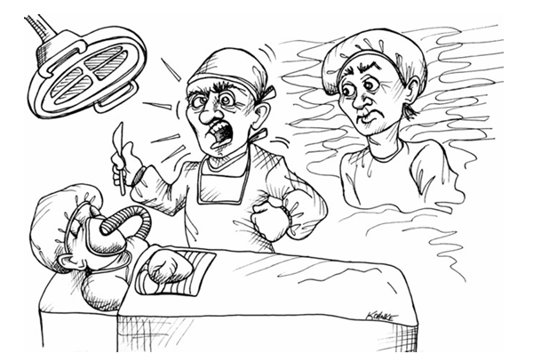

 

# فشار

تصور کنید که یک تجربه خروج از بدن دارید و خودتان را روی تخت عمل جراحی مشاهده می‌کنید، در حالی که جراحی در حال انجام عمل قلب باز روی شماست. آن جراح سعی دارد جان شما را نجات دهد، اما زمان محدود است، بنابراین او تحت یک ضرب‌الاجل (Deadline) کار می‌کند؛ یک ضرب‌الاجل واقعی که پای مرگ و زندگی در میان است.

چگونه می‌خواهید آن دکتر رفتار کند؟ آیا می‌خواهید آرام و مسلط به نظر برسد؟ آیا می‌خواهید دستورات واضح و دقیقی به کارکنان پشتیبانی خود بدهد؟ آیا می‌خواهید از آموزش‌های خود پیروی کرده و به نظم و انضباط‌هایش پایبند باشد؟

یا اینکه می‌خواهید عرق بریزد و فحش بدهد؟ آیا می‌خواهید ابزارها را پرت کند و به در و دیوار بکوبد؟ آیا می‌خواهید مدیریت را به خاطر انتظارات غیرواقعی سرزنش کند و دائماً از کمبود وقت ناله کند؟ آیا می‌خواهید مانند یک فرد حرفه‌ای رفتار کند، یا مانند یک توسعه‌دهنده معمولی؟

توسعه‌دهنده حرفه‌ای تحت فشار، آرام و قاطع است. با افزایش فشار، او به آموزش‌ها و نظم و انضباط‌های خود پایبند می‌ماند، زیرا می‌داند که آن‌ها بهترین راه برای برآورده کردن ضرب‌الاجل‌ها و تعهداتی هستند که بر او فشار می‌آورند.

در سال ۱۹۸۸، من در شرکت «Clear Communications» کار می‌کردم. این یک استارتاپ بود که هرگز واقعاً شروع به کار نکرد. ما دور اول تأمین مالی را سوزاندیم و سپس مجبور شدیم سراغ دور دوم و سپس سوم برویم. چشم‌انداز اولیه محصول خوب به نظر می‌رسید، اما معماری محصول هرگز نتوانست جای پای خود را محکم کند. در ابتدا محصول هم شامل نرم‌افزار بود و هم سخت‌افزار. سپس فقط نرم‌افزار شد. پلتفرم نرم‌افزاری از PC به ایستگاه‌های کاری Sparc تغییر کرد. مشتریان از سطح بالا (High end) به سطح پایین تغییر کردند. در نهایت، حتی هدف اصلی محصول هم تغییر کرد، زیرا شرکت سعی می‌کرد چیزی پیدا کند که درآمد ایجاد کند. در طول نزدیک به چهار سالی که من آنجا بودم، فکر نمی‌کنم شرکت حتی یک پنی درآمد دیده باشد.

ناگفته نماند که ما توسعه‌دهندگان نرم‌افزار تحت فشار قابل توجهی بودیم. شب‌های بسیار طولانی و آخرهفته‌های حتی طولانی‌تری وجود داشت که در دفتر و پای ترمینال سپری می‌شد. توابعی در زبان C نوشته می‌شدند که ۳۰۰۰ خط طول داشتند. بحث‌هایی با داد و فریاد و فحاشی وجود داشت. توطئه و دسیسه‌چینی در کار بود. مشت‌هایی که دیوارها را سوراخ می‌کرد، خودکارهایی که با عصبانیت به سمت وایت‌برد پرت می‌شد، کاریکاتورهایی از همکارانِ روی اعصاب که با نوک مداد روی دیوار حک می‌شد، و منبع بی‌پایانی از خشم و استرس وجود داشت.

ضرب‌الاجل‌ها توسط رویدادها رانده می‌شدند. ویژگی‌ها باید برای نمایشگاه‌های تجاری یا دموهای مشتری آماده می‌شدند. هر چیزی که مشتری می‌خواست، فارغ از اینکه چقدر احمقانه بود، ما باید برای دموی بعدی آماده می‌کردیم. زمان همیشه خیلی کم بود. کار همیشه عقب بود. برنامه‌ها همیشه طاقت‌فرسا بودند.

اگر هفته‌ای ۸۰ ساعت کار می‌کردید، می‌توانستید قهرمان باشید. اگر یک کثیف‌کاری را سرهم‌بندی (Hack) می‌کردید تا به دموی مشتری برسد، می‌توانستید قهرمان باشید. اگر به اندازه کافی این کارها را می‌کردید، می‌توانستید ترفیع بگیرید. اگر نمی‌کردید، ممکن بود اخراج شوید. این یک استارتاپ بود؛ همه‌چیز حول محور «عرق ریختن برای سهام» (Sweat equity) می‌چرخید.

و در سال ۱۹۸۸، با وجود نزدیک به ۲۰ سال تجربه، من هم خریدار این فرهنگ شدم. من مدیر توسعه‌ای بودم که به برنامه‌نویسان زیردستم می‌گفتم باید بیشتر و سریع‌تر کار کنند. من یکی از همان آدم‌های ۸۰-ساعتی بودم که ساعت ۲ بامداد توابع ۳۰۰۰ خطی C می‌نوشت، در حالی که بچه‌هایم در خانه بدون پدر خوابیده بودند. من همان کسی بودم که خودکار پرت می‌کرد و داد می‌زد. من باعث اخراج آدم‌هایی شدم که خودشان را جمع‌وجور نمی‌کردند. وحشتناک بود. من وحشتناک بودم.

سپس روزی رسید که همسرم مرا مجبور کرد تا نگاهی طولانی و دقیق به آینه بیندازم. از چیزی که دیدم خوشم نیامد. او به من گفت که بودن در کنار من اصلاً خوشایند نیست. مجبور بودم موافقت کنم. اما از شنیدنش خوشم نیامد، پس با عصبانیت از خانه بیرون زدم و بدون مقصد شروع به راه رفتن کردم. حدود سی دقیقه با خشم و غضب گام برداشتم؛ و سپس باران شروع شد. و ناگهان چیزی در سرم کلیک کرد (جرقه زد). شروع کردم به خندیدن. به حماقت خودم خندیدم. به استرسم خندیدم. به مرد درون آینه خندیدم، آن احمق بیچاره‌ای که زندگی را برای خودش و دیگران تلخ کرده بود، به نامِ... چی؟

همه چیز آن روز تغییر کرد. من ساعات کاری دیوانه‌وار را متوقف کردم. سبک زندگی پر استرس را کنار گذاشتم. پرت کردن خودکار و نوشتن توابع ۳۰۰۰ خطی C را متوقف کردم. تصمیم گرفتم که از حرفه‌ام با «خوب انجام دادن» آن لذت ببرم، نه با «احمقانه انجام دادن» آن. من آن شغل را تا جایی که می‌توانستم حرفه‌ای ترک کردم و مشاور شدم. از آن روز به بعد، هرگز شخص دیگری را «رئیس» خطاب نکردم.

### اجتناب از فشار (Avoiding Pressure)

بهترین راه برای حفظ آرامش تحت فشار، اجتناب از موقعیت‌هایی است که باعث ایجاد فشار می‌شوند. این اجتناب ممکن است فشار را به طور کامل از بین نبرد، اما می‌تواند تأثیر زیادی در به حداقل رساندن و کوتاه کردن دوره‌های پرفشار داشته باشد.

#### تعهدات (Commitments)

همان‌طور که در فصل ۱۰ دریافتیم، مهم است که از متعهد شدن به ضرب‌الاجل‌هایی که مطمئن نیستیم می‌توانیم برآورده کنیم، اجتناب کنیم. کسب‌وکار همیشه این تعهدات را می‌خواهد زیرا می‌خواهد ریسک را حذف کند. کاری که ما باید انجام دهیم این است که اطمینان حاصل کنیم ریسک کمی‌سازی شده و به کسب‌وکار ارائه می‌شود تا آن‌ها بتوانند آن را به درستی مدیریت کنند. پذیرفتن تعهدات غیرواقعی، این هدف را خنثی می‌کند و هم به کسب‌وکار و هم به خودمان خیانت می‌کند.

گاهی اوقات تعهدات برای ما (از طرف دیگران) ایجاد می‌شود. گاهی می‌فهمیم که کسب‌وکار ما بدون مشورت با ما قول‌هایی به مشتریان داده است. وقتی این اتفاق می‌افتد، ما از نظر اخلاقی (شرافتمندانه) موظفیم به کسب‌وکار کمک کنیم تا راهی برای برآورده کردن آن تعهدات پیدا کند. با این حال، ما موظف نیستیم که آن تعهدات را «بپذیریم».

تفاوت در اینجا مهم است. افراد حرفه‌ای همیشه به کسب‌وکار کمک می‌کنند تا راهی برای دستیابی به اهدافش پیدا کند. اما افراد حرفه‌ای لزوماً تعهداتی را که توسط کسب‌وکار برایشان ایجاد شده، نمی‌پذیرند. در نهایت، اگر نتوانیم راهی برای برآورده کردن قول‌های داده شده توسط کسب‌وکار پیدا کنیم، افرادی که آن قول‌ها را داده‌اند باید مسئولیت آن را بپذیرند.

گفتنش آسان است. اما وقتی کسب‌وکار شما در حال شکست است و چک حقوقتان به خاطر تعهدات از دست رفته به تأخیر افتاده، سخت است که فشار را احساس نکنید. اما اگر حرفه‌ای رفتار کرده باشید، حداقل می‌توانید وقتی به دنبال کار جدید می‌گردید، سرتان را بالا بگیرید.

#### تمیز ماندن (Staying Clean)

راهِ سریع پیش رفتن و دور نگه داشتن ضرب‌الاجل‌ها، تمیز ماندن است. افراد حرفه‌ای تسلیمِ وسوسه ایجاد کثیف‌کاری برای حرکت سریع‌تر نمی‌شوند. افراد حرفه‌ای می‌فهمند که «سریع و کثیف» (Quick and dirty) یک تناقض‌گویی (Oxymoron) است. کثیف همیشه به معنای کُند است!

ما می‌توانیم با تمیز نگه داشتن سیستم‌ها، کدها و طراحی خود تا حد امکان، از فشار اجتناب کنیم. این به معنای صرف ساعات بی‌پایان برای صیقل دادن کد نیست. بلکه صرفاً به این معناست که کثیف‌کاری را تحمل نمی‌کنیم. ما می‌دانیم که کثیف‌کاری‌ها سرعت ما را کم می‌کنند و باعث می‌شوند تاریخ‌ها را از دست بدهیم و تعهدات را بشکنیم. بنابراین ما بهترین کاری را که می‌توانیم انجام می‌دهیم و خروجی خود را تا حد امکان تمیز نگه می‌داریم.

---

### انضباط در بحران (Crisis Discipline)

شما با مشاهده خودتان در یک بحران، می‌فهمید که به چه چیزی باور دارید. اگر در یک بحران از انضباط‌های خود پیروی کنید، آنگاه واقعاً به آن انضباط‌ها ایمان دارید. از سوی دیگر، اگر در بحران رفتار خود را تغییر دهید، پس واقعاً به رفتار معمول خود ایمان ندارید.

* اگر در زمان‌های غیربحرانی از انضباط «توسعه مبتنی بر تست» (TDD) پیروی می‌کنید اما در طول بحران آن را رها می‌کنید، پس واقعاً اعتماد ندارید که TDD کمک‌کننده است.
* اگر در زمان‌های عادی کد خود را تمیز نگه می‌دارید اما در بحران کثیف‌کاری می‌کنید، پس واقعاً باور ندارید که کثیف‌کاری سرعت شما را کم می‌کند.
* اگر در بحران «برنامه‌نویسی دونفره» (Pair Programming) انجام می‌دهید اما در حالت عادی نه، پس باور دارید که برنامه‌نویسی دونفره کارآمدتر از کار انفرادی است.

انضباط‌هایی را انتخاب کنید که در زمان بحران با پیروی از آن‌ها راحت هستید. سپس همیشه از آن‌ها پیروی کنید. پیروی از این انضباط‌ها بهترین راه برای جلوگیری از افتادن در بحران است.

وقتی فشار کاری (Crunch) پیش می‌آید، رفتار خود را تغییر ندهید. اگر انضباط‌های شما بهترین روش برای کار کردن هستند، پس باید حتی در عمیق‌ترین لحظات بحران هم رعایت شوند.

### مدیریت فشار (Handling Pressure)

پیشگیری، کاهش و حذف فشار همگی خوب و عالی هستند، اما گاهی اوقات فشار علیرغم تمام نیت‌های خیر و پیشگیری‌های شما سر می‌رسد. گاهی پروژه صرفاً بیشتر از آنچه هر کسی فکر می‌کرد طول می‌کشد. گاهی طراحی اولیه صرفاً اشتباه است و باید دوباره‌کاری شود. گاهی یک عضو ارزشمند تیم یا یک مشتری را از دست می‌دهید. گاهی تعهدی می‌دهید که واقعاً نمی‌توانید به آن عمل کنید.

حالا چه؟

#### وحشت نکنید (Don't Panic)

استرس خود را مدیریت کنید. شب‌بیداری کمکی نمی‌کند که کارتان سریع‌تر انجام شود. نشستن و غصه خوردن هم کمکی نمی‌کند. و بدترین کاری که می‌توانید بکنید این است که **عجله کنید**!

به هر قیمتی در برابر این وسوسه مقاومت کنید. عجله کردن تنها شما را عمیق‌تر در چاله فرو می‌برد.

در عوض، سرعت را کم کنید. مشکل را به دقت بررسی کنید. مسیری به سوی بهترین نتیجه ممکن ترسیم کنید و سپس با سرعتی معقول و پایدار به سمت آن نتیجه حرکت کنید.

#### ارتباط برقرار کنید (Communicate)

به تیم و مافوق‌های خود اطلاع دهید که به مشکل خورده‌اید. بهترین نقشه‌های خود برای خروج از مشکل را به آن‌ها بگویید. از آن‌ها نظر و راهنمایی بخواهید.

از ایجاد غافلگیری (سورپرایز) اجتناب کنید. هیچ‌چیز مردم را عصبانی‌تر و غیرمنطقی‌تر از غافلگیری نمی‌کند. غافلگیری‌ها فشار را ده برابر می‌کنند.

#### به انضباط‌های خود تکیه کنید (Rely on Your Disciplines)

وقتی شرایط سخت می‌شود، به انضباط‌های خود اعتماد کنید. دلیل اینکه شما انضباط دارید این است که در زمان‌های پرفشار شما را راهنمایی کنند. این‌ها زمان‌هایی هستند که باید توجه ویژه‌ای به تمام انضباط‌های خود داشته باشید. این‌ها زمان زیر سوال بردن یا رها کردن آن‌ها نیست.

به جای اینکه با وحشت به اطراف نگاه کنید تا چیزی، هر چیزی، پیدا کنید که به شما کمک کند سریع‌تر کار را تمام کنید، آگاهانه‌تر و متعهدانه‌تر از انضباط‌های انتخابی خود پیروی کنید.

اگر TDD انجام می‌دهید، حتی بیشتر از معمول تست بنویسید. اگر یک ریفکتورکننده بی‌رحم هستید، حتی بیشتر ریفکتور کنید. اگر توابع خود را کوچک نگه می‌دارید، آن‌ها را حتی کوچک‌تر کنید. تنها راه عبور از این دیگ زودپز، تکیه بر چیزهایی است که از قبل می‌دانید کار می‌کنند: انضباط‌های شما.

#### کمک بگیرید (Get Help)

برنامه‌نویسی دونفره (Pair) کنید! وقتی اوضاع داغ می‌شود، همکاری پیدا کنید که مایل باشد با شما برنامه‌نویسی دونفره انجام دهد. کار شما سریع‌تر و با نقص‌های کمتر انجام خواهد شد.

یار (Partner) شما کمک می‌کند تا به انضباط‌های خود پایبند بمانید و از وحشت‌زدگی شما جلوگیری می‌کند. یار شما چیزهایی را که از قلم انداخته‌اید می‌بیند، ایده‌های مفیدی خواهد داشت و وقتی تمرکزتان را از دست می‌دهید، کار را به دوش می‌کشد.

به همین ترتیب، وقتی می‌بینید کس دیگری تحت فشار است، پیشنهاد دهید که با او Pair شوید. به آن‌ها کمک کنید تا از چاله‌ای که در آن هستند خارج شوند.

### نتیجه‌گیری

ترفند مدیریت فشار این است که وقتی می‌توانید از آن اجتناب کنید، و وقتی نمی‌توانید آن را تاب بیاورید.

شما با مدیریت تعهدات، پیروی از انضباط‌ها و تمیز نگه داشتن کار، از فشار **اجتناب** می‌کنید.
و با حفظ آرامش، برقراری ارتباط، تکیه بر انضباط‌ها و کمک گرفتن، آن را **تاب می‌آورید**.
