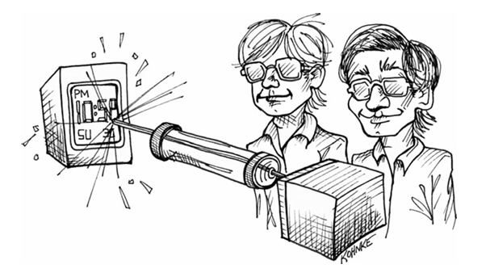

 

# همکاری

بیشتر نرم‌افزارها توسط تیم‌ها ساخته می‌شوند. تیم‌ها زمانی بیشترین کارایی را دارند که اعضای تیم به صورت حرفه‌ای با یکدیگر همکاری کنند. انزواطلبی یا گوشه‌گیری در یک تیم، رفتاری غیرحرفه‌ای است.

در سال ۱۹۷۴، من ۲۲ ساله بودم. از ازدواجم با همسر فوق‌العاده‌ام، آن ماری، به سختی شش ماه می‌گذشت. تولد اولین فرزندم، آنجلا، هنوز یک سال با ما فاصله داشت. و من در یکی از بخش‌های شرکت «تراداین» (Teradyne) که به نام «سیستم‌های لیزری شیکاگو» شناخته می‌شد، کار می‌کردم.

کنار من، دوست دوران دبیرستانم، تیم کنراد (Tim Conrad) کار می‌کرد. من و تیم در دوران خودمان معجزه‌های زیادی انجام داده بودیم. ما با هم در زیرزمین خانه او کامپیوتر ساختیم. در زیرزمین خانه من «نردبان یعقوب» (Jacob’s ladder - نوعی دستگاه الکتریکی) ساختیم. ما به یکدیگر یاد دادیم که چگونه PDP-8 برنامه‌نویسی کنیم و چگونه مدارهای مجتمع و ترانزیستورها را به هم وصل کنیم تا ماشین‌حساب‌های کارآمد بسازیم.

ما برنامه‌نویسانی بودیم که روی سیستمی کار می‌کردیم که از لیزر برای تنظیم دقیق (Trim) قطعات الکترونیکی مانند مقاومت‌ها و خازن‌ها با دقت بسیار بالا استفاده می‌کرد. برای مثال، ما کریستال اولین ساعت دیجیتال، موتورولا پولسار (Motorola Pulsar) را تنظیم کردیم.

کامپیوتری که ما برنامه‌نویسی می‌کردیم M365 بود، کپیِ تراداین از PDP-8. ما به زبان اسمبلی می‌نوشتیم و فایل‌های سورس (Source files) ما روی کارتریج‌های نوار مغناطیسی نگهداری می‌شد. اگرچه می‌توانستیم روی صفحه نمایش ویرایش کنیم، اما این فرآیند بسیار پیچیده بود، بنابراین برای بیشتر کارهای کدخوانی و ویرایش‌های اولیه از پرینت لیستینگ‌ها (Listings) استفاده می‌کردیم.

ما هیچ امکانی برای جستجو در پایگاه کد (Code base) نداشتیم. هیچ راهی نبود که بفهمیم یک تابع خاص در چه جاهایی فراخوانی شده یا یک ثابت خاص کجاها استفاده شده است. همان‌طور که حدس می‌زنید، این مانع بزرگی بود.

بنابراین یک روز من و تیم تصمیم گرفتیم که یک «تولیدکننده ارجاع متقابل» (Cross-reference generator) بنویسیم. این برنامه نوارهای سورس ما را می‌خواند و فهرستی از هر نماد (Symbol)، به همراه فایل و شماره خط‌هایی که آن نماد در آن‌ها استفاده شده بود، چاپ می‌کرد.

برنامه اولیه برای نوشتن خیلی ساده بود. به سادگی نوار سورس را می‌خواند، نحو (Syntax) اسمبلی را تجزیه می‌کرد، یک جدول نماد ایجاد می‌کرد و ارجاعات را به ورودی‌ها اضافه می‌کرد. عالی کار می‌کرد، اما وحشتناک کُند بود. پردازش «برنامه عملیاتی اصلی» ما (MOP) بیش از یک ساعت طول می‌کشید.

دلیل کُندی این بود که ما جدول نمادِ در حال رشد را در یک بافر حافظه واحد نگه می‌داشتیم. هر وقت یک ارجاع جدید پیدا می‌کردیم، آن را در بافر درج می‌کردیم و بقیه بافر را چند بایت به پایین حرکت می‌دادیم تا جا باز شود.

من و تیم متخصص ساختمان داده و الگوریتم نبودیم. ما هرگز نام جداول درهم‌سازی (Hash tables) یا جستجوی باینری را نشنیده بودیم. هیچ ایده‌ای نداشتیم که چگونه یک الگوریتم را سریع کنیم. فقط می‌دانستیم کاری که انجام می‌دهیم بیش از حد کُند است.

بنابراین ما یکی پس از دیگری روش‌های مختلف را امتحان کردیم. سعی کردیم ارجاعات را در لیست‌های پیوندی (Linked lists) قرار دهیم. سعی کردیم در آرایه جاهای خالی بگذاریم و تنها زمانی بافر را رشد دهیم که جاهای خالی پر شوند. سعی کردیم لیست‌های پیوندی از جاهای خالی ایجاد کنیم. انواع و اقسام ایده‌های دیوانه‌وار را امتحان کردیم.

ما پای وایت‌برد دفترمان می‌ایستادیم و نمودارهایی از ساختمان داده‌هایمان می‌کشیدیم و محاسباتی انجام می‌دادیم تا عملکرد را پیش‌بینی کنیم. هر روز با ایده جدیدی به دفتر می‌آمدیم. ما مثل دیوانه‌ها با هم همکاری می‌کردیم.

برخی از چیزهایی که امتحان کردیم عملکرد را افزایش داد. برخی سرعت را کم کرد. دیوانه‌کننده بود. این زمانی بود که من برای اولین بار کشف کردم که بهینه‌سازی نرم‌افزار چقدر دشوار است و این فرآیند چقدر غیرشهودی (Non-intuitive) است.

در نهایت ما زمان را به زیر ۱۵ دقیقه رساندیم، که بسیار نزدیک به زمانی بود که صرفاً خواندن نوار سورس طول می‌کشید. بنابراین راضی شدیم.

### برنامه‌نویسان در برابر مردم (Programmers Versus People)

ما برنامه‌نویس نشدیم چون کار کردن با مردم را دوست داشتیم. به عنوان یک قاعده، ما روابط بین‌فردی را آشفته و غیرقابل پیش‌بینی می‌دانیم. ما رفتار تمیز و قابل پیش‌بینی ماشین‌هایی را که برنامه‌ریزی می‌کنیم، دوست داریم. ما زمانی شادترین هستیم که ساعت‌ها به تنهایی در اتاقی روی یک مسئله واقعاً جالب تمرکز کرده‌ایم.

خیلی خب، این یک تعمیم بیش از حدِ بزرگ است و استثناهای زیادی وجود دارد. برنامه‌نویسان زیادی هستند که در کار با مردم خوب هستند و از این چالش لذت می‌برند. اما میانگین گروه همچنان به سمتی که گفتم تمایل دارد. ما برنامه‌نویسان از نوعی محرومیت حسی ملایم و غوطه‌وری پیله‌مانند در تمرکز لذت می‌بریم.

---

### برنامه‌نویسان در برابر کارفرمایان (Programmers Versus Employers)

در دهه‌های هفتاد و هشتاد، زمانی که به عنوان برنامه‌نویس در شرکت «تراداین» کار می‌کردم، یاد گرفتم که در دیباگ (عیب‌یابی) واقعاً خوب باشم. من عاشق چالش بودم و خودم را با شور و اشتیاق به روی مشکلات می‌انداختم. هیچ باگی نمی‌توانست مدت زیادی از من پنهان بماند!

وقتی باگی را حل می‌کردم، مثل یک پیروزی یا کشتن اژدها (Jabberwock) بود! با شمشیر برنده در دست، پیش رئیسم «کن فایندر» می‌رفتم و با شور و حرارت برایش توصیف می‌کردم که آن باگ چقدر جالب بوده است.

یک روز بالاخره کاسه صبر «کن» لبریز شد و با عصبانیت گفت: «باگ‌ها جالب نیستند. باگ‌ها فقط باید رفع شوند!»

من آن روز چیزی یاد گرفتم. خوب است که نسبت به کاری که انجام می‌دهیم شور و اشتیاق داشته باشیم. اما این هم خوب است که چشمتان به اهداف کسانی باشد که به شما پول می‌دهند.

اولین مسئولیت برنامه‌نویس حرفه‌ای، برآورده کردن نیازهای کارفرمای اوست. این به معنای همکاری با مدیران، تحلیل‌گران کسب‌وکار، تسترها و سایر اعضای تیم برای درک عمیق اهداف تجاری است.

این بدان معنا نیست که باید تبدیل به یک خوره کسب‌وکار شوید. اما به این معناست که باید بفهمید چرا کدی را که می‌نویسید، می‌نویسید و چگونه کسب‌وکاری که شما را استخدام کرده، از آن سود می‌برد.

بدترین کاری که یک برنامه‌نویس حرفه‌ای می‌تواند انجام دهد این است که با خوشحالی خودش را در مقبره‌ای از تکنولوژی دفن کند، در حالی که کسب‌وکار در اطراف او در حال سقوط و سوختن است. وظیفه شما شناور نگه داشتن کسب‌وکار است!

بنابراین، برنامه‌نویسان حرفه‌ای وقت می‌گذارند تا کسب‌وکار را بفهمند. آن‌ها با کاربران درباره نرم‌افزاری که استفاده می‌کنند صحبت می‌کنند. با افراد فروش و بازاریابی درباره مشکلات و مسائلی که دارند صحبت می‌کنند. با مدیران خود صحبت می‌کنند تا اهداف کوتاه‌مدت و بلندمدت تیم را بفهمند. خلاصه اینکه، آن‌ها به کشتی‌ای که بر آن سوارند توجه می‌کنند.

تنها زمانی که از یک شغل برنامه‌نویسی اخراج شدم، در سال ۱۹۷۶ بود. در آن زمان برای شرکت «Outboard Marine Corp» کار می‌کردم. من به نوشتن یک سیستم اتوماسیون کارخانه کمک می‌کردم که از کامپیوترهای IBM System/7 برای نظارت بر ده‌ها ماشین ریخته‌گری دایکاست آلومینیوم در کف کارخانه استفاده می‌کرد.

از نظر فنی، این یک شغل چالش‌برانگیز و باارزش بود. معماری System/7 جذاب بود و سیستم اتوماسیون کارخانه هم واقعاً جالب بود. ما تیم خوبی هم داشتیم. رهبر تیم، جان، باکفایت و باانگیزه بود. دو هم‌تیمی برنامه‌نویس من خوش‌برخورد و کمک‌کننده بودند. ما آزمایشگاهی اختصاصی برای پروژه خود داشتیم و همه در آن آزمایشگاه کار می‌کردیم. شریک تجاری درگیر کار بود و در آزمایشگاه با ما حضور داشت. مدیر ما، رالف، باکفایت، متمرکز و مسئول بود. همه چیز باید عالی پیش می‌رفت.

مشکل من بودم.

من نسبت به پروژه و تکنولوژی به اندازه کافی اشتیاق داشتم، اما در سن پخته ۲۴ سالگی، به سادگی نمی‌توانستم خودم را راضی کنم که به کسب‌وکار یا ساختار سیاسی داخلی آن اهمیت دهم.

اولین اشتباه من در روز اول کاری‌ام بود. من بدون کراوات سر کار حاضر شدم. در مصاحبه کراوات زده بودم و دیده بودم که همه کراوات می‌زنند، اما نتوانستم این ارتباط را برقرار کنم. بنابراین در روز اول، رالف پیش من آمد و به صراحت گفت: «ما اینجا کراوات می‌زنیم.»

نمی‌توانم بگویم چقدر از این حرف بیزار شدم. در سطح عمیقی اذیتم کرد. هر روز کراوات می‌زدم و از آن متنفر بودم. اما چرا؟ من می‌دانستم وارد چه محیطی می‌شوم. آداب و رسومی را که پذیرفته بودند می‌دانستم. چرا باید این‌قدر ناراحت می‌شدم؟ چون من یک احمقِ خودخواه و خودشیفته بودم.

من به سادگی نمی‌توانستم سر وقت سر کار برسم. و فکر می‌کردم که اهمیتی ندارد. هر چه باشد، داشتم «کارِ خوب» انجام می‌دادم. و این حقیقت داشت، من در نوشتن برنامه‌هایم کار بسیار خوبی انجام می‌دادم. من به راحتی بهترین برنامه‌نویس فنی تیم بودم. می‌توانستم سریع‌تر و بهتر از دیگران کد بنویسم. می‌توانستم مشکلات را سریع‌تر تشخیص داده و حل کنم. می‌دانستم ارزشمند هستم. بنابراین زمان‌ها و تاریخ‌ها برایم اهمیت زیادی نداشتند.

تصمیم اخراج من روزی گرفته شد که نتوانستم برای یک مایلستون (Milestone) سر وقت حاضر شوم. ظاهراً جان به همه ما گفته بود که دوشنبه آینده دموی ویژگی‌های کاری را می‌خواهد. مطمئنم که من این را می‌دانستم، اما تاریخ‌ها و زمان‌ها به سادگی برایم مهم نبودند. ما در حال توسعه فعال بودیم. سیستم در محیط عملیاتی نبود. دلیلی نداشت وقتی کسی در آزمایشگاه نیست سیستم را روشن بگذاریم. من باید آخرین نفری بوده باشم که آن جمعه آزمایشگاه را ترک کرد و ظاهراً سیستم را در وضعیتی غیرفعال رها کردم. این واقعیت که دوشنبه مهم بود، به سادگی در مغزم فرو نرفته بود.

آن دوشنبه با یک ساعت تأخیر وارد شدم و دیدم همه با چهره‌ای عبوس دور یک سیستمِ از کار افتاده جمع شده‌اند. جان از من پرسید: «چرا امروز سیستم کار نمی‌کنه باب؟»
پاسخ من: «نمی‌دونم.» و نشستم تا دیباگ کنم.

من هنوز درباره دموی دوشنبه بی‌خبر بودم، اما از زبان بدن دیگران می‌توانستم بفهمم که چیزی غلط است. سپس جان جلو آمد و در گوشم زمزمه کرد: «اگه استنبرگ تصمیم گرفته بود بازدید کنه چی؟» سپس با انزجار دور شد.

استنبرگ معاون مسئول اتوماسیون بود. امروزه به او CIO می‌گوییم. این سوال هیچ معنایی برای من نداشت. با خودم فکر کردم: «که چی؟ سیستم که در محیط عملیاتی نیست، چه اهمیتی داره؟»

من اولین نامه اخطارم را همان روز دریافت کردم. به من گفته بود که باید فوراً نگرشم را تغییر دهم وگرنه «اخراج سریع نتیجه کار خواهد بود.» من وحشت کردم!

زمانی را صرف تحلیل رفتارم کردم و شروع کردم به فهمیدن اینکه چه اشتباهی می‌کرده‌ام. با جان و رالف در مورد آن صحبت کردم. مصمم شدم که خودم و شغلم را متحول کنم. و این کار را کردم! دیر آمدن را متوقف کردم. شروع به توجه به سیاست‌های داخلی کردم. شروع کردم به درک اینکه چرا جان نگران استنبرگ بود. شروع کردم به دیدن موقعیت بدی که با فعال نبودن سیستم در دوشنبه او را در آن قرار داده بودم.

اما خیلی کم بود و خیلی دیر. کار از کار گذشته بود.

یک ماه بعد نامه اخطار دوم را برای یک خطای پیش‌پاافتاده دریافت کردم. باید در آن لحظه می‌فهمیدم که نامه‌ها تشریفاتی هستند و تصمیم برای اخراج من قبلاً گرفته شده است. اما مصمم بودم که وضعیت را نجات دهم. پس حتی سخت‌تر کار کردم.

جلسه اخراج چند هفته بعد برگزار شد. آن روز به خانه پیش همسر ۲۲ ساله و باردارم رفتم و مجبور شدم به او بگویم که اخراج شده‌ام. این تجربه‌ای است که هرگز نمی‌خواهم تکرار شود.

### برنامه‌نویسان در برابر برنامه‌نویسان

برنامه‌نویسان اغلب در همکاری نزدیک با سایر برنامه‌نویسان مشکل دارند. این منجر به مشکلات واقعاً وحشتناکی می‌شود.

#### کدِ تحت تملک (Owned Code)

یکی از بدترین علائم یک تیم ناکارآمد (Dysfunctional) زمانی است که هر برنامه‌نویس دیواری دور کدِ خود می‌کشد و اجازه نمی‌دهد سایر برنامه‌نویسان به آن دست بزنند. من در جاهایی بوده‌ام که برنامه‌نویسان حتی اجازه نمی‌دادند دیگران کدشان را ببینند. این نسخه‌ای برای فاجعه است.

من زمانی مشاور شرکتی بودم که چاپگرهای پیشرفته می‌ساخت. این دستگاه‌ها قطعات مختلف زیادی مانند فیدر، پرینتر، استکر، منگنه‌زن، برش‌دهنده و غیره داشتند. کسب‌وکار برای هر یک از این دستگاه‌ها ارزش متفاوتی قائل بود. فیدرها مهم‌تر از استکرها بودند و هیچ‌چیز مهم‌تر از پرینتر نبود.

هر برنامه‌نویس روی دستگاه خود کار می‌کرد. یک نفر کد فیدر را می‌نوشت، نفر دیگر کد منگنه‌زن را. هر کدام تکنولوژی خود را برای خودشان نگه می‌داشتند و مانع دست زدن دیگران به کدشان می‌شدند. نفوذ سیاسی این برنامه‌نویسان رابطه مستقیمی با ارزش آن دستگاه برای کسب‌وکار داشت. برنامه‌نویسی که روی پرینتر کار می‌کرد، دست‌نیافتنی بود.

این برای تکنولوژی فاجعه بود. به عنوان مشاور می‌توانستم ببینم که همانندسازی (Duplication) عظیمی در کد وجود دارد و رابط‌های بین ماژول‌ها کاملاً کج و کوله هستند. اما هیچ مقدار استدلالی از طرف من نمی‌توانست برنامه‌نویسان (یا کسب‌وکار) را متقاعد کند که روششان را تغییر دهند. هر چه باشد، بررسی حقوق آن‌ها به اهمیت دستگاهی که نگهداری می‌کردند گره خورده بود.

#### مالکیت جمعی (Collective Ownership)

بسیار بهتر است که تمام دیوارهای مالکیت کد شکسته شود و تیم صاحب تمام کد باشد. من تیم‌هایی را ترجیح می‌دهم که در آن هر عضو تیم بتواند هر ماژولی را بررسی (Check out) کند و هر تغییری را که مناسب می‌داند اعمال کند. من می‌خواهم تیم مالک کد باشد، نه افراد.

توسعه‌دهندگان حرفه‌ای مانع کار دیگران روی کد نمی‌شوند. آن‌ها دیوارهای مالکیتی دور کد نمی‌کشند. بلکه تا جایی که می‌توانند با یکدیگر روی بخش‌های بیشتری از سیستم کار می‌کنند. آن‌ها با کار کردن با همدیگر روی بخش‌های دیگر سیستم، از هم یاد می‌گیرند.

#### برنامه‌نویسی دونفره (Pairing)

بسیاری از برنامه‌نویسان از ایده برنامه‌نویسی دونفره بدشان می‌آید. من این را عجیب می‌دانم چون اکثر برنامه‌نویسان در مواقع اضطراری Pair می‌کنند. چرا؟ چون به وضوح کارآمدترین راه برای حل مشکل است. این فقط بازگشت به همان ضرب‌المثل قدیمی است: دو فکر بهتر از یکی است.

اما اگر Pairing در مواقع اضطراری کارآمدترین راه برای حل مشکل است، چرا کارآمدترین راه برای حل مشکل در حالت عادی نباشد؟

من نمی‌خواهم برایتان مطالعه نقل کنم، اگرچه مواردی هست که می‌توان نقل کرد. نمی‌خواهم داستان تعریف کنم، اگرچه داستان‌های زیادی می‌توانم بگویم. حتی نمی‌خواهم بگویم چقدر باید Pair کنید. تنها چیزی که می‌خواهم بگویم این است که **حرفه‌ای‌ها Pair می‌کنند.**

چرا؟ چون حداقل برای برخی مشکلات، این کارآمدترین راه حل آن‌هاست. اما این تنها دلیل نیست. حرفه‌ای‌ها همچنین Pair می‌کنند چون بهترین راه برای اشتراک دانش با یکدیگر است. حرفه‌ای‌ها سیلوهای دانش ایجاد نمی‌کنند. بلکه بخش‌های مختلف سیستم و کسب‌وکار را با Pair کردن با یکدیگر یاد می‌گیرند. آن‌ها تشخیص می‌دهند که اگرچه همه اعضای تیم پستی برای بازی دارند، همه اعضای تیم باید بتوانند در مواقع لزوم در پست دیگری بازی کنند.

حرفه‌ای‌ها Pair می‌کنند چون این بهترین راه برای بازبینی کد (Code Review) است. هیچ سیستمی نباید شامل کدی باشد که توسط سایر برنامه‌نویسان بازبینی نشده است. راه‌های زیادی برای انجام بازبینی کد وجود دارد؛ اکثر آن‌ها به طرز وحشتناکی ناکارآمد هستند. کارآمدترین و مؤثرترین راه برای بازبینی کد، همکاری در نوشتن آن است.

### مخچه‌ها (Cerebellums)

یک روز صبح در سال ۲۰۰۰، در اوج رونق دات‌کام، سوار قطار به سمت شیکاگو بودم. وقتی از قطار روی سکو پیاده شدم، با بیلبورد عظیمی که بالای درهای خروجی آویزان بود مواجه شدم. تابلو مربوط به یک شرکت نرم‌افزاری معروف بود که برنامه‌نویس استخدام می‌کرد. روی آن نوشته شده بود:

**بیایید با بهترین‌ها مخچه بمالید.** (Come rub cerebellums with the best)

من فوراً تحت تأثیر حماقت محض چنین تابلویی قرار گرفتم. این تبلیغاتچی‌های بیچاره و بی‌خبر سعی می‌کردند نظر جمعیتی بسیار فنی، باهوش و آگاه از برنامه‌نویسان را جلب کنند. این‌ها کسانی هستند که حماقت را چندان برنمی‌تابند.

تبلیغاتچی‌ها سعی داشتند تصویر اشتراک دانش با سایر افراد بسیار باهوش را القا کنند. متأسفانه آن‌ها به بخشی از مغز، مخچه (Cerebellum)، اشاره کرده بودند که با کنترل دقیق عضلات سروکار دارد، نه هوش. بنابراین همان افرادی که سعی در جذبشان داشتند، به چنین خطای احمقانه‌ای پوزخند می‌زدند.

اما چیز دیگری درباره آن تابلو مرا مجذوب کرد. باعث شد به گروهی از افراد فکر کنم که سعی دارند مخچه‌هایشان را به هم بمالند. از آنجا که مخچه در پشت مغز قرار دارد، بهترین راه برای مالیدن مخچه‌ها این است که پشت به یکدیگر بایستید.

تیمی از برنامه‌نویسان را در اتاقک‌ها (Cubicles) تصور کردم که در گوشه‌ها نشسته‌اند، پشتشان به هم است، در حالی که هدفون زده‌اند به مانیتورها خیره شده‌اند. این‌طوری است که مخچه می‌مالید. و این همچنین یک تیم نیست.

حرفه‌ای‌ها با هم کار می‌کنند. شما نمی‌توانید در حالی که در گوشه‌ای نشسته‌اید و هدفون زده‌اید با هم کار کنید. بنابراین من می‌خواهم شما دور میزهایی بنشینید و روبروی هم باشید. می‌خواهم بتوانید بوی ترس یکدیگر را حس کنید. می‌خواهم بتوانید زمزمه‌های ناشی از استیصال کسی را بشنوید. من ارتباطات تصادفی و شانسی (Serendipitous)، هم کلامی و هم زبان بدن را می‌خواهم. می‌خواهم شما به عنوان یک واحد ارتباط برقرار کنید.

شاید باور داشته باشید که وقتی تنها کار می‌کنید بهتر کار می‌کنید. این ممکن است درست باشد، اما به این معنا نیست که «تیم» وقتی شما تنها کار می‌کنید بهتر کار می‌کند. و در واقع، بسیار بعید است که شما وقتی تنها کار می‌کنید واقعاً بهتر کار کنید.

زمان‌هایی هست که تنها کار کردن کار درستی است. زمان‌هایی هست که صرفاً نیاز دارید طولانی و عمیق درباره یک مشکل فکر کنید. زمان‌هایی هست که وظیفه آن‌قدر پیش‌پاافتاده است که داشتن یک نفر دیگر در کنار شما اتلاف وقت است. اما به طور کلی، بهترین کار این است که با دیگران همکاری نزدیک داشته باشید و بخش بزرگی از زمان را با آن‌ها Pair کنید.

### نتیجه‌گیری

شاید ما وارد برنامه‌نویسی نشدیم تا با مردم کار کنیم. شانس با ما یار نبود. برنامه‌نویسی تماماً درباره کار با مردم است. ما نیاز داریم با کسب‌وکار خود کار کنیم و نیاز داریم با یکدیگر کار کنیم.

می‌دانم، می‌دانم. عالی نمی‌شد اگر فقط ما را در اتاقی با شش مانیتور عظیم، یک خط اینترنت T3، آرایه‌ای موازی از پردازنده‌های فوق سریع، رم و دیسک نامحدود و منبع بی‌پایانی از نوشابه رژیمی و چیپس ذرت تند حبس می‌کردند؟

افسوس که قرار نیست این‌طور باشد. اگر واقعاً می‌خواهیم روزهایمان را صرف برنامه‌نویسی کنیم، باید یاد بگیریم که با... مردم صحبت کنیم.
