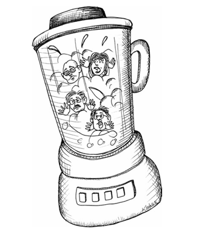

 

# تیم‌ها و پروژه‌ها

اگر تعداد زیادی پروژه کوچک برای انجام دادن داشته باشید چه؟ چگونه باید آن پروژه‌ها را به برنامه‌نویسان اختصاص دهید؟ اگر یک پروژه واقعاً بزرگ برای انجام دادن داشته باشید چه؟

### آیا مخلوط می‌شود؟ (Does it Blend)

من در طول سال‌ها برای تعدادی از بانک‌ها و شرکت‌های بیمه مشاوره داده‌ام. یک چیزی که به نظر می‌رسد همه آن‌ها در آن اشتراک دارند، روش عجیبی است که پروژه‌ها را تقسیم‌بندی (پارتیشن‌بندی) می‌کنند.

اغلب یک پروژه در بانک، کاری نسبتاً کوچک است که به یک یا دو برنامه‌نویس برای چند هفته نیاز دارد. این پروژه اغلب با یک مدیر پروژه تأمین نیرو می‌شود که همزمان در حال مدیریت پروژه‌های دیگر است. یک تحلیل‌گر کسب‌وکار خواهد داشت که او هم در حال تأمین نیازمندی‌ها برای سایر پروژه‌هاست. تعدادی برنامه‌نویس خواهد داشت که آن‌ها هم روی پروژه‌های دیگر کار می‌کنند. یک یا دو تستر هم به آن اختصاص داده می‌شوند که آن‌ها نیز روی پروژه‌های دیگر کار می‌کنند.

الگو را می‌بینید؟ پروژه آن‌قدر کوچک است که هیچ فردی نمی‌تواند به صورت تمام‌وقت به آن اختصاص داده شود. همه دارند روی پروژه به میزان ۵۰ یا حتی ۲۵ درصد کار می‌کنند.

حالا اینجا یک قانون وجود دارد: **چیزی به نام نصف آدم وجود ندارد.**

هیچ معنایی ندارد که به یک برنامه‌نویس بگویید نیمی از زمانش را صرف پروژه A و بقیه زمانش را صرف پروژه B کند، به خصوص وقتی که دو پروژه دارای دو مدیر پروژه متفاوت، تحلیل‌گران متفاوت، برنامه‌نویسان متفاوت و تسترهای متفاوت هستند.

در کدام جهنم‌دره‌ای می‌توانید به چنین هیولایی «تیم» بگویید؟ این تیم نیست، این چیزی است که از داخل مخلوط‌کن بیرون آمده است.

### تیم شکل‌گرفته (The Gelled Team)

زمان می‌برد تا یک تیم شکل بگیرد. اعضای تیم شروع به ایجاد روابط می‌کنند. آن‌ها یاد می‌گیرند که چگونه با هم همکاری کنند. آن‌ها عیب‌ها، نقاط قوت و ضعف یکدیگر را می‌شناسند. در نهایت، تیم شروع به «بستن» (Gel - مثل ژله‌ای که خودش را می‌گیرد) می‌کند.

چیزی واقعاً جادویی در مورد یک تیمِ شکل‌گرفته وجود دارد. آن‌ها می‌توانند معجزه کنند. آن‌ها حرکت بعدی هم را پیش‌بینی می‌کنند، هوای هم را دارند (Cover می‌کنند)، از هم حمایت می‌کنند و بهترین‌ها را از یکدیگر طلب می‌کنند. آن‌ها کارها را عملی می‌کنند.

یک تیم شکل‌گرفته معمولاً شامل حدود دوازده نفر است. می‌تواند بیست نفر یا به کمیِ سه نفر باشد، اما بهترین عدد احتمالاً حدود دوازده است.

تیم باید متشکل از برنامه‌نویسان، تسترها و تحلیل‌گران باشد. و باید یک مدیر پروژه داشته باشد. نسبت برنامه‌نویسان به تسترها و تحلیل‌گران می‌تواند بسیار متفاوت باشد، اما ۲ به ۱ عدد خوبی است. بنابراین یک تیمِ خوب شکل‌گرفته دوازده نفره ممکن است هفت برنامه‌نویس، دو تستر، دو تحلیل‌گر و یک مدیر پروژه داشته باشد.

تحلیل‌گران نیازمندی‌ها را توسعه می‌دهند و تست‌های پذیرش خودکار برای آن‌ها می‌نویسند. تسترها نیز تست‌های پذیرش خودکار می‌نویسند. تفاوت بین این دو در دیدگاه (Perspective) است. هر دو دارند نیازمندی می‌نویسند. اما تحلیل‌گران روی «ارزش کسب‌وکار» تمرکز دارند؛ تسترها روی «صحت» (Correctness) تمرکز می‌کنند. تحلیل‌گران موارد «مسیر خوشحالی» را می‌نویسند؛ تسترها نگران این هستند که چه چیزی ممکن است اشتباه پیش برود و موارد شکست و مرزی را می‌نویسند.

مدیر پروژه پیشرفت تیم را ردیابی می‌کند و اطمینان حاصل می‌کند که تیم برنامه‌های زمانی و اولویت‌ها را درک کرده است.

یکی از اعضای تیم ممکن است نقش پاره‌وقت مربی (Coach) یا استاد (Master) را بازی کند، با مسئولیت دفاع از فرآیند و انضباط‌های تیم. آن‌ها زمانی که تیم وسوسه می‌شود به خاطر فشارِ برنامه زمانی از فرآیند خارج شود، به عنوان وجدان تیم عمل می‌کنند.

#### تخمیر (Fermentation)

زمان می‌برد تا چنین تیمی اختلافاتش را حل کند، با هم کنار بیایند و واقعاً «ببندند» (شکل بگیرند). ممکن است شش ماه طول بکشد. ممکن است حتی یک سال طول بکشد. اما وقتی اتفاق بیفتد، جادوست. یک تیم شکل‌گرفته با هم برنامه‌ریزی می‌کنند، با هم مشکلات را حل می‌کنند، با هم با مسائل روبرو می‌شوند و کارها را انجام می‌دهند.

وقتی این اتفاق می‌افتد، مضحک است که آن را از هم بپاشیم فقط به این دلیل که یک پروژه به پایان رسیده است. بهترین کار این است که آن تیم را کنار هم نگه دارید و فقط به تغذیه کردن آن با پروژه‌های جدید ادامه دهید.

#### اول مرغ بود یا تخم مرغ؟ تیم یا پروژه؟

بانک‌ها و شرکت‌های بیمه سعی کردند تیم‌ها را حول پروژه‌ها شکل دهند. این رویکردی احمقانه است. تیم‌ها به سادگی نمی‌توانند شکل بگیرند. افراد فقط برای مدت کوتاهی و فقط برای درصدی از زمانشان در پروژه هستند و بنابراین هرگز یاد نمی‌گیرند چگونه با یکدیگر تعامل کنند.

سازمان‌های توسعه حرفه‌ای، پروژه‌ها را به تیم‌های شکل‌گرفتهِ موجود اختصاص می‌دهند، آن‌ها تیم‌ها را حول پروژه‌ها تشکیل نمی‌دهند.

یک تیم شکل‌گرفته می‌تواند چندین پروژه را به طور همزمان بپذیرد و کار را بر اساس نظرات، مهارت‌ها و توانایی‌های خودشان تقسیم کند. تیم شکل‌گرفته پروژه‌ها را انجام خواهد داد.

### اما چطور آن را مدیریت می‌کنید؟

تیم‌ها «سرعت» (Velocity) دارند.* سرعتِ یک تیم به سادگی مقدار کاری است که می‌تواند در یک دوره زمانی ثابت انجام دهد. برخی تیم‌ها سرعت خود را با «امتیاز در هفته» (Points per week) اندازه می‌گیرند، جایی که امتیاز واحدی برای پیچیدگی است. آن‌ها ویژگی‌های هر پروژه‌ای را که روی آن کار می‌کنند می‌شکنند و آن‌ها را با امتیاز تخمین می‌زنند. سپس اندازه می‌گیرند که چند امتیاز در هفته انجام می‌دهند.

سرعت یک معیار آماری است. یک تیم ممکن است یک هفته ۳۸ امتیاز، هفته بعد ۴۲ امتیاز و هفته بعد ۲۵ امتیاز انجام دهد. در طول زمان این میانگین گرفته می‌شود.

مدیریت می‌تواند برای هر پروژه که به یک تیم داده می‌شود، اهدافی تعیین کند. برای مثال، اگر میانگین سرعت یک تیم ۵۰ است و آن‌ها سه پروژه دارند که روی آن کار می‌کنند، مدیریت می‌تواند از تیم بخواهد که تلاش خود را به ۱۵، ۱۵ و ۲۰ تقسیم کنند.

جدا از داشتن یک تیم شکل‌گرفته که روی پروژه‌های شما کار می‌کند، مزیت این طرح این است که در مواقع اضطراری کسب‌وکار می‌تواند بگوید: «پروژه B در بحران است؛ ۱۰۰٪ تلاش خود را برای سه هفته آینده روی آن پروژه بگذارید.»

تخصیص مجدد اولویت‌ها با این سرعت، با تیم‌هایی که از «مخلوط‌کن» بیرون آمده‌اند عملاً غیرممکن است، اما تیم‌های شکل‌گرفته که روی دو یا سه پروژه به صورت همزمان (Concurrently) کار می‌کنند، می‌توانند در کسری از ثانیه تغییر جهت دهند (Turn on a dime).

> *پانویس: در متدولوژی‌های چابک، Velocity معیاری برای سنجش سرعت پیشرفت تیم است.*

---

### معمای مالک پروژه (The Project Owner Dilemma)

یکی از اعتراضاتی که به رویکرد مورد حمایت من وارد می‌شود این است که «مالکان پروژه» مقداری از امنیت و قدرت خود را از دست می‌دهند.

مالکان پروژه‌ای که تیمی اختصاصی برای پروژه خود دارند، می‌توانند روی تلاش آن تیم حساب کنند. آن‌ها می‌دانند که چون تشکیل و انحلال یک تیم عملیاتی پرهزینه است، کسب‌وکار آن تیم را به دلایل کوتاه‌مدت از آن‌ها نخواهد گرفت.

از سوی دیگر، اگر پروژه‌ها به تیم‌های شکل‌گرفته (Gelled teams) داده شوند و اگر آن تیم‌ها چندین پروژه را به طور همزمان به عهده بگیرند، آنگاه کسب‌وکار آزاد است که اولویت‌ها را بنا به هوس خود تغییر دهد. این می‌تواند مالک پروژه را نسبت به آینده ناامن کند. منابعی که مالک پروژه به آن‌ها وابسته است، ممکن است ناگهان از او گرفته شوند.

صادقانه بگویم، من وضعیت دوم را ترجیح می‌دهم. دستان کسب‌وکار نباید به خاطر دشواریِ مصنوعیِ تشکیل و انحلال تیم‌ها بسته باشد. اگر کسب‌وکار تصمیم می‌گیرد که اولویت یک پروژه بالاتر از دیگری است، باید بتواند منابع را به سرعت بازتخصیص (Reallocate) دهد. این مسئولیت مالک پروژه است که برای پروژه خود استدلال کند و از آن دفاع نماید.

### نتیجه‌گیری

ساختن تیم‌ها سخت‌تر از ساختن پروژه‌هاست. بنابراین، بهتر است تیم‌های پایداری تشکیل دهیم که با هم از یک پروژه به پروژه بعدی حرکت می‌کنند و می‌توانند بیش از یک پروژه را در یک زمان بر عهده بگیرند.

هدف در تشکیل یک تیم این است که به آن تیم زمان کافی بدهیم تا «شکل بگیرد» (Gel کند) و سپس آن را به عنوان موتوری برای انجام پروژه‌های متعدد در کنار هم نگه داریم.

---
**کتاب‌شناسی**

* *[RCM2003]: Robert C. Martin, Agile Software Development: Principles, Patterns, and Practices, Upper Saddle River, NJ: Prentice Hall, 2003.*
* *[COHN2006]: Mike Cohn, Agile Estimating and Planning, Upper Saddle River, NJ: Prentice Hall, 2006.*
