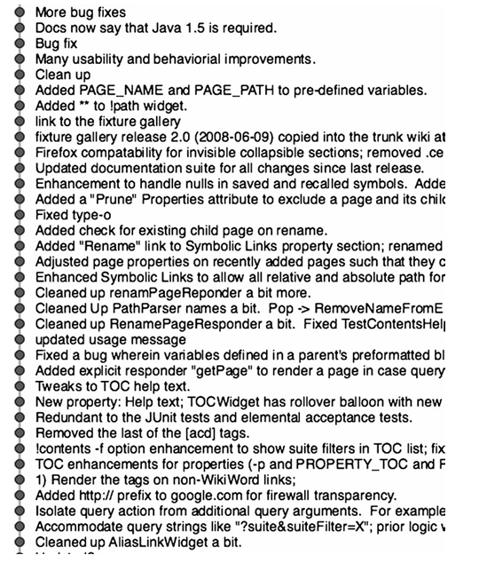
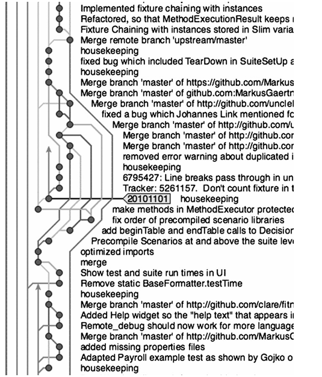

# ضمیمه A: ابزارها

در سال ۱۹۷۸، من در شرکت «تراداین» روی سیستم تست تلفنی که قبلاً توصیف کردم کار می‌کردم. این سیستم حدود ۸۰ هزار خط کد اسمبلی برای M365 بود. ما کد منبع (Source Code) را روی نوارها نگه می‌داشتیم. نوارها شبیه به آن کارتریج‌های نوار استریو ۸-تِرَک (8-track) بودند که در دهه ۷۰ خیلی محبوب بودند. نوار یک حلقه بی‌پایان بود و درایو نوار فقط می‌توانست در یک جهت حرکت کند.

کارتریج‌ها در طول‌های ۱۰، ۲۵، ۵۰ و ۱۰۰ فوت (حدود ۳ تا ۳۰ متر) عرضه می‌شدند. هر چه نوار طولانی‌تر بود، زمان بیشتری طول می‌کشید تا «ریوایند» (Rewind - بازپیچی) شود، چون درایو نوار مجبور بود صرفاً آن را به جلو ببرد تا «نقطه بارگذاری» (Load point) را پیدا کند. یک نوار ۱۰۰ فوتی پنج دقیقه طول می‌کشید تا به نقطه بارگذاری برسد، بنابراین ما طول نوارهایمان را هوشمندانه انتخاب می‌کردیم.*

از نظر منطقی، نوارها به فایل‌ها تقسیم می‌شدند. شما می‌توانستید هر تعداد فایلی که جا می‌شد روی یک نوار داشته باشید. برای پیدا کردن یک فایل، نوار را بارگذاری می‌کردید و سپس یکی‌یکی فایل‌ها را رد می‌کردید (Skip می‌کردید) تا فایلی را که می‌خواستید پیدا کنید. ما یک لیستینگ از دایرکتوری کد منبع روی دیوار نگه می‌داشتیم تا بدانیم قبل از رسیدن به فایل مورد نظر، چند فایل را باید رد کنیم.

یک نسخه «مستر» (Master) صد فوتی از نوار کد منبع روی قفسه‌ای در آزمایشگاه وجود داشت. برچسب «Master» روی آن بود. وقتی می‌خواستیم فایلی را ویرایش کنیم، نوار سورس مستر را در یک درایو و یک نوار ۱۰ فوتی خام را در درایو دیگر بارگذاری می‌کردیم. در نوار مستر جلو می‌رفتیم تا به فایل مورد نظر برسیم. سپس آن فایل را روی نوار چرک‌نویس (Scratch tape) کپی می‌کردیم. بعد هر دو نوار را «ریوایند» کرده و مستر را سر جایش روی قفسه می‌گذاشتیم.

یک لیستینگ ویژه از دایرکتوریِ مستر روی یک تابلو اعلانات در آزمایشگاه وجود داشت. وقتی کپی فایل‌هایی را که باید ویرایش می‌کردیم تهیه می‌کردیم، یک **سوزن رنگی** روی تابلو کنار نام آن فایل می‌زدیم. این‌طوری فایل‌ها را Check out می‌کردیم!

ما نوارها را روی صفحه نمایش ویرایش می‌کردیم. ویرایشگر متن ما، ED-402، در واقع خیلی خوب بود. بسیار شبیه به `vi` بود. ما یک «صفحه» از نوار را می‌خواندیم، محتوا را ویرایش می‌کردیم و سپس آن صفحه را می‌نوشتیم و صفحه بعدی را می‌خواندیم. یک صفحه معمولاً ۵۰ خط کد بود.

شما نمی‌توانستید روی نوار به جلو نگاه کنید تا صفحاتی را که می‌آیند ببینید و نمی‌توانستید به عقب نگاه کنید تا صفحاتی را که ویرایش کرده‌اید ببینید. بنابراین ما از لیستینگ‌ها (پرینت کدها) استفاده می‌کردیم. در واقع، ما تغییراتی را که می‌خواستیم بدهیم روی لیستینگ‌ها علامت‌گذاری می‌کردیم و سپس فایل‌ها را طبق علامت‌گذاری‌هایمان ویرایش می‌کردیم. **هیچ‌کس پشت ترمینال کد نمی‌نوشت یا تغییر نمی‌داد!** این کار خودکشی بود.

وقتی تغییرات روی تمام فایل‌هایی که نیاز داشتیم اعمال می‌شد، آن فایل‌ها را با مستر ادغام (Merge) می‌کردیم تا یک «نوار کاری» (Working tape) ایجاد کنیم. این نواری بود که برای اجرای کامپایل‌ها و تست‌هایمان استفاده می‌کردیم. وقتی تست کردن تمام می‌شد و مطمئن بودیم تغییراتمان کار می‌کند، به تابلو نگاه می‌کردیم. اگر سوزن جدیدی روی تابلو نبود، به سادگی برچسب نوار کاری خود را به «مستر» تغییر می‌دادیم و سوزن‌هایمان را از تابلو می‌کندیم. اگر سوزن جدیدی روی تابلو بود، سوزن‌هایمان را برمی‌داشتیم و نوار کاری خود را به کسی که سوزنش هنوز روی تابلو بود می‌دادیم. آن‌ها مجبور بودند ادغام را انجام دهند.

ما سه نفر بودیم و هر کدام رنگ سوزن خودمان را داشتیم، بنابراین فهمیدن اینکه چه کسی چه فایل‌هایی را Check out کرده آسان بود. و چون همه در یک آزمایشگاه کار می‌کردیم و دائماً با هم حرف می‌زدیم، وضعیت تابلو را در ذهنمان نگه می‌داشتیم. بنابراین معمولاً تابلو زائد بود و ما اغلب از آن استفاده نمی‌کردیم.

> *پانویس ۱: این نوارها فقط می‌توانستند در یک جهت حرکت کنند. بنابراین وقتی خطای خواندن رخ می‌داد، راهی نبود که درایو نوار به عقب برگردد و دوباره بخواند. مجبور بودید کاری را که انجام می‌دادید متوقف کنید، نوار را به نقطه بارگذاری بفرستید و دوباره شروع کنید. این اتفاق دو یا سه بار در روز می‌افتاد. خطاهای نوشتن هم بسیار رایج بود و درایو راهی برای تشخیص آن‌ها نداشت. بنابراین ما همیشه نوارها را جفتی می‌نوشتیم و وقتی کارمان تمام می‌شد جفت‌ها را چک می‌کردیم. اگر یکی از نوارها خراب بود فوراً یک کپی می‌گرفتیم. اگر هر دو خراب بودند، که خیلی نادر بود، کل عملیات را از اول شروع می‌کردیم. زندگی در دهه ۷۰ این‌شکلی بود.*

### ابزارها (Tools)

امروزه توسعه‌دهندگان نرم‌افزار طیف وسیعی از ابزارها را برای انتخاب دارند. بیشتر آن‌ها ارزش درگیر شدن ندارند، اما تعداد کمی هستند که هر توسعه‌دهنده نرم‌افزار باید با آن‌ها آشنا باشد. این فصل جعبه‌ابزار شخصی فعلی من را توصیف می‌کند. من بررسی کاملی از تمام ابزارهای دیگر موجود انجام نداده‌ام، بنابراین این نباید یک بررسی جامع در نظر گرفته شود. این فقط چیزی است که من استفاده می‌کنم.

### کنترل کد منبع (Source Code Control)

وقتی صحبت از کنترل کد منبع می‌شود، ابزارهای منبع‌باز (Open source) معمولاً بهترین گزینه شما هستند. چرا؟ زیرا توسط توسعه‌دهندگان، برای توسعه‌دهندگان نوشته شده‌اند. ابزارهای منبع‌باز چیزهایی هستند که توسعه‌دهندگان وقتی به چیزی نیاز دارند که کار کند، برای خودشان می‌نویسند.

تعداد زیادی سیستم کنترل نسخه «سازمانی» (Enterprise) گران‌قیمت و تجاری موجود است. من دریافته‌ام که این‌ها بیش از آنکه به توسعه‌دهندگان فروخته شوند، به مدیران، اجرایی‌ها و «گروه‌های ابزار» فروخته می‌شوند. لیست ویژگی‌های آن‌ها چشمگیر و قانع‌کننده است. متأسفانه، آن‌ها اغلب ویژگی‌هایی را که توسعه‌دهندگان واقعاً نیاز دارند، ندارند. مهم‌ترین آن‌ها **سرعت** است.

#### یک سیستم کنترل منبع «سازمانی»

ممکن است شرکت شما ثروت کوچکی را روی یک سیستم کنترل کد منبع «سازمانی» سرمایه‌گذاری کرده باشد. اگر چنین است، تسلیت می‌گویم. احتمالا از نظر سیاسی نامناسب است که راه بیفتید و به همه بگویید: «عمو باب می‌گوید از این استفاده نکنید.»

با این حال، راه حل آسانی وجود دارد. شما می‌توانید در پایان هر تکرار (مثلاً هر دو هفته یک بار) کد منبع خود را در سیستم «سازمانی» Check in کنید و در طول هر تکرار از یکی از سیستم‌های منبع‌باز استفاده کنید. این کار همه را راضی نگه می‌دارد، هیچ قانون شرکتی را نقض نمی‌کند و بهره‌وری شما را بالا نگه می‌دارد.

#### قفل‌گذاری بدبینانه در برابر خوش‌بینانه (Pessimistic vs. Optimistic Locking)

قفل‌گذاری بدبینانه در دهه ۸۰ ایده خوبی به نظر می‌رسید. هر چه باشد، ساده‌ترین راه برای مدیریت مشکلات به‌روزرسانی همزمان (Concurrent)، سریال کردن آن‌هاست. بنابراین اگر من دارم فایلی را ویرایش می‌کنم، بهتر است شما نکنید. در واقع، سیستم سوزن‌های رنگی که من در اواخر دهه ۷۰ استفاده می‌کردم نوعی قفل‌گذاری بدبینانه بود. اگر سوزنی روی فایل بود، شما آن فایل را ویرایش نمی‌کردید.

البته قفل‌گذاری بدبینانه مشکلات خود را دارد. اگر من فایلی را قفل کنم و به تعطیلات بروم، هر کس دیگری که بخواهد آن فایل را ویرایش کند گیر می‌افتد. حتی اگر فایل را یکی دو روز قفل نگه دارم، می‌توانم دیگرانی را که نیاز به ایجاد تغییرات دارند معطل کنم.

ابزارهای ما در ادغام فایل‌های سورس که به طور همزمان ویرایش شده‌اند، بسیار بهتر شده‌اند. وقتی به آن فکر می‌کنید واقعاً شگفت‌انگیز است. ابزارها به دو فایل مختلف و به جد (Ancestor) آن دو فایل نگاه می‌کنند و سپس استراتژی‌های متعددی را اعمال می‌کنند تا بفهمند چگونه تغییرات همزمان را یکپارچه کنند. و کارشان را خیلی خوب انجام می‌دهند.

بنابراین دوران قفل‌گذاری بدبینانه به سر آمده است. ما دیگر نیازی به قفل کردن فایل‌ها هنگام Check out نداریم. در واقع، ما اصلاً زحمت Check out کردن فایل‌های تکی را به خود نمی‌دهیم. ما کل سیستم را Check out می‌کنیم و هر فایلی را که نیاز داریم ویرایش می‌کنیم.

وقتی آماده Check in کردن تغییراتمان هستیم، عملیات «Update» را انجام می‌دهیم. این به ما می‌گوید که آیا کس دیگری قبل از ما کدی Check in کرده است یا نه، اکثر تغییرات را به صورت خودکار ادغام می‌کند، تضادها (Conflicts) را پیدا می‌کند و به ما کمک می‌کند تا ادغام‌های باقی‌مانده را انجام دهیم. سپس کد ادغام‌شده را کامیت (Commit) می‌کنیم.

بعداً در این فصل حرف‌های زیادی درباره نقشی که تست‌های خودکار و یکپارچه‌سازی مداوم (CI) در این فرآیند ایفا می‌کنند خواهم زد. فعلاً فقط بگویم که **ما هرگز کدی را که تمام تست‌ها را پاس نکند، Check in نمی‌کنیم. هرگزِ هرگز.**

### CVS / SVN

سیستم کنترل منبع قدیمی و قابل اعتماد CVS است. برای زمان خودش خوب بود اما برای پروژه‌های امروزی کمی قدیمی شده است. اگرچه در برخورد با فایل‌های تکی و دایرکتوری‌ها خیلی خوب است، اما در تغییر نام فایل‌ها یا حذف دایرکتوری‌ها خیلی خوب نیست. و اتاق زیر شیروانی (Attic)... خب، هر چه کمتر در موردش گفته شود بهتر است.

از طرف دیگر، Subversion (یا همان SVN) خیلی خوب کار می‌کند. به شما اجازه می‌دهد کل سیستم را در یک عملیات Check out کنید. می‌توانید به راحتی Update، Merge و Commit کنید. تا زمانی که وارد بحث شاخه‌سازی (Branching) نشوید، سیستم‌های SVN مدیریت نسبتاً ساده‌ای دارند.

#### شاخه‌سازی (Branching)

تا سال ۲۰۰۸ من از همه انواع شاخه‌سازی به جز ساده‌ترین آن‌ها اجتناب می‌کردم. اگر توسعه‌دهنده‌ای شاخه‌ای (Branch) ایجاد می‌کرد، آن شاخه باید قبل از پایان تکرار (Iteration) به خط اصلی بازگردانده می‌شد. در واقع، من در مورد شاخه‌سازی آن‌قدر سخت‌گیر بودم که در پروژه‌هایی که درگیرشان بودم به ندرت انجام می‌شد. اگر از SVN استفاده می‌کنید، من هنوز هم فکر می‌کنم این سیاست خوبی است.

با این حال، ابزارهای جدیدی وجود دارند که بازی را کاملاً تغییر می‌دهند. آن‌ها سیستم‌های کنترل منبع توزیع‌شده (Distributed Source Control Systems) هستند. `git` مورد علاقه من در بین سیستم‌های کنترل منبع توزیع‌شده است. بگذارید درباره‌اش برایتان بگویم.

### گیت (git)

من استفاده از `git` را در اواخر سال ۲۰۰۸ شروع کردم و از آن زمان همه چیز را در مورد نحوه استفاده من از کنترل کد منبع تغییر داده است. درک اینکه چرا این ابزار چنین تغییر دهنده بازی‌ای است، فراتر از حوصله این کتاب است. اما مقایسه شکل A-1 با شکل A-2 باید ارزش کلمات زیادی را داشته باشد که قرار نیست اینجا بنویسم.

شکل A-1 چند هفته توسعه روی پروژه FitNesse را نشان می‌دهد زمانی که توسط SVN کنترل می‌شد. می‌توانید اثر قانون سخت‌گیرانه «بدون شاخه» مرا ببینید. ما اصلاً شاخه نمی‌زدیم. در عوض، آپدیت‌ها، مرج‌ها و کامیت‌های بسیار مکرر روی خط اصلی انجام می‌دادیم.

 

تصویر شکل A-2 چند هفته توسعه روی همان پروژه را با استفاده از `git` نشان می‌دهد. همان‌طور که می‌بینید، ما در همه‌جا در حال شاخه‌سازی (Branching) و ادغام (Merging) هستیم. دلیل این امر آن نبود که من سیاست «عدم شاخه‌سازی» خود را کنار گذاشته باشم؛ بلکه، این صرفاً...

 

---

... به روش واضح و راحت برای کار کردن تبدیل شد. توسعه‌دهندگان فردی می‌توانند شاخه‌های بسیار کوتاه‌مدت ایجاد کنند و سپس بنا به میل خود آن‌ها را با یکدیگر ادغام نمایند.

همچنین توجه داشته باشید که نمی‌توانید یک «خط اصلی» (Main line) واقعی ببینید. دلیلش این است که چنین چیزی وجود ندارد. وقتی از `git` استفاده می‌کنید چیزی به نام مخزن مرکزی یا خط اصلی وجود ندارد. هر توسعه‌دهنده کپی خودش از **کل تاریخچه پروژه** را روی ماشین محلی خود نگه می‌دارد. آن‌ها از آن کپی محلی Check in و Check out می‌کنند و سپس در صورت نیاز آن را با دیگران ادغام می‌نمایند.

درست است که من یک مخزن «طلایی» (Golden repository) خاص نگه می‌دارم که تمام نسخه‌های انتشار و بیلد‌های میانی را به آن Push می‌کنم. اما نامیدن این مخزن به عنوان «خط اصلی» اشتباه گرفتنِ موضوع است. این در واقع فقط یک اسنپ‌شات راحت از کل تاریخچه‌ای است که هر توسعه‌دهنده به صورت محلی نگهداری می‌کند.

اگر این را درک نمی‌کنید، اشکالی ندارد. `git` در ابتدا کمی ذهن را می‌پیچاند. باید به نحوه کارکردش عادت کنید. اما این را به شما می‌گویم: `git` و ابزارهایی شبیه به آن، آینده کنترل کد منبع هستند.

### IDE / ویرایشگر (IDE / Editor)

به عنوان توسعه‌دهنده، ما بیشتر وقت خود را صرف خواندن و ویرایش کد می‌کنیم. ابزارهایی که برای این منظور استفاده می‌کنیم در طول دهه‌ها تغییرات زیادی کرده‌اند. برخی بسیار قدرتمندند و برخی از دهه ۷۰ تغییر چندانی نکرده‌اند.

#### vi

شما فکر می‌کنید که روزهای استفاده از `vi` به عنوان ویرایشگر اصلی توسعه باید خیلی وقت پیش تمام شده باشد. امروزه ابزارهایی وجود دارند که از نظر کلاس کاری بسیار بالاتر از `vi` و سایر ویرایشگرهای متن ساده شبیه به آن هستند. اما حقیقت این است که `vi` به دلیل سادگی، سهولت استفاده، سرعت و انعطاف‌پذیری، دوباره محبوبیت قابل توجهی پیدا کرده است. ممکن است `vi` به اندازه `Emacs` یا `Eclipse` قدرتمند نباشد، اما همچنان یک ویرایشگر سریع و قدرتمند است.

با این حال، من دیگر یک کاربر حرفه‌ای (Power user) `vi` نیستم. روزگاری بود که من را به عنوان «خدای `vi`» می‌شناختند، اما آن روزها خیلی وقت است که گذشته. من گهگاهی اگر نیاز به ویرایش سریع یک فایل متنی داشته باشم از `vi` استفاده می‌کنم. حتی اخیراً از آن برای ایجاد تغییر سریع در یک فایل سورس جاوا در یک محیط ریموت استفاده کردم. اما مقدار کدنویسی واقعی که من در ۱۰ سال گذشته در `vi` انجام داده‌ام، به طرز ناچیزی کم است.

#### Emacs

`Emacs` هنوز هم یکی از قدرتمندترین ویرایشگرهای موجود است و احتمالاً برای دهه‌های آینده نیز باقی خواهد ماند. مدل داخلی Lisp آن، این را تضمین می‌کند. به عنوان یک ابزار ویرایش همه‌منظوره، هیچ چیز دیگری حتی نزدیک به آن نمی‌شود.

از سوی دیگر، من فکر می‌کنم که `Emacs` واقعاً نمی‌تواند با IDEهای خاص‌منظوره‌ای که اکنون مسلط هستند رقابت کند. ویرایش کد یک کار ویرایش همه‌منظوره نیست.

در دهه ۹۰ من یک متعصبِ `Emacs` بودم. استفاده از هیچ چیز دیگری را در نظر نمی‌گرفتم. ویرایشگرهای اشاره‌کن-و-کلیک‌کنِ آن روزها اسباب‌بازی‌های خنده‌داری بودند که هیچ توسعه‌دهنده‌ای نمی‌توانست جدی‌شان بگیرد. اما در اوایل دهه ۲۰۰۰ با `IntelliJ`، انتخاب فعلی من برای IDE، آشنا شدم و دیگر هرگز به عقب نگاه نکردم.

#### Eclipse / IntelliJ

من کاربر `IntelliJ` هستم. عاشقشم. از آن برای نوشتن جاوا، روبی، کلوژر، اسکالا، جاوااسکریپت و بسیاری دیگر استفاده می‌کنم. این ابزار توسط برنامه‌نویسانی نوشته شده که می‌فهمند برنامه‌نویسان هنگام نوشتن کد به چه چیزی نیاز دارند. در طول سال‌ها، آن‌ها به ندرت مرا ناامید کرده‌اند و تقریباً همیشه خشنودم ساخته‌اند.

`Eclipse` از نظر قدرت و دامنه شبیه به `IntelliJ` است. وقتی نوبت به ویرایش جاوا می‌رسد، این دو به سادگی فرسنگ‌ها جلوتر از `Emacs` هستند. IDEهای دیگری هم در این دسته وجود دارند، اما من اینجا نامشان را نمی‌برم چون تجربه مستقیمی با آن‌ها ندارم.

ویژگی‌هایی که این IDEها را بالاتر از ابزارهایی مانند `Emacs` قرار می‌دهد، روش‌های فوق‌العاده قدرتمندی است که با آن‌ها به شما در دستکاری کد کمک می‌کنند. برای مثال در `IntelliJ` می‌توانید با یک دستور واحد، یک سوپرکلاس (Superclass) از یک کلاس استخراج کنید. می‌توانید متغیرها را تغییر نام دهید، متدها را استخراج کنید و وراثت را به ترکیب (Composition) تبدیل کنید، و بسیاری ویژگی‌های عالی دیگر.

با این ابزارها، ویرایش کد دیگر آن‌قدر درباره خطوط و کاراکترها نیست که درباره دستکاری‌های پیچیده است. به جای فکر کردن به چند کاراکتر و خط بعدی که باید تایپ کنید، به چند «تبدیل» (Transformation) بعدی که باید انجام دهید فکر می‌کنید. خلاصه اینکه، مدل برنامه‌نویسی به طرز قابل ملاحظه‌ای متفاوت و بسیار بهره‌ور است.

البته، این قدرت هزینه‌ای هم دارد. منحنی یادگیری بالاست و زمان راه‌اندازی پروژه ناچیز نیست. این ابزارها سبک‌وزن نیستند. برای اجرا به منابع محاسباتی زیادی نیاز دارند.

#### TextMate

`TextMate` قدرتمند و سبک‌وزن است. نمی‌تواند دستکاری‌های شگفت‌انگیزی را که `IntelliJ` و `Eclipse` انجام می‌دهند انجام دهد. موتور قدرتمند Lisp و کتابخانه `Emacs` را ندارد. سرعت و روانیِ `vi` را ندارد.

از سوی دیگر، منحنی یادگیری آن کوچک است و کار با آن شهودی (Intuitive) است. من گهگاهی از `TextMate` استفاده می‌کنم، مخصوصاً برای کارهای گهگاهی ++C. برای یک پروژه بزرگ ++C از `Emacs` استفاده می‌کردم، اما برای کارهای کوچک و کوتاه ++C که دارم، خیلی «زنگ‌زده»تر از آنم (مهارتم کم شده) که بخواهم خودم را با `Emacs` درگیر کنم.

---

### ردیابی مشکلات (Issue Tracking)

در حال حاضر من از `Pivotal Tracker` استفاده می‌کنم. سیستمی زیبا و ساده برای استفاده است. به خوبی با رویکرد چابک/تکرارپذیر (Agile/Iterative) سازگار است. به تمام ذینفعان و توسعه‌دهندگان اجازه می‌دهد به سرعت ارتباط برقرار کنند. من از آن بسیار راضی هستم.

برای پروژه‌های بسیار کوچک، گاهی اوقات از `Lighthouse` استفاده کرده‌ام. راه‌اندازی و استفاده از آن بسیار سریع و آسان است. اما به گرد پای قدرت Tracker نمی‌رسد.

من همچنین به سادگی از یک ویکی (Wiki) استفاده کرده‌ام. ویکی‌ها برای پروژه‌های داخلی خوب هستند. به شما اجازه می‌دهند هر طرحی که دوست دارید پیاده کنید. شما مجبور به پیروی از یک فرآیند خاص یا ساختار خشک نیستید. درک و استفاده از آن‌ها بسیار آسان است.

گاهی اوقات بهترین سیستم ردیابی مشکل از همه، مجموعه‌ای از کارت‌ها و یک تابلو اعلانات است. تابلو اعلانات به ستون‌هایی مانند «To Do» (انجام شود)، «In Progress» (در حال انجام) و «Done» (انجام شد) تقسیم می‌شود. توسعه‌دهندگان در زمان مناسب به سادگی کارت‌ها را از یک ستون به ستون بعدی منتقل می‌کنند. در واقع، این ممکن است رایج‌ترین سیستم ردیابی مشکل باشد که امروزه توسط تیم‌های چابک استفاده می‌شود.

توصیه‌ای که من به مشتریان می‌کنم این است که قبل از خرید ابزار ردیابی، با یک سیستم دستی مانند تابلو اعلانات شروع کنند. وقتی بر سیستم دستی مسلط شدید، دانش لازم برای انتخاب ابزار مناسب را خواهید داشت. و در واقع، انتخاب مناسب ممکن است صرفاً ادامه استفاده از همان سیستم دستی باشد.

#### شمارش باگ‌ها (Bug Counts)

تیم‌های توسعه‌دهندگان قطعاً به لیستی از مسائل (Issues) برای کار کردن نیاز دارند. آن مسائل شامل وظایف و ویژگی‌های جدید و همچنین باگ‌ها هستند. برای هر تیمی با اندازه معقول (۵ تا ۱۲ توسعه‌دهنده)، اندازه آن لیست باید در حد ده‌ها تا صدها باشد. نه هزاران.

اگر هزاران باگ دارید، چیزی غلط است. اگر هزاران ویژگی و/یا وظیفه دارید، چیزی غلط است. به طور کلی، لیست مسائل باید نسبتاً کوچک باشد و بنابراین با ابزار سبک‌وزنی مانند ویکی، Lighthouse یا Tracker قابل مدیریت باشد.

ابزارهای تجاری‌ای وجود دارند که به نظر می‌رسد خیلی خوب باشند. من دیده‌ام که مشتریان از آن‌ها استفاده می‌کنند اما فرصت کار مستقیم با آن‌ها را نداشته‌ام. من مخالفتی با ابزارهایی مثل این ندارم، تا زمانی که تعداد مسائل کوچک و قابل مدیریت باقی بماند. وقتی ابزارهای ردیابی مشکل مجبور می‌شوند هزاران مشکل را ردیابی کنند، کلمه «ردیابی» معنای خود را از دست می‌دهد. آن‌ها تبدیل به «محل دفن زباله مشکلات» (Issue dumps) می‌شوند (و اغلب بوی زباله‌دانی هم می‌دهند).

### بیلد مداوم (Continuous Build)

اخیراً من از `Jenkins` به عنوان موتور بیلد مداوم (Continuous Build) خود استفاده می‌کنم. سبک‌وزن و ساده است و تقریباً هیچ منحنی یادگیری ندارد. دانلودش می‌کنید، اجرایش می‌کنید، چند پیکربندی سریع و ساده انجام می‌دهید و آماده کار است. خیلی عالی.

فلسفه من درباره بیلد مداوم ساده است: آن را به سیستم کنترل کد منبع خود وصل کنید. هر زمان که هر کسی کدی را Check in می‌کند، باید به صورت خودکار بیلد کند و سپس وضعیت را به تیم گزارش دهد.

تیم باید به سادگی بیلد را همیشه در حال کار (سالم) نگه دارد. اگر بیلد شکست بخورد (Fail شود)، باید یک رویداد «توقف چاپخانه‌ها» (Stop the presses - رویداد بسیار مهم و فوری) باشد و تیم باید برای حل سریع مشکل جلسه بگذارد. تحت هیچ شرایطی نباید اجازه داد شکست برای یک روز یا بیشتر باقی بماند.

برای پروژه `FitNesse` من از هر توسعه‌دهنده می‌خواهم که قبل از کامیت کردن، اسکریپت بیلد مداوم را اجرا کند. بیلد کمتر از ۵ دقیقه طول می‌کشد، بنابراین این کار دشواری نیست. اگر مشکلی وجود داشته باشد، توسعه‌دهندگان قبل از کامیت آن را حل می‌کنند. بنابراین بیلد خودکار به ندرت مشکلی پیدا می‌کند. شایع‌ترین منبع شکست‌های بیلد خودکار، مسائل مربوط به محیط (Environment) است، زیرا محیط بیلد خودکار من با محیط‌های توسعهِ توسعه‌دهندگان کاملاً متفاوت است.

### ابزارهای تست واحد (Unit Testing Tools)

هر زبانی ابزار تست واحد خاص خود را دارد. موارد مورد علاقه من `JUnit` برای جاوا، `rspec` برای روبی، `NUnit` برای دات‌نت، `Midje` برای کلوژر و `CppUTest` برای C و ++C هستند. هر ابزار تست واحدی را که انتخاب می‌کنید، چند ویژگی اساسی وجود دارد که همه باید پشتیبانی کنند:

۱. **اجرای تست‌ها باید سریع و آسان باشد.** اینکه این کار از طریق پلاگین‌های IDE انجام شود یا ابزارهای خط فرمان ساده، بی‌اهمیت است، تا زمانی که توسعه‌دهندگان بتوانند آن تست‌ها را هر لحظه که خواستند اجرا کنند. ژست (عمل) اجرای تست‌ها باید پیش‌پاافتاده باشد. مثلاً من تست‌های `CppUTest` خود را با تایپ `Command-M` در `TextMate` اجرا می‌کنم. من این دستور را تنظیم کرده‌ام تا `makefile` مرا اجرا کند که به طور خودکار تست‌ها را اجرا کرده و اگر همه تست‌ها پاس شوند، یک گزارش یک‌خطی چاپ می‌کند. `JUnit` و `rspec` هر دو توسط `IntelliJ` پشتیبانی می‌شوند، بنابراین تنها کاری که باید بکنم فشار دادن یک دکمه است. برای `NUnit`، من از پلاگین `Resharper` استفاده می‌کنم تا دکمه تست را به من بدهد.

۲. **ابزار باید نشان‌گر بصری واضحی از قبولی/ردی (Pass/Fail) به شما بدهد.** مهم نیست که این یک نوار سبز گرافیکی باشد یا یک پیام کنسول که می‌گوید «All Tests Pass». نکته این است که باید بتوانید سریع و بدون ابهام تشخیص دهید که تمام تست‌ها پاس شده‌اند. اگر مجبورید یک گزارش چندخطی را بخوانید، یا بدتر، خروجی دو فایل را مقایسه کنید تا بفهمید تست‌ها پاس شده‌اند یا نه، در این مورد شکست خورده‌اید.

۳. **ابزار باید نشان‌گر بصری واضحی از پیشرفت به شما بدهد.** مهم نیست که این یک متر گرافیکی باشد یا رشته‌ای از نقاط، تا زمانی که بتوانید تشخیص دهید پیشرفت همچنان در حال انجام است و تست‌ها متوقف (Stall) یا لغو (Abort) نشده‌اند.

۴. **ابزار باید مانع از ارتباط تست‌های تکی با یکدیگر شود.** `JUnit` این کار را با ایجاد یک نمونه (Instance) جدید از کلاسِ تست برای هر متدِ تست انجام می‌دهد، و بدین ترتیب مانع از استفاده تست‌ها از متغیرهای نمونه (Instance variables) برای ارتباط با یکدیگر می‌شود. ابزارهای دیگر متدهای تست را به ترتیب تصادفی اجرا می‌کنند تا نتوانید به این وابسته باشید که یک تست قبل از دیگری اجرا شود. مکانیسم هر چه باشد، ابزار باید به شما کمک کند تست‌های خود را مستقل از هم نگه دارید. تست‌های وابسته دامی عمیق هستند که نمی‌خواهید در آن بیفتید.

۵. **ابزار باید نوشتن تست‌ها را بسیار آسان کند.** `JUnit` این کار را با ارائه یک API راحت برای انجام Assertها (تصدیق‌ها) انجام می‌دهد. همچنین از Reflection و ویژگی‌های جاوا برای تشخیص توابع تست از توابع عادی استفاده می‌کند. این به یک IDE خوب اجازه می‌دهد تا به طور خودکار تمام تست‌های شما را شناسایی کند و دردسرِ وصله‌پینه کردن سوئیت‌ها و ایجاد لیست‌های خطاخیز از تست‌ها را از بین می‌برد.

### ابزارهای تست مؤلفه (Component Testing Tools)

این ابزارها برای تست مؤلفه‌ها در سطح API هستند. نقش آن‌ها اطمینان از این است که رفتار یک مؤلفه به زبانی مشخص شود که افراد کسب‌وکار و QA بتوانند آن را درک کنند. در واقع، حالت ایده‌آل زمانی است که تحلیل‌گران کسب‌وکار و QA بتوانند آن مشخصات (Specification) را با استفاده از ابزار بنویسند.

#### تعریف انجام شده (The Definition of Done)

بیش از هر ابزار دیگری، ابزارهای تست مؤلفه وسیله‌ای هستند که با آن مشخص می‌کنیم «انجام شده» (Done) یعنی چه. وقتی تحلیل‌گران کسب‌وکار و QA برای ایجاد یک مشخصات که رفتار یک مؤلفه را تعریف می‌کند همکاری می‌کنند، و وقتی آن مشخصات می‌تواند به عنوان مجموعه‌ای از تست‌ها که پاس یا رد می‌شوند اجرا شود، آنگاه «انجام شده» معنای بسیار بی‌ابهامی پیدا می‌کند: **«همه تست‌ها پاس شدند.»**

#### FitNesse

ابزار تست مؤلفه مورد علاقه من `FitNesse` است. من بخش بزرگی از آن را نوشتم و کامیت‌کننده اصلی هستم. پس بچه من است.

`FitNesse` یک سیستم مبتنی بر ویکی است که به تحلیل‌گران کسب‌وکار و متخصصان QA اجازه می‌دهد تست‌ها را در فرمت جدولی بسیار ساده‌ای بنویسند. این جداول هم از نظر فرم و هم از نظر هدف شبیه به جداول «پارناس» (Parnas tables) هستند. تست‌ها می‌توانند به سرعت در سوئیت‌ها (Suites) جمع‌آوری شوند و سوئیت‌ها می‌توانند هر لحظه اجرا شوند.

`FitNesse` به زبان جاوا نوشته شده اما می‌تواند سیستم‌های هر زبانی را تست کند زیرا با یک سیستم تست زیرین ارتباط برقرار می‌کند که می‌تواند به هر زبانی نوشته شود. زبان‌های پشتیبانی شده شامل جاوا، #C/.NET، C، ++C، پایتون، روبی، PHP، دلفی و دیگران هستند.

دو سیستم تست زیربنای `FitNesse` وجود دارد: `Fit` و `Slim`. سیستم `Fit` توسط «وارد کانینگهام» (Ward Cunningham) نوشته شد و الهام‌بخش اصلی `FitNesse` و امثال آن بود. `Slim` یک سیستم تست بسیار ساده‌تر و قابل حمل‌تر است که امروزه مورد علاقه کاربران `FitNesse` است.

#### سایر ابزارها

من چندین ابزار دیگر را می‌شناسم که می‌توانند به عنوان ابزارهای تست مؤلفه طبقه‌بندی شوند:

* **RobotFX:** ابزاری توسعه‌یافته توسط مهندسان نوکیا. از فرمت جدولی مشابه `FitNesse` استفاده می‌کند اما مبتنی بر ویکی نیست. ابزار صرفاً روی فایل‌های فلت (Flat files) تهیه شده با اکسل یا مشابه آن اجرا می‌شود. ابزار به زبان پایتون نوشته شده اما با استفاده از پل‌های (Bridges) مناسب می‌تواند سیستم‌های هر زبانی را تست کند.
* **Green Pepper:** ابزاری تجاری که شباهت‌های زیادی با `FitNesse` دارد. این ابزار بر پایه ویکیِ محبوب `Confluence` بنا شده است.
* **Cucumber:** یک ابزار متنی ساده (Plain text) که توسط یک موتور روبی رانده می‌شود، اما قادر به تست پلتفرم‌های مختلف بسیاری است. زبان `Cucumber` سبک محبوب Given/When/Then است.
* **JBehave:** شبیه به `Cucumber` است و والد منطقی `Cucumber` محسوب می‌شود. به زبان جاوا نوشته شده است.

### ابزارهای تست یکپارچه‌سازی (Integration Testing Tools)

ابزارهای تست مؤلفه می‌توانند برای بسیاری از تست‌های یکپارچه‌سازی نیز استفاده شوند، اما برای تست‌هایی که از طریق رابط کاربری (UI) هدایت می‌شوند، چندان مناسب نیستند. به طور کلی، ما نمی‌خواهیم تست‌های خیلی زیادی را از طریق UI هدایت کنیم زیرا UIها ذاتاً ناپایدار (Volatile) هستند. آن ناپایداری باعث می‌شود تست‌هایی که از طریق UI می‌روند بسیار شکننده باشند.

با این حال، تست‌هایی وجود دارند که **باید** از طریق UI بروند—مهم‌تر از همه، تست‌های خودِ UI. همچنین، تعداد کمی تست «انتها-به-انتها» (End-to-end) باید از طریق کل سیستم اسمبل شده، از جمله UI، عبور کنند. ابزارهایی که من برای تست UI بیشتر دوست دارم `Selenium` و `Watir` هستند.

### UML / MDA

در اوایل دهه ۹۰ من بسیار امیدوار بودم که صنعت ابزارهای مهندسی نرم‌افزار به کمک کامپیوتر (CASE) تغییری اساسی در نحوه کار توسعه‌دهندگان نرم‌افزار ایجاد کند. وقتی از آن روزهای سرمست‌کننده به آینده نگاه می‌کردم، فکر می‌کردم که تا الان همه باید در حال کدنویسی با نمودارها در سطح بالاتری از انتزاع باشند و کد متنی باید متعلق به گذشته باشد.

پسر، چقدر اشتباه می‌کردم.

نه تنها این رویا محقق نشده، بلکه هر تلاشی برای حرکت در آن جهت با شکست خفت‌باری مواجه شده است. نه اینکه ابزارها و سیستم‌هایی وجود نداشته باشند که پتانسیل را نشان دهند؛ مسئله فقط این است که آن ابزارها واقعاً رویا را محقق نمی‌کنند و تقریباً هیچ‌کس به نظر نمی‌رسد بخواهد از آن‌ها استفاده کند.

رویا این بود که توسعه‌دهندگان نرم‌افزار بتوانند جزئیات کد متنی را پشت سر بگذارند و سیستم‌ها را در زبان سطح بالاتری از نمودارها تألیف کنند. در واقع، طبق رویا، ممکن بود اصلاً به برنامه‌نویسان نیاز نداشته باشیم. معماران می‌توانستند کل سیستم‌ها را از نمودارهای UML خلق کنند. موتورهایی عظیم و خفن و بی‌تفاوت نسبت به وضعیت اسفبارِ برنامه‌نویسانِ صرف، آن نمودارها را به کد اجرایی تبدیل می‌کردند.

این رویای بزرگ «معماری مبتنی بر مدل» (Model Driven Architecture - MDA) بود.

متأسفانه، این رویای بزرگ یک نقص کوچک ریز دارد. MDA فرض می‌کند که مشکل، **کد** است. اما کد مشکل نیست. هرگز مشکل نبوده است. مشکل، **جزئیات** است.

---

### جزئیات (The Details)

برنامه‌نویسان، مدیرانِ جزئیات هستند. این کاری است که ما انجام می‌دهیم. ما رفتار سیستم‌ها را با ریزترین جزئیات مشخص می‌کنیم. اتفاقاً ما برای این کار از زبان‌های متنی (کد) استفاده می‌کنیم، زیرا زبان‌های متنی به طرز قابل توجهی راحت هستند (مثلاً زبان انگلیسی را در نظر بگیرید).

چه نوع جزئیاتی را مدیریت می‌کنیم؟ آیا تفاوت بین دو کاراکتر `\n` و `\r` را می‌دانید؟ اولی، `\n`، یک «تغذیه خط» (Line feed) است. دومی، `\r`، یک «بازگشت ارابه» (Carriage return) است.

ارابه چیست؟

در دهه ۶۰ و اوایل دهه ۷۰، یکی از دستگاه‌های خروجی رایج برای کامپیوترها، تله‌تایپ (Teletype) بود. مدل ASR33* رایج‌ترین آن‌ها بود. این دستگاه شامل یک هد چاپ بود که می‌توانست ده کاراکتر در ثانیه چاپ کند. هد چاپ از یک استوانه کوچک تشکیل شده بود که کاراکترها روی آن حک شده بودند. استوانه می‌چرخید و بالا و پایین می‌رفت تا کاراکتر صحیح روبروی کاغذ قرار گیرد، و سپس چکش کوچکی استوانه را به کاغذ می‌کوبید. یک نوار جوهر بین استوانه و کاغذ وجود داشت و جوهر به شکل کاراکتر به کاغذ منتقل می‌شد.

هد چاپ روی یک «ارابه» (Carriage) سوار بود. با هر کاراکتر، ارابه یک فضای خالی به سمت راست حرکت می‌کرد و هد چاپ را با خود می‌برد. وقتی ارابه به انتهای خط ۷۲ کاراکتری می‌رسید، شما باید صراحتاً ارابه را با ارسال کاراکتر «بازگشت ارابه» (`0x0D` = `\r`) برمی‌گرداندید، وگرنه هد چاپ به چاپ کاراکترها در ستون ۷۲ ادامه می‌داد و آن را به یک مستطیل سیاه و کثیف تبدیل می‌کرد.

البته، این کافی نبود. بازگرداندن ارابه، کاغذ را به خط بعدی بالا نمی‌برد. اگر ارابه را برمی‌گرداندید و کاراکتر تغذیه خط (`0x0A` = `\n`) را ارسال نمی‌کردید، آنگاه خط جدید روی خط قبلی چاپ می‌شد. بنابراین، برای یک تله‌تایپ ASR33، دنباله پایان خط `\r\n` بود.

در واقع، باید در این مورد مراقب می‌بودید چون ممکن بود بازگشت ارابه بیش از ۱۰۰ میلی‌ثانیه طول بکشد. اگر `\n\r` می‌فرستادید، ممکن بود کاراکتر بعدی درست زمانی چاپ شود که ارابه در حال بازگشت است، و در نتیجه یک کاراکتر لکه‌دار در وسط خط ایجاد کند. برای ایمنی، ما اغلب دنباله پایان خط را با یک یا دو کاراکتر Rubout** (`0xFF`) لایی‌گذاری (Pad) می‌کردیم.

در دهه ۷۰، با کم‌رنگ شدن استفاده از تله‌تایپ‌ها، سیستم‌عامل‌هایی مانند یونیکس دنباله پایان خط را صرفاً به `\n` کوتاه کردند. با این حال، سیستم‌عامل‌های دیگر، مثل DOS، به استفاده از قرارداد `\r\n` ادامه دادند.

آخرین باری که مجبور شدید با فایل‌های متنی که از قرارداد «اشتباه» استفاده می‌کردند سروکله بزنید کی بود؟ من حداقل سالی یک بار با این مشکل روبرو می‌شوم. دو فایل سورس یکسان با هم مقایسه نمی‌شوند و Checksum یکسانی تولید نمی‌کنند، چون از پایان خط‌های متفاوتی استفاده می‌کنند. ویرایشگرهای متن در شکستن خطوط (Word-wrap) درست عمل نمی‌کنند، یا متن را با فاصله خطوط دوبرابر نشان می‌دهند چون پایان خط‌ها «اشتباه» هستند. برنامه‌هایی که انتظار خطوط خالی را ندارند کرش می‌کنند چون `\r\n` را به عنوان دو خط تفسیر می‌کنند. برخی برنامه‌ها `\r\n` را تشخیص می‌دهند اما `\n\r` را نه. و الی آخر.

**این چیزی است که منظور من از جزئیات است.** سعی کنید منطق وحشتناکِ مرتب کردن پایان خط‌ها را در UML کدنویسی کنید!

> *پانویس ۲: <http://en.wikipedia.org/wiki/ASR-33_Teletype>*
> *پانویس ۳: کاراکترهای Rubout برای ویرایش نوارهای کاغذی بسیار مفید بودند. طبق قرارداد، کاراکترهای Rubout نادیده گرفته می‌شدند. کد آن‌ها، 0xFF، به این معنا بود که تمام سوراخ‌های آن ردیفِ نوار پانچ شده است. این یعنی هر کاراکتری می‌توانست با پانچ کردنِ روی آن (Overpunching) به یک Rubout تبدیل شود. بنابراین، اگر هنگام تایپ برنامه‌تان اشتباه می‌کردید، می‌توانستید پانچ را یک دکمه به عقب برگردانید (Backspace)، دکمه Rubout را بزنید و سپس به تایپ ادامه دهید.*

### نه امیدی، نه تغییری (No Hope, No Change)

امید جنبش MDA این بود که حجم عظیمی از جزئیات با استفاده از نمودارها به جای کد، حذف شود. آن امید تاکنون واهی از آب درآمده است.

معلوم شد که آن‌قدرها جزئیاتِ اضافی در کد وجود ندارد که بتوان با تصاویر حذفشان کرد. علاوه بر این، تصاویر جزئیات تصادفی (Accidental details) خاص خودشان را دارند. تصاویر گرامر، نحو، قوانین و محدودیت‌های خودشان را دارند. بنابراین در نهایت، تفاوت در میزان جزئیات سربه‌سر می‌شود.

امید MDA این بود که نمودارها در سطح انتزاع بالاتری نسبت به کد قرار بگیرند، درست همان‌طور که جاوا در سطح بالاتری نسبت به اسمبلی است. اما باز هم، آن امید تاکنون نابجا بوده است. تفاوت در سطح انتزاع در بهترین حالت ناچیز است.

و در نهایت، بیایید فرض کنیم روزی کسی یک زبان نموداری واقعاً مفید اختراع کند. آن کسی که آن نمودارها را می‌کشد معماران نخواهند بود، بلکه برنامه‌نویسان خواهند بود. نمودارها صرفاً تبدیل به **کد جدید** می‌شوند و به برنامه‌نویسان نیاز خواهد بود تا آن کد را بکشند؛ زیرا در نهایت، همه‌چیز به **جزئیات** برمی‌گردد و این برنامه‌نویسان هستند که آن جزئیات را مدیریت می‌کنند.

### نتیجه‌گیری

ابزارهای نرم‌افزاری از زمانی که من برنامه‌نویسی را شروع کردم، به طرز وحشیانه‌ای قدرتمندتر و فراوان‌تر شده‌اند. جعبه‌ابزار فعلی من زیرمجموعه ساده‌ای از آن باغ وحش است.

من از `git` برای کنترل کد منبع، از `Tracker` برای مدیریت مشکلات، از `Jenkins` برای بیلد مداوم، از `IntelliJ` به عنوان IDE، از `XUnit` برای تست و از `FitNesse` برای تست مؤلفه استفاده می‌کنم.

ماشین من یک مک‌بوک پرو، ۲.۸ گیگاهرتز Intel Core i7، با صفحه نمایش ۱۷ اینچ مات، ۸ گیگابایت رم، ۵۱۲ گیگابایت SSD و دو مانیتور اضافی است.
