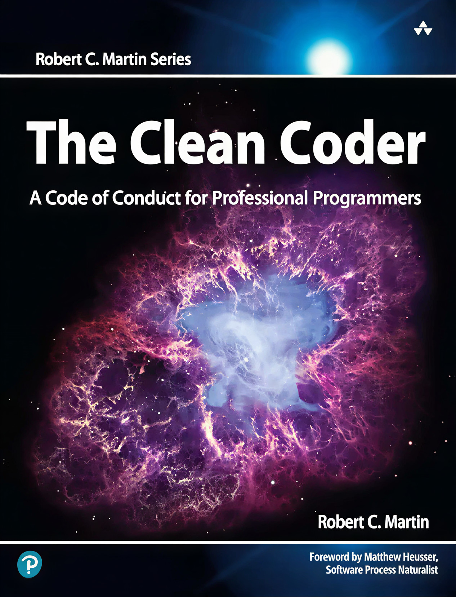

  

<h1 align="center">📘 ترجمه فارسی کتاب The Clean Coder</h1>

  
  
  
  

## ✨ معرفی پروژه

کتاب **The Clean Coder** یکی دیگر از مجموعه کتاب های `Robert C.Martin` است که به رفتار حرفه ای برنامه نویسان توجه میکند. 

     📘 موضوع اصلی کتاب

    حرفه‌ای‌گری در برنامه‌نویسی:
    کتاب توضیح می‌دهد که یک برنامه‌نویس حرفه‌ای چه ویژگی‌هایی باید داشته باشد؛ از جمله تعهد به کیفیت، مسئولیت‌پذیری، و احترام به زمان و نیازهای مشتری.

    رفتار و اخلاق کاری:
    Uncle Bob روی اهمیت صداقت، شفافیت، و پایبندی به اصول اخلاقی در تیم‌های نرم‌افزاری تأکید می‌کند.

    مدیریت زمان و تعهدات:
    برنامه‌نویسان باید یاد بگیرند چگونه قول بدهند، چگونه به قولشان عمل کنند، و چه زمانی باید "نه" بگویند.

    تست و کیفیت کد: 
    هرچند کتاب بیشتر درباره‌ی رفتار حرفه‌ای است، اما بر اهمیت تست‌نویسی، بازبینی کد، و رعایت استانداردهای کیفیت هم تأکید دارد.

    ارتباطات تیمی:
    یکی از بخش‌های مهم کتاب، نحوه‌ی تعامل با مدیران، همکاران و مشتریان است.

## 🙌 راه‌های مشارکت

ما به حضور شما در این پروژه افتخار می‌کنیم! ترجمه حتی یک صفحه میتونه کمک زیادی کنه :) 

با توجه به ساختار پروژه مارو توی ترجمه کردن کتاب کمک کنید.

### روش ها :
<ul dir="rtl">
  <li>ترجمه کردن کتاب</li>
  <li>بهبود ترجمه بخش هایی که به خوبی ترجمه نشده اند</li>
  <li>اضافه کردن کلمات کلیدی و پرکاربرد این حوزه به زبان اصلی برای تقویب زبان</li>
  <li>مرتب کردن ساختار در صورت بهم ریختگی</li>

</ul>

## ساختار پروژه

<ul dir="rtl">
  <li>فرمت فایل ها <code>.md</code> میباشد. </li>
  <li>عکس‌ها داخل پوشه <code>assets/image/</code> ذخیره شده‌اند. </li>
  <li>به این نکته توجه داشته باشید که تا حد امکان کلماتی که زیاد تکرار میشوند و کلمات مهم در این حوزه کاری هستند را هم به فارسی و هم به انگلیسی در ترجمه بیاورید. بدین شکل مخاطب و خواننده در کنار کسب اطلاعات کتاب به تقویت زبان خود هم میپردازد.</li>
</ul>

